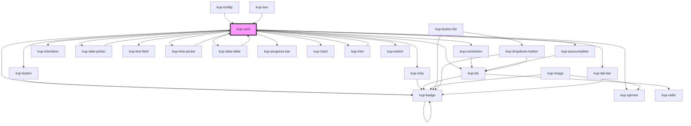

# kup-card

<!-- Auto Generated Below -->

## Properties

| Property       | Attribute       | Description                                                                                                     | Type                                                                                                                                                   | Default                  |
| -------------- | --------------- | --------------------------------------------------------------------------------------------------------------- | ------------------------------------------------------------------------------------------------------------------------------------------------------ | ------------------------ |
| `customStyle`  | `custom-style`  | Custom style of the component.                                                                                  | `string`                                                                                                                                               | `''`                     |
| `data`         | --              | The actual data of the card.                                                                                    | `KupCardData`                                                                                                                                          | `null`                   |
| `isMenu`       | `is-menu`       | Defines whether the card is a menu or not. Works together with menuVisible.                                     | `boolean`                                                                                                                                              | `false`                  |
| `layoutFamily` | `layout-family` | Sets the type of the card.                                                                                      | `KupCardFamily.BUILTIN \| KupCardFamily.COLLAPSIBLE \| KupCardFamily.DIALOG \| KupCardFamily.FREE \| KupCardFamily.SCALABLE \| KupCardFamily.STANDARD` | `KupCardFamily.STANDARD` |
| `layoutNumber` | `layout-number` | Sets the number of the layout.                                                                                  | `number`                                                                                                                                               | `1`                      |
| `menuVisible`  | `menu-visible`  | Sets the status of the card as menu, when false it's hidden otherwise it's visible. Works together with isMenu. | `boolean`                                                                                                                                              | `false`                  |
| `sizeX`        | `size-x`        | The width of the card, defaults to 100%. Accepts any valid CSS format (px, %, vw, etc.).                        | `string`                                                                                                                                               | `'100%'`                 |
| `sizeY`        | `size-y`        | The height of the card, defaults to 100%. Accepts any valid CSS format (px, %, vh, etc.).                       | `string`                                                                                                                                               | `'100%'`                 |

## Events

| Event            | Description                                                | Type                               |
| ---------------- | ---------------------------------------------------------- | ---------------------------------- |
| `kup-card-click` | Triggered when the card is clicked.                        | `CustomEvent<KupCardClickPayload>` |
| `kup-card-close` | Triggered when a dialog card is closed with the "X".       | `CustomEvent<KupEventPayload>`     |
| `kup-card-event` | Triggered when a sub-component of the card emits an event. | `CustomEvent<KupCardEventPayload>` |
| `kup-card-ready` | Triggered when the component is ready.                     | `CustomEvent<KupEventPayload>`     |

## Methods

### `getProps(descriptions?: boolean) => Promise<GenericObject>`

Used to retrieve component's props values.

#### Returns

Type: `Promise<GenericObject>`

List of props as object, each key will be a prop.

### `refresh() => Promise<void>`

This method is used to trigger a new render of the component.

#### Returns

Type: `Promise<void>`

### `resizeCallback() => Promise<void>`

This method is invoked by KupManager whenever the component changes size.

#### Returns

Type: `Promise<void>`

### `setProps(props: GenericObject) => Promise<void>`

Sets the props to the component.

#### Returns

Type: `Promise<void>`

## CSS Custom Properties

| Name                      | Description                                         |
| ------------------------- | --------------------------------------------------- |
| `--kup-card-ripple-color` | Sets color of ripple effect (for Material layouts). |

## Dependencies

### Used by

 - [kup-box](../kup-box)
 - [kup-data-table](../kup-data-table)
 - [kup-date-picker](../kup-date-picker)
 - [kup-time-picker](../kup-time-picker)
 - [kup-tooltip](../kup-tooltip)
 - [kup-tree](../kup-tree)

### Depends on

- [kup-badge](../kup-badge)
- [kup-button](../kup-button)
- [kup-chip](../kup-chip)
- [kup-list](../kup-list)
- [kup-combobox](../kup-combobox)
- [kup-autocomplete](../kup-autocomplete)
- [kup-checkbox](../kup-checkbox)
- [kup-date-picker](../kup-date-picker)
- [kup-text-field](../kup-text-field)
- [kup-time-picker](../kup-time-picker)
- [kup-data-table](../kup-data-table)
- [kup-spinner](../kup-spinner)
- [kup-progress-bar](../kup-progress-bar)
- [kup-chart](../kup-chart)
- [kup-tab-bar](../kup-tab-bar)
- [kup-tree](../kup-tree)
- [kup-switch](../kup-switch)

### Graph

----------------------------------------------

*Built with [StencilJS](https://stenciljs.com/)*
