# kup-card

<!-- Auto Generated Below -->

## Properties

| Property       | Attribute       | Description                                                                                                     | Type                                                                                                                                                                         | Default                  |
| -------------- | --------------- | --------------------------------------------------------------------------------------------------------------- | ---------------------------------------------------------------------------------------------------------------------------------------------------------------------------- | ------------------------ |
| `customStyle`  | `custom-style`  | Custom style of the component.                                                                                  | `string`                                                                                                                                                                     | `''`                     |
| `data`         | --              | The actual data of the card.                                                                                    | `KupCardData`                                                                                                                                                                | `null`                   |
| `isMenu`       | `is-menu`       | Defines whether the card is a menu or not. Works together with menuVisible.                                     | `boolean`                                                                                                                                                                    | `false`                  |
| `layoutFamily` | `layout-family` | Sets the type of the card.                                                                                      | `KupCardFamily.BOX \| KupCardFamily.BUILT_IN \| KupCardFamily.COLLAPSIBLE \| KupCardFamily.DIALOG \| KupCardFamily.FREE \| KupCardFamily.SCALABLE \| KupCardFamily.STANDARD` | `KupCardFamily.STANDARD` |
| `layoutNumber` | `layout-number` | Sets the number of the layout.                                                                                  | `number`                                                                                                                                                                     | `1`                      |
| `menuVisible`  | `menu-visible`  | Sets the status of the card as menu, when false it's hidden otherwise it's visible. Works together with isMenu. | `boolean`                                                                                                                                                                    | `false`                  |
| `showModal`    | `show-modal`    | Sets the card as modal window                                                                                   | `boolean`                                                                                                                                                                    | `false`                  |
| `sizeX`        | `size-x`        | The width of the card, defaults to 100%. Accepts any valid CSS format (px, %, vw, etc.).                        | `string`                                                                                                                                                                     | `'100%'`                 |
| `sizeY`        | `size-y`        | The height of the card, defaults to 100%. Accepts any valid CSS format (px, %, vh, etc.).                       | `string`                                                                                                                                                                     | `'100%'`                 |

## Events

| Event            | Description                                                | Type                               |
| ---------------- | ---------------------------------------------------------- | ---------------------------------- |
| `kup-card-click` | Triggered when the card is clicked.                        | `CustomEvent<KupCardClickPayload>` |
| `kup-card-close` | Triggered when a dialog card is closed with the "X".       | `CustomEvent<KupEventPayload>`     |
| `kup-card-event` | Triggered when a sub-component of the card emits an event. | `CustomEvent<KupCardEventPayload>` |
| `kup-card-ready` | Triggered when the component is ready.                     | `CustomEvent<KupEventPayload>`     |

## Methods

### `getProps(descriptions?: boolean) => Promise<GenericObject>`

Used to retrieve component's props values.

#### Returns

Type: `Promise<GenericObject>`

List of props as object, each key will be a prop.

### `refresh() => Promise<void>`

This method is used to trigger a new render of the component.

#### Returns

Type: `Promise<void>`

### `resizeCallback() => Promise<void>`

This method is invoked by KupManager whenever the component changes size.

#### Returns

Type: `Promise<void>`

### `setProps(props: GenericObject) => Promise<void>`

Sets the props to the component.

#### Returns

Type: `Promise<void>`

## CSS Custom Properties

| Name                      | Description                                         |
| ------------------------- | --------------------------------------------------- |
| `--kup-card-backdrop`     | Backdrop of the component when is visible.          |
| `--kup-card-ripple-color` | Sets color of ripple effect (for Material layouts). |

## Dependencies

### Used by

 - [kup-accordion](../kup-accordion)
 - [kup-autocomplete](../kup-autocomplete)
 - [kup-badge](../kup-badge)
 - [kup-box](../kup-box)
 - [kup-button](../kup-button)
 - [kup-button-list](../kup-button-list)
 - [kup-calendar](../kup-calendar)
 - [kup-card](.)
 - [kup-cell](../kup-cell)
 - [kup-chart](../kup-chart)
 - [kup-checkbox](../kup-checkbox)
 - [kup-chip](../kup-chip)
 - [kup-color-picker](../kup-color-picker)
 - [kup-combobox](../kup-combobox)
 - [kup-dash](../kup-dash)
 - [kup-dash-list](../kup-dash-list)
 - [kup-dashboard](../kup-dashboard)
 - [kup-data-table](../kup-data-table)
 - [kup-date-picker](../kup-date-picker)
 - [kup-drawer](../kup-drawer)
 - [kup-dropdown-button](../kup-dropdown-button)
 - [kup-echart](../kup-echart)
 - [kup-family-tree](../kup-family-tree)
 - [kup-form](../kup-form)
 - [kup-gauge](../kup-gauge)
 - [kup-grid](../kup-grid)
 - [kup-iframe](../kup-iframe)
 - [kup-image](../kup-image)
 - [kup-image-list](../kup-image-list)
 - [kup-lazy](../kup-lazy)
 - [kup-list](../kup-list)
 - [kup-magic-box](../kup-magic-box)
 - [kup-nav-bar](../kup-nav-bar)
 - [kup-numeric-picker](../kup-numeric-picker)
 - [kup-photo-frame](../kup-photo-frame)
 - [kup-probe](../kup-probe)
 - [kup-progress-bar](../kup-progress-bar)
 - [kup-qlik](../kup-qlik)
 - [kup-radio](../kup-radio)
 - [kup-rating](../kup-rating)
 - [kup-snackbar](../kup-snackbar)
 - [kup-spinner](../kup-spinner)
 - [kup-switch](../kup-switch)
 - [kup-tab-bar](../kup-tab-bar)
 - [kup-text-field](../kup-text-field)
 - [kup-time-picker](../kup-time-picker)
 - [kup-tree](../kup-tree)

### Depends on

- [kup-autocomplete](../kup-autocomplete)
- [kup-color-picker](../kup-color-picker)
- [kup-combobox](../kup-combobox)
- [kup-date-picker](../kup-date-picker)
- [kup-rating](../kup-rating)
- [kup-time-picker](../kup-time-picker)
- [kup-image](../kup-image)
- [kup-button](../kup-button)
- [kup-button-list](../kup-button-list)
- [kup-chart](../kup-chart)
- [kup-gauge](../kup-gauge)
- [kup-progress-bar](../kup-progress-bar)
- [kup-radio](../kup-radio)
- [kup-badge](../kup-badge)
- [kup-chip](../kup-chip)
- [kup-list](../kup-list)
- [kup-form](../kup-form)
- [kup-checkbox](../kup-checkbox)
- [kup-text-field](../kup-text-field)
- [kup-data-table](../kup-data-table)
- [kup-spinner](../kup-spinner)
- [kup-tab-bar](../kup-tab-bar)
- [kup-tree](../kup-tree)
- [kup-switch](../kup-switch)
- [kup-dropdown-button](../kup-dropdown-button)
- [kup-card](.)

### Graph

```mermaid
graph TD;
  kup-card --> kup-card
  kup-autocomplete --> kup-card
  kup-list --> kup-card
  kup-radio --> kup-card
  kup-badge --> kup-card
  kup-color-picker --> kup-card
  kup-combobox --> kup-card
  kup-date-picker --> kup-card
  kup-rating --> kup-card
  kup-time-picker --> kup-card
  kup-image --> kup-card
  kup-spinner --> kup-card
  kup-button --> kup-card
  kup-button-list --> kup-card
  kup-dropdown-button --> kup-card
  kup-chart --> kup-card
  kup-gauge --> kup-card
  kup-progress-bar --> kup-card
  kup-chip --> kup-card
  kup-form --> kup-card
  kup-checkbox --> kup-card
  kup-text-field --> kup-card
  kup-data-table --> kup-card
  kup-switch --> kup-card
  kup-tab-bar --> kup-card
  kup-tree --> kup-card
  kup-accordion --> kup-card
  kup-box --> kup-card
  kup-calendar --> kup-card
  kup-cell --> kup-card
  kup-dash --> kup-card
  kup-dash-list --> kup-card
  kup-dashboard --> kup-card
  kup-drawer --> kup-card
  kup-echart --> kup-card
  kup-family-tree --> kup-card
  kup-grid --> kup-card
  kup-iframe --> kup-card
  kup-image-list --> kup-card
  kup-lazy --> kup-card
  kup-magic-box --> kup-card
  kup-nav-bar --> kup-card
  kup-numeric-picker --> kup-card
  kup-photo-frame --> kup-card
  kup-probe --> kup-card
  kup-qlik --> kup-card
  kup-snackbar --> kup-card
  style kup-card fill:#f9f,stroke:#333,stroke-width:4px
```

----------------------------------------------

*Built with [StencilJS](https://stenciljs.com/)*
