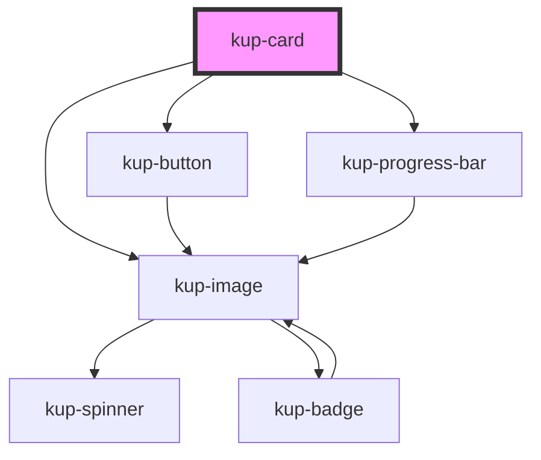

# kup-spinner

<!-- Auto Generated Below -->

## Properties

| Property      | Attribute      | Description                                                                               | Type                   | Default     |
| ------------- | -------------- | ----------------------------------------------------------------------------------------- | ---------------------- | ----------- |
| `customStyle` | `custom-style` | Custom style to be passed to the component.                                               | `string`               | `undefined` |
| `data`        | --             | The actual data of the card.                                                              | `ComponentCardElement` | `undefined` |
| `isMenu`      | `is-menu`      | Defines whether the card is a menu or not.                                                | `boolean`              | `false`     |
| `layout`      | `layout`       | Sets the layout of the card.                                                              | `number`               | `1`         |
| `menuVisible` | `menu-visible` | Sets the status of the menu, when false it's hidden otherwise it's visible.               | `boolean`              | `false`     |
| `sizeX`       | `size-x`       | The width of the card, defaults to 100%. Accepts any valid CSS format (px, %, vh, etc.).  | `string`               | `'100%'`    |
| `sizeY`       | `size-y`       | The height of the card, defaults to 100%. Accepts any valid CSS format (px, %, vh, etc.). | `string`               | `'100%'`    |

## Events

| Event          | Description | Type                                                |
| -------------- | ----------- | --------------------------------------------------- |
| `kupCardEvent` |             | `CustomEvent<{ id: any; value: any; event: any; }>` |

## Dependencies

### Depends on

- [kup-button](../kup-button)
- [kup-image](../kup-image)
- [kup-progress-bar](../kup-progress-bar)

### Graph

----------------------------------------------

*Built with [StencilJS](https://stenciljs.com/)*
