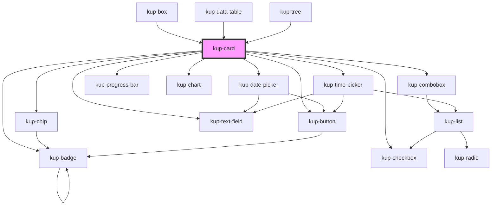

# kup-card

<!-- Auto Generated Below -->

## Properties

| Property       | Attribute       | Description                                                                                                     | Type                                                                                        | Default               |
| -------------- | --------------- | --------------------------------------------------------------------------------------------------------------- | ------------------------------------------------------------------------------------------- | --------------------- |
| `customStyle`  | `custom-style`  | Custom style of the component.                                                                                  | `string`                                                                                    | `''`                  |
| `data`         | --              | The actual data of the card.                                                                                    | `CardData`                                                                                  | `null`                |
| `isMenu`       | `is-menu`       | Defines whether the card is a menu or not. Works together with menuVisible.                                     | `boolean`                                                                                   | `false`               |
| `layoutFamily` | `layout-family` | Sets the type of the card.                                                                                      | `CardFamily.COLLAPSIBLE \| CardFamily.DIALOG \| CardFamily.SCALABLE \| CardFamily.STANDARD` | `CardFamily.STANDARD` |
| `layoutNumber` | `layout-number` | Sets the number of the layout.                                                                                  | `number`                                                                                    | `1`                   |
| `menuVisible`  | `menu-visible`  | Sets the status of the card as menu, when false it's hidden otherwise it's visible. Works together with isMenu. | `boolean`                                                                                   | `false`               |
| `sizeX`        | `size-x`        | The width of the card, defaults to 100%. Accepts any valid CSS format (px, %, vw, etc.).                        | `string`                                                                                    | `'100%'`              |
| `sizeY`        | `size-y`        | The height of the card, defaults to 100%. Accepts any valid CSS format (px, %, vh, etc.).                       | `string`                                                                                    | `'100%'`              |

## Events

| Event          | Description                                                | Type                                          |
| -------------- | ---------------------------------------------------------- | --------------------------------------------- |
| `kupCardClick` | Triggered when the card is clicked.                        | `CustomEvent<{ card: KupCard; }>`             |
| `kupCardEvent` | Triggered when a sub-component of the card emits an event. | `CustomEvent<{ card: KupCard; event: any; }>` |

## Methods

### `getProps(descriptions?: boolean) => Promise<GenericObject>`

Used to retrieve component's props values.

#### Returns

Type: `Promise<GenericObject>`

### `resizeCallback() => Promise<void>`

This method is invoked by KupManager whenever the component changes size.

#### Returns

Type: `Promise<void>`

### `themeChangeCallback(customStyleTheme: string) => Promise<void>`

This method is invoked by the theme manager.
Whenever the current Ketch.UP theme changes, every component must be re-rendered with the new component-specific customStyle.

#### Returns

Type: `Promise<void>`

## Dependencies

### Used by

 - [kup-box](../kup-box)
 - [kup-data-table](../kup-data-table)
 - [kup-tree](../kup-tree)

### Depends on

- [kup-chip](../kup-chip)
- [kup-badge](../kup-badge)
- [kup-button](../kup-button)
- [kup-checkbox](../kup-checkbox)
- [kup-combobox](../kup-combobox)
- [kup-date-picker](../kup-date-picker)
- [kup-text-field](../kup-text-field)
- [kup-time-picker](../kup-time-picker)
- [kup-progress-bar](../kup-progress-bar)
- [kup-chart](../kup-chart)

### Graph

----------------------------------------------

*Built with [StencilJS](https://stenciljs.com/)*
