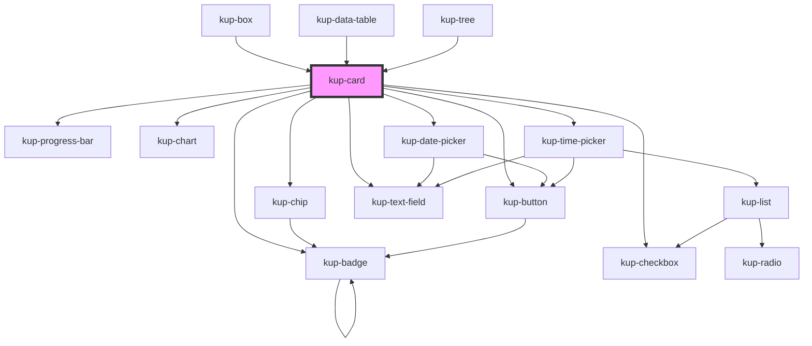

# kup-card

<!-- Auto Generated Below -->

## Properties

| Property       | Attribute       | Description                                                                                                      | Type                   | Default      |
| -------------- | --------------- | ---------------------------------------------------------------------------------------------------------------- | ---------------------- | ------------ |
| `customStyle`  | `custom-style`  | Custom style of the component. For more information: https://ketchup.smeup.com/ketchup-showcase/#/customization. | `string`               | `undefined`  |
| `data`         | --              | The actual data of the card.                                                                                     | `ComponentCardElement` | `undefined`  |
| `isMenu`       | `is-menu`       | Defines whether the card is a menu or not.                                                                       | `boolean`              | `false`      |
| `layoutFamily` | `layout-family` | Sets the type of the card. Currently supported values: "collapsible", "scalable", "standard".                    | `string`               | `'standard'` |
| `layoutNumber` | `layout-number` | Sets the number of the layout.                                                                                   | `number`               | `1`          |
| `menuVisible`  | `menu-visible`  | Sets the status of the menu, when false it's hidden otherwise it's visible.                                      | `boolean`              | `false`      |
| `sizeX`        | `size-x`        | The width of the card, defaults to 100%. Accepts any valid CSS format (px, %, vw, etc.).                         | `string`               | `'100%'`     |
| `sizeY`        | `size-y`        | The height of the card, defaults to 100%. Accepts any valid CSS format (px, %, vh, etc.).                        | `string`               | `'100%'`     |

## Events

| Event          | Description | Type                                          |
| -------------- | ----------- | --------------------------------------------- |
| `kupCardClick` |             | `CustomEvent<{ id: any; }>`                   |
| `kupCardEvent` |             | `CustomEvent<{ card: KupCard; event: any; }>` |

## Methods

### `refreshCustomStyle(customStyleTheme: string) => Promise<void>`

#### Returns

Type: `Promise<void>`

## Dependencies

### Used by

 - [kup-box](../kup-box)
 - [kup-data-table](../kup-data-table)
 - [kup-tree](../kup-tree)

### Depends on

- [kup-chip](../kup-chip)
- [kup-button](../kup-button)
- [kup-badge](../kup-badge)
- [kup-progress-bar](../kup-progress-bar)
- [kup-chart](../kup-chart)
- [kup-checkbox](../kup-checkbox)
- [kup-date-picker](../kup-date-picker)
- [kup-text-field](../kup-text-field)
- [kup-time-picker](../kup-time-picker)

### Graph

----------------------------------------------

*Built with [StencilJS](https://stenciljs.com/)*
