# kup-cell

<!-- Auto Generated Below -->

## Properties

| Property      | Attribute      | Description                                                                             | Type                                                                                  | Default             |
| ------------- | -------------- | --------------------------------------------------------------------------------------- | ------------------------------------------------------------------------------------- | ------------------- |
| `customStyle` | `custom-style` | Custom style of the component.                                                          | `string`                                                                              | `''`                |
| `data`        | --             | The data of the cell.                                                                   | `KupDataCell`                                                                         | `null`              |
| `density`     | `density`      | The density of the cell, defaults at 'dense' and can be also set to 'wide' or 'medium'. | `FCellPadding.DENSE \| FCellPadding.MEDIUM \| FCellPadding.NONE \| FCellPadding.WIDE` | `FCellPadding.NONE` |
| `dragEnabled` | `drag-enabled` | When set to true, the component is draggable.                                           | `boolean`                                                                             | `false`             |

## Methods

### `addCssClasses(classes?: string[]) => Promise<void>`

Adds the given CSS classes to the cell's data.

#### Returns

Type: `Promise<void>`

### `getProps(descriptions?: boolean) => Promise<GenericObject>`

Used to retrieve component's props values.

#### Returns

Type: `Promise<GenericObject>`

List of props as object, each key will be a prop.

### `refresh() => Promise<void>`

This method is used to trigger a new render of the component.

#### Returns

Type: `Promise<void>`

### `removeCssClasses(classes?: string[]) => Promise<void>`

Removes the given CSS classes from the cell's data.

#### Returns

Type: `Promise<void>`

### `setProps(props: GenericObject) => Promise<void>`

Sets the props to the component.

#### Returns

Type: `Promise<void>`

## CSS Custom Properties

| Name                               | Description                                                                                                                                                                         |
| ---------------------------------- | ----------------------------------------------------------------------------------------------------------------------------------------------------------------------------------- |
| `--kup-cell-background`            | Sets the background of the cell.                                                                                                                                                    |
| `--kup-cell-font-family`           | Sets the font family of the cell.                                                                                                                                                   |
| `--kup-cell-font-family-monospace` | Sets the monospace font family of the cell (for numbers).                                                                                                                           |
| `--kup-cell-font-size`             | Sets the font size of the cell.                                                                                                                                                     |
| `--kup-cell-text-color`            | Sets the text color of the cell. NOTE: These variables are defined in the "kup-theme.css" file, because they must work even without the kup component (it's a functional component) |

## Dependencies

### Depends on

- [kup-card](../kup-card)
- [kup-autocomplete](../kup-autocomplete)
- [kup-color-picker](../kup-color-picker)
- [kup-combobox](../kup-combobox)
- [kup-date-picker](../kup-date-picker)
- [kup-rating](../kup-rating)
- [kup-time-picker](../kup-time-picker)
- [kup-image](../kup-image)
- [kup-button](../kup-button)
- [kup-button-list](../kup-button-list)
- [kup-chart](../kup-chart)
- [kup-gauge](../kup-gauge)
- [kup-progress-bar](../kup-progress-bar)
- [kup-radio](../kup-radio)
- [kup-badge](../kup-badge)

### Graph

```mermaid
graph TD;
  kup-cell --> kup-card
  kup-cell --> kup-autocomplete
  kup-cell --> kup-color-picker
  kup-cell --> kup-combobox
  kup-cell --> kup-date-picker
  kup-cell --> kup-rating
  kup-cell --> kup-time-picker
  kup-cell --> kup-image
  kup-cell --> kup-button
  kup-cell --> kup-button-list
  kup-cell --> kup-chart
  kup-cell --> kup-gauge
  kup-cell --> kup-progress-bar
  kup-cell --> kup-radio
  kup-cell --> kup-badge
  kup-card --> kup-autocomplete
  kup-card --> kup-color-picker
  kup-card --> kup-combobox
  kup-card --> kup-date-picker
  kup-card --> kup-rating
  kup-card --> kup-time-picker
  kup-card --> kup-image
  kup-card --> kup-button
  kup-card --> kup-button-list
  kup-card --> kup-chart
  kup-card --> kup-gauge
  kup-card --> kup-progress-bar
  kup-card --> kup-radio
  kup-card --> kup-badge
  kup-card --> kup-chip
  kup-card --> kup-list
  kup-card --> kup-form
  kup-card --> kup-checkbox
  kup-card --> kup-text-field
  kup-card --> kup-data-table
  kup-card --> kup-spinner
  kup-card --> kup-tab-bar
  kup-card --> kup-tree
  kup-card --> kup-switch
  kup-card --> kup-dropdown-button
  kup-card --> kup-card
  kup-autocomplete --> kup-list
  kup-autocomplete --> kup-card
  kup-list --> kup-list
  kup-list --> kup-radio
  kup-list --> kup-card
  kup-list --> kup-badge
  kup-radio --> kup-card
  kup-badge --> kup-badge
  kup-badge --> kup-card
  kup-color-picker --> kup-card
  kup-combobox --> kup-list
  kup-combobox --> kup-card
  kup-date-picker --> kup-card
  kup-rating --> kup-card
  kup-time-picker --> kup-card
  kup-time-picker --> kup-list
  kup-image --> kup-spinner
  kup-image --> kup-card
  kup-image --> kup-badge
  kup-spinner --> kup-card
  kup-button --> kup-card
  kup-button --> kup-badge
  kup-button-list --> kup-dropdown-button
  kup-button-list --> kup-card
  kup-button-list --> kup-badge
  kup-dropdown-button --> kup-list
  kup-dropdown-button --> kup-card
  kup-dropdown-button --> kup-badge
  kup-chart --> kup-card
  kup-gauge --> kup-card
  kup-progress-bar --> kup-card
  kup-chip --> kup-card
  kup-chip --> kup-badge
  kup-form --> kup-card
  kup-form --> kup-autocomplete
  kup-form --> kup-color-picker
  kup-form --> kup-combobox
  kup-form --> kup-date-picker
  kup-form --> kup-rating
  kup-form --> kup-time-picker
  kup-form --> kup-image
  kup-form --> kup-button
  kup-form --> kup-button-list
  kup-form --> kup-chart
  kup-form --> kup-gauge
  kup-form --> kup-progress-bar
  kup-form --> kup-radio
  kup-form --> kup-badge
  kup-checkbox --> kup-card
  kup-text-field --> kup-card
  kup-data-table --> kup-card
  kup-data-table --> kup-list
  kup-data-table --> kup-switch
  kup-data-table --> kup-button
  kup-data-table --> kup-spinner
  kup-data-table --> kup-form
  kup-data-table --> kup-image
  kup-data-table --> kup-checkbox
  kup-data-table --> kup-combobox
  kup-data-table --> kup-badge
  kup-data-table --> kup-autocomplete
  kup-data-table --> kup-color-picker
  kup-data-table --> kup-date-picker
  kup-data-table --> kup-rating
  kup-data-table --> kup-time-picker
  kup-data-table --> kup-button-list
  kup-data-table --> kup-chart
  kup-data-table --> kup-gauge
  kup-data-table --> kup-progress-bar
  kup-data-table --> kup-radio
  kup-switch --> kup-card
  kup-tab-bar --> kup-card
  kup-tab-bar --> kup-badge
  kup-tree --> kup-card
  kup-tree --> kup-list
  kup-tree --> kup-text-field
  kup-tree --> kup-autocomplete
  kup-tree --> kup-color-picker
  kup-tree --> kup-combobox
  kup-tree --> kup-date-picker
  kup-tree --> kup-rating
  kup-tree --> kup-time-picker
  kup-tree --> kup-image
  kup-tree --> kup-button
  kup-tree --> kup-button-list
  kup-tree --> kup-chart
  kup-tree --> kup-gauge
  kup-tree --> kup-progress-bar
  kup-tree --> kup-radio
  kup-tree --> kup-badge
  style kup-cell fill:#f9f,stroke:#333,stroke-width:4px
```

----------------------------------------------

*Built with [StencilJS](https://stenciljs.com/)*
