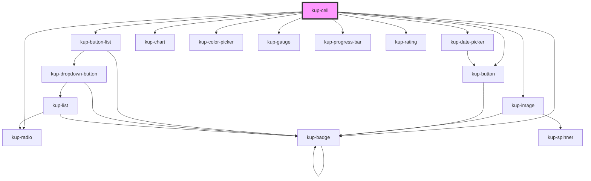

# kup-cell

<!-- Auto Generated Below -->

## Properties

| Property      | Attribute      | Description                                   | Type      | Default |
| ------------- | -------------- | --------------------------------------------- | --------- | ------- |
| `customStyle` | `custom-style` | Custom style of the component.                | `string`  | `''`    |
| `data`        | --             | The data of the cell.                         | `Cell`    | `null`  |
| `dragEnabled` | `drag-enabled` | When set to true, the component is draggable. | `boolean` | `false` |

## Events

| Event             | Description                            | Type                               |
| ----------------- | -------------------------------------- | ---------------------------------- |
| `kup-cell-change` | Triggered when the element changes.    | `CustomEvent<KupCellEventPayload>` |
| `kup-cell-click`  | Triggered when the element is clicked. | `CustomEvent<KupCellEventPayload>` |

## Methods

### `getProps(descriptions?: boolean) => Promise<GenericObject>`

Used to retrieve component's props values.

#### Returns

Type: `Promise<GenericObject>`

List of props as object, each key will be a prop.

### `refresh() => Promise<void>`

This method is used to trigger a new render of the component.

#### Returns

Type: `Promise<void>`

### `setProps(props: GenericObject) => Promise<void>`

Sets the props to the component.

#### Returns

Type: `Promise<void>`

## Dependencies

### Depends on

- [kup-date-picker](../kup-date-picker)
- [kup-image](../kup-image)
- [kup-button](../kup-button)
- [kup-button-list](../kup-button-list)
- [kup-chart](../kup-chart)
- [kup-color-picker](../kup-color-picker)
- [kup-gauge](../kup-gauge)
- [kup-progress-bar](../kup-progress-bar)
- [kup-radio](../kup-radio)
- [kup-rating](../kup-rating)
- [kup-badge](../kup-badge)

### Graph

----------------------------------------------

*Built with [StencilJS](https://stenciljs.com/)*
