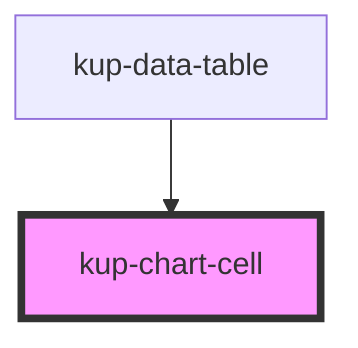

# kup-chart-cell

<!-- Auto Generated Below -->

## Properties

| Property     | Attribute    | Description | Type     | Default     |
| ------------ | ------------ | ----------- | -------- | ----------- |
| `cellConfig` | `cellconfig` |             | `any`    | `undefined` |
| `value`      | `value`      |             | `string` | `undefined` |

## Dependencies

### Used by

 - [kup-data-table](../kup-data-table)

### Graph

----------------------------------------------

*Built with [StencilJS](https://stenciljs.com/)*
