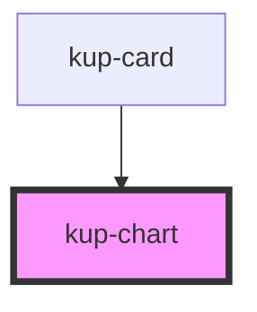

# kup-chart

<!-- Auto Generated Below -->

## Properties

| Property          | Attribute           | Description                  | Type                               | Default            |
| ----------------- | ------------------- | ---------------------------- | ---------------------------------- | ------------------ |
| `asp`             | `asp`               |                              | `ChartAspect.D2 \| ChartAspect.D3` | `undefined`        |
| `axis`            | `axis`              |                              | `string`                           | `undefined`        |
| `colors`          | --                  |                              | `string[]`                         | `[]`               |
| `data`            | --                  |                              | `DataTable`                        | `undefined`        |
| `graphTitle`      | `graph-title`       |                              | `string`                           | `undefined`        |
| `graphTitleColor` | `graph-title-color` |                              | `string`                           | `undefined`        |
| `graphTitleSize`  | `graph-title-size`  |                              | `number`                           | `undefined`        |
| `hAxis`           | --                  |                              | `ChartAxis`                        | `undefined`        |
| `height`          | `height`            |                              | `number`                           | `undefined`        |
| `legend`          | `legend`            |                              | `boolean`                          | `true`             |
| `series`          | --                  |                              | `string[]`                         | `undefined`        |
| `showMarks`       | `show-marks`        |                              | `boolean`                          | `false`            |
| `stacked`         | `stacked`           |                              | `boolean`                          | `false`            |
| `types`           | --                  |                              | `ChartType[]`                      | `[ChartType.Hbar]` |
| `vAxis`           | --                  |                              | `ChartAxis`                        | `undefined`        |
| `version`         | `version`           | Google chart version to load | `string`                           | `'45.2'`           |
| `width`           | `width`             |                              | `number`                           | `undefined`        |

## Events

| Event             | Description                             | Type                             |
| ----------------- | --------------------------------------- | -------------------------------- |
| `kupChartClicked` | Triggered when a chart serie is clicked | `CustomEvent<ChartClickedEvent>` |

## Dependencies

### Used by

 - [kup-card](../kup-card)

### Graph

----------------------------------------------

*Built with [StencilJS](https://stenciljs.com/)*
