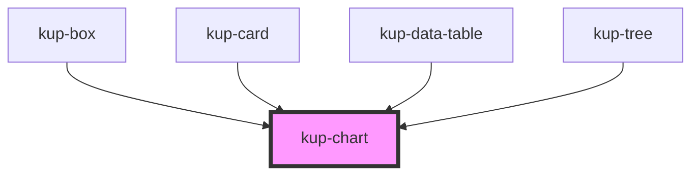

# kup-chart

<!-- Auto Generated Below -->

## Properties

| Property          | Attribute           | Description                                                                                                      | Type                               | Default            |
| ----------------- | ------------------- | ---------------------------------------------------------------------------------------------------------------- | ---------------------------------- | ------------------ |
| `asp`             | `asp`               |                                                                                                                  | `ChartAspect.D2 \| ChartAspect.D3` | `undefined`        |
| `axis`            | `axis`              |                                                                                                                  | `string`                           | `undefined`        |
| `colors`          | --                  |                                                                                                                  | `string[]`                         | `[]`               |
| `customStyle`     | `custom-style`      | Custom style of the component. For more information: https://ketchup.smeup.com/ketchup-showcase/#/customization. | `string`                           | `undefined`        |
| `data`            | --                  |                                                                                                                  | `DataTable`                        | `undefined`        |
| `graphTitle`      | `graph-title`       |                                                                                                                  | `string`                           | `undefined`        |
| `graphTitleColor` | `graph-title-color` |                                                                                                                  | `string`                           | `undefined`        |
| `graphTitleSize`  | `graph-title-size`  |                                                                                                                  | `number`                           | `undefined`        |
| `hAxis`           | --                  |                                                                                                                  | `ChartAxis`                        | `undefined`        |
| `legend`          | `legend`            |                                                                                                                  | `boolean`                          | `true`             |
| `offlineMode`     | --                  |                                                                                                                  | `ChartOfflineMode`                 | `undefined`        |
| `series`          | --                  |                                                                                                                  | `string[]`                         | `undefined`        |
| `showMarks`       | `show-marks`        |                                                                                                                  | `boolean`                          | `false`            |
| `sizeX`           | `size-x`            |                                                                                                                  | `string`                           | `'100%'`           |
| `sizeY`           | `size-y`            |                                                                                                                  | `string`                           | `'100%'`           |
| `stacked`         | `stacked`           |                                                                                                                  | `boolean`                          | `false`            |
| `types`           | --                  |                                                                                                                  | `ChartType[]`                      | `[ChartType.Hbar]` |
| `vAxis`           | --                  |                                                                                                                  | `ChartAxis`                        | `undefined`        |
| `version`         | `version`           | Google chart version to load                                                                                     | `string`                           | `'45.2'`           |

## Events

| Event             | Description                             | Type                             |
| ----------------- | --------------------------------------- | -------------------------------- |
| `kupChartClicked` | Triggered when a chart serie is clicked | `CustomEvent<ChartClickedEvent>` |

## Methods

### `refreshCustomStyle(customStyleTheme: string) => Promise<void>`

#### Returns

Type: `Promise<void>`

## Dependencies

### Used by

 - [kup-box](../kup-box)
 - [kup-card](../kup-card)
 - [kup-data-table](../kup-data-table)
 - [kup-tree](../kup-tree)

### Graph

----------------------------------------------

*Built with [StencilJS](https://stenciljs.com/)*
