# kup-chart

<!-- Auto Generated Below -->

## Properties

| Property      | Attribute      | Description                                                                                                                                                                           | Type                               | Default            |
| ------------- | -------------- | ------------------------------------------------------------------------------------------------------------------------------------------------------------------------------------- | ---------------------------------- | ------------------ |
| `asp`         | `asp`          | Sets the chart to a 2D or 3D aspect. 3D only works for Pie graphs.                                                                                                                    | `ChartAspect.D2 \| ChartAspect.D3` | `undefined`        |
| `axis`        | `axis`         | Sets the axis of the chart.                                                                                                                                                           | `string`                           | `undefined`        |
| `chartTitle`  | --             | Title of the graph.                                                                                                                                                                   | `ChartTitle`                       | `undefined`        |
| `colors`      | --             | Colors of the chart.                                                                                                                                                                  | `string[]`                         | `[]`               |
| `customStyle` | `custom-style` | Custom style of the component.                                                                                                                                                        | `string`                           | `''`               |
| `data`        | --             | The actual data of the chart.                                                                                                                                                         | `KupDataDataset`                   | `undefined`        |
| `hAxes`       | --             | Customize the hAxes for multiple-chart.                                                                                                                                               | `ChartAxis[]`                      | `undefined`        |
| `hAxis`       | --             | Customize the hAxis.                                                                                                                                                                  | `ChartAxis`                        | `undefined`        |
| `legend`      | `legend`       | Sets the position of the legend. Supported values: bottom, labeled, left, none, right, top. Keep in mind that legend types are tied to chart types, some combinations might not work. | `string`                           | `'right'`          |
| `offlineMode` | --             | Renders charts without the Google API and using jQuery Sparkline.                                                                                                                     | `ChartOfflineMode`                 | `undefined`        |
| `series`      | --             | The data series to be displayed. They must be of the same type.                                                                                                                       | `ChartSerie[]`                     | `undefined`        |
| `showMarks`   | `show-marks`   | Displays the numerical values.                                                                                                                                                        | `boolean`                          | `false`            |
| `sizeX`       | `size-x`       | The width of the chart, defaults to 100%. Accepts any valid CSS format (px, %, vw, etc.).                                                                                             | `string`                           | `'100%'`           |
| `sizeY`       | `size-y`       | The height of the chart, defaults to 100%. Accepts any valid CSS format (px, %, vh, etc.).                                                                                            | `string`                           | `'100%'`           |
| `sorting`     | --             | Used to sort series.                                                                                                                                                                  | `KupChartSort[]`                   | `null`             |
| `stacked`     | `stacked`      | Displays the data columns of an object on top of each other.                                                                                                                          | `boolean`                          | `false`            |
| `trendlines`  | --             | KupChartTrendlines.                                                                                                                                                                   | `KupChartTrendlines`               | `undefined`        |
| `types`       | --             | The type of the chart. Supported formats: Area, Bubble, Cal, Candlestick, Combo, Geo, Hbar, Line, Ohlc, Pie, Sankey, Scatter, Unk, Vbar.                                              | `ChartType[]`                      | `[ChartType.Hbar]` |
| `vAxes`       | --             | Customize the vAxes for multiple-chart.                                                                                                                                               | `ChartAxis[]`                      | `undefined`        |
| `vAxis`       | --             | Customize the vAxis.                                                                                                                                                                  | `ChartAxis`                        | `undefined`        |
| `version`     | `version`      | Google chart version to load                                                                                                                                                          | `string`                           | `'45.2'`           |

## Events

| Event             | Description                             | Type                              |
| ----------------- | --------------------------------------- | --------------------------------- |
| `kup-chart-click` | Triggered when a chart serie is clicked | `CustomEvent<KupChartClickEvent>` |

## Methods

### `getProps(descriptions?: boolean) => Promise<GenericObject>`

Used to retrieve component's props values.

#### Returns

Type: `Promise<GenericObject>`

List of props as object, each key will be a prop.

### `refresh() => Promise<void>`

This method is used to trigger a new render of the component.

#### Returns

Type: `Promise<void>`

### `resizeCallback() => Promise<void>`

This method is invoked by KupManager whenever the component changes size.

#### Returns

Type: `Promise<void>`

### `setProps(props: GenericObject) => Promise<void>`

Sets the props to the component.

#### Returns

Type: `Promise<void>`

## Dependencies

### Used by

 - [kup-box](../kup-box)
 - [kup-card](../kup-card)
 - [kup-cell](../kup-cell)
 - [kup-data-table](../kup-data-table)
 - [kup-form](../kup-form)
 - [kup-image-list](../kup-image-list)
 - [kup-magic-box](../kup-magic-box)
 - [kup-tree](../kup-tree)

### Depends on

- [kup-card](../kup-card)

### Graph

```mermaid
graph TD;
  kup-chart --> kup-card
  kup-card --> kup-chart
  kup-autocomplete --> kup-list
  kup-autocomplete --> kup-card
  kup-list --> kup-list
  kup-list --> kup-radio
  kup-list --> kup-card
  kup-list --> kup-badge
  kup-radio --> kup-card
  kup-badge --> kup-badge
  kup-badge --> kup-card
  kup-color-picker --> kup-card
  kup-combobox --> kup-list
  kup-combobox --> kup-card
  kup-date-picker --> kup-card
  kup-rating --> kup-card
  kup-time-picker --> kup-card
  kup-time-picker --> kup-list
  kup-image --> kup-spinner
  kup-image --> kup-card
  kup-image --> kup-badge
  kup-spinner --> kup-card
  kup-button --> kup-card
  kup-button --> kup-badge
  kup-button-list --> kup-dropdown-button
  kup-button-list --> kup-card
  kup-button-list --> kup-badge
  kup-dropdown-button --> kup-list
  kup-dropdown-button --> kup-card
  kup-dropdown-button --> kup-badge
  kup-gauge --> kup-card
  kup-progress-bar --> kup-card
  kup-chip --> kup-card
  kup-chip --> kup-badge
  kup-form --> kup-chart
  kup-checkbox --> kup-card
  kup-text-field --> kup-card
  kup-data-table --> kup-chart
  kup-switch --> kup-card
  kup-tab-bar --> kup-card
  kup-tab-bar --> kup-badge
  kup-tree --> kup-chart
  kup-box --> kup-chart
  kup-cell --> kup-chart
  kup-image-list --> kup-chart
  kup-magic-box --> kup-chart
  style kup-chart fill:#f9f,stroke:#333,stroke-width:4px
```

----------------------------------------------

*Built with [StencilJS](https://stenciljs.com/)*
