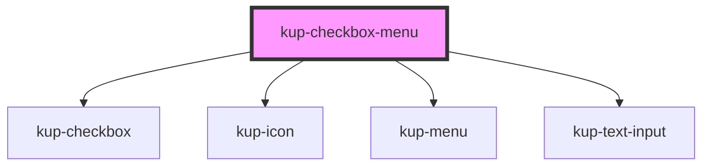

# kup-checkbox-menu

<!-- Auto Generated Below -->

## Properties

| Property         | Attribute         | Description                                                                              | Type                    | Default        |
| ---------------- | ----------------- | ---------------------------------------------------------------------------------------- | ----------------------- | -------------- |
| `disabled`       | `disabled`        | Sets if the checkbox menu should be disabled                                             | `boolean`               | `false`        |
| `displayedField` | `displayed-field` | Chooses which field of an item object should be used to create the list and be filtered. | `string`                | `'id'`         |
| `filterLabel`    | `filter-label`    | The label to show as a placeholder inside the filter input                               | `string`                | `'Filtra per'` |
| `isFilterable`   | `is-filterable`   | Marks the field as filterable, allowing an input text to filter the options              | `boolean`               | `true`         |
| `items`          | --                | Sets the checkbox to be disabled  Must have reflect into the attribute                   | `KupCheckboxMenuItem[]` | `[]`           |
| `label`          | `label`           | The label to set to the component                                                        | `string`                | `'Scegli'`     |
| `valueField`     | `value-field`     | Chooses which field of an item object should be used to create the list and be filtered. | `string`                | `'id'`         |

## Events

| Event                     | Description                                     | Type                                 |
| ------------------------- | ----------------------------------------------- | ------------------------------------ |
| `kupCheckboxMenuSelected` | Fired when the checkbox input changes its value | `CustomEvent<KupCheckboxMenuItem[]>` |

## CSS Custom Properties

| Name                                                                     | Description                                                        |
| ------------------------------------------------------------------------ | ------------------------------------------------------------------ |
| `--checkbox_background-color, --kup-checkbox_background-color`           | Sets the background color of the checkbox                          |
| `--checkbox_border-color, --kup-checkbox_border-color`                   | Sets color of the border when checkbox is NOT disabled.            |
| `--checkbox_border-color-disabled, --kup-checkbox_border-color-disabled` | Sets color of the border when checkbox IS disabled.                |
| `--checkbox_size, --kup-checkbox_size`                                   | Sets the component size; all other sizes are scaled automatically. |
| `--checkbox_tick-color, --kup-checkbox_tick-color`                       | Sets color of the tick of the checkbox.                            |
| `--checkbox_tick-color-disabled, --kup-checkbox_tick-color-disabled`     | Sets color of the tick of the checkbox when checkbox is disabled.  |

## Dependencies

### Depends on

- [kup-checkbox](..\kup-checkbox)
- [kup-icon](..\kup-icon)
- [kup-menu](..\kup-menu)
- [kup-text-input](..\kup-text-input)

### Graph

----------------------------------------------

*Built with [StencilJS](https://stenciljs.com/)*
