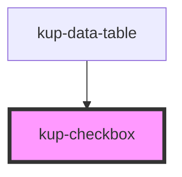

# kup-checkbox

### Features to add:

* Main label support: by using a label tag and a generated id.
* Support aria-labelledby attribute.

<!-- Auto Generated Below -->

## Properties

| Property      | Attribute       | Description                                                            | Type      | Default |
| ------------- | --------------- | ---------------------------------------------------------------------- | --------- | ------- |
| `checked`     | `checked`       | Sets the checkbox to be disabled                                       | `boolean` | `false` |
| `disabled`    | `disabled`      | Sets the checkbox to be disabled  Must have reflect into the attribute | `boolean` | `false` |
| `label`       | `label`         | The label to set to the component                                      | `string`  | `''`    |
| `setTabIndex` | `set-tab-index` | Sets the tabindex of the checkbox                                      | `number`  | `0`     |

## Events

| Event               | Description                                     | Type                                 |
| ------------------- | ----------------------------------------------- | ------------------------------------ |
| `kupCheckboxBlur`   | Fired when the checkbox input is blurred        | `CustomEvent<{ checked: boolean; }>` |
| `kupCheckboxChange` | Fired when the checkbox input changes its value | `CustomEvent<{ checked: boolean; }>` |
| `kupCheckboxFocus`  | Fired when the checkbox input receive focus     | `CustomEvent<{ checked: boolean; }>` |

## CSS Custom Properties

| Name                                                                     | Description                                                        |
| ------------------------------------------------------------------------ | ------------------------------------------------------------------ |
| `--checkbox_background-color, --kup-checkbox_background-color`           | Sets the background color of the checkbox                          |
| `--checkbox_border-color, --kup-checkbox_border-color`                   | Sets color of the border when checkbox is NOT disabled.            |
| `--checkbox_border-color-disabled, --kup-checkbox_border-color-disabled` | Sets color of the border when checkbox IS disabled.                |
| `--checkbox_size, --kup-checkbox_size`                                   | Sets the component size; all other sizes are scaled automatically. |
| `--checkbox_tick-color, --kup-checkbox_tick-color`                       | Sets color of the tick of the checkbox.                            |
| `--checkbox_tick-color-disabled, --kup-checkbox_tick-color-disabled`     | Sets color of the tick of the checkbox when checkbox is disabled.  |

## Dependencies

### Used by

 - [kup-data-table](../kup-data-table)

### Graph

----------------------------------------------

*Built with [StencilJS](https://stenciljs.com/)*
