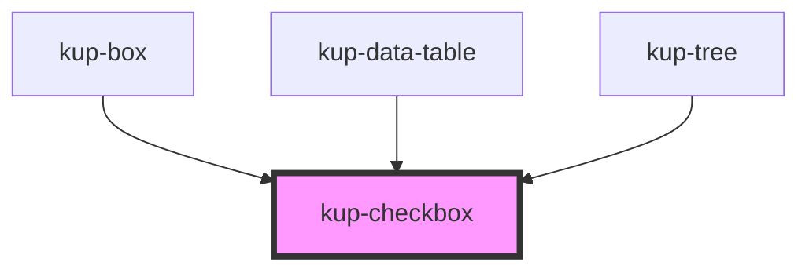

# kup-checkbox

### Features to add:

* Main label support: by using a label tag and a generated id.
* Support aria-labelledby attribute.

<!-- Auto Generated Below -->

## Properties

| Property      | Attribute       | Description                                                            | Type      | Default |
| ------------- | --------------- | ---------------------------------------------------------------------- | --------- | ------- |
| `checked`     | `checked`       | Sets the checkbox to be disabled                                       | `boolean` | `false` |
| `disabled`    | `disabled`      | Sets the checkbox to be disabled  Must have reflect into the attribute | `boolean` | `false` |
| `label`       | `label`         | The label to set to the component                                      | `string`  | `''`    |
| `setTabIndex` | `set-tab-index` | Sets the tabindex of the checkbox                                      | `number`  | `0`     |

## Events

| Event               | Description                                     | Type                                 |
| ------------------- | ----------------------------------------------- | ------------------------------------ |
| `kupCheckboxBlur`   | Fired when the checkbox input is blurred        | `CustomEvent<{ checked: boolean; }>` |
| `kupCheckboxChange` | Fired when the checkbox input changes its value | `CustomEvent<{ checked: boolean; }>` |
| `kupCheckboxFocus`  | Fired when the checkbox input receive focus     | `CustomEvent<{ checked: boolean; }>` |

## Dependencies

### Used by

 - [kup-box](../kup-box)
 - [kup-data-table](../kup-data-table)
 - [kup-tree](../kup-tree)

### Graph

----------------------------------------------

*Built with [StencilJS](https://stenciljs.com/)*
