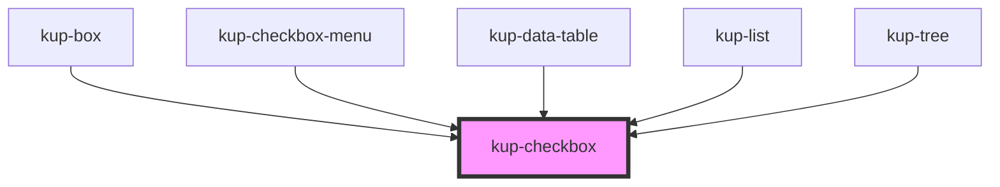

# kup-checkbox

### Features to add:

-   Main label support: by using a label tag and a generated id.
-   Support aria-labelledby attribute.

<!-- Auto Generated Below -->

## Properties

| Property        | Attribute       | Description                                                                                                     | Type      | Default     |
| --------------- | --------------- | --------------------------------------------------------------------------------------------------------------- | --------- | ----------- |
| `checked`       | `checked`       | Defaults at false. When set to true, the component will be set to 'checked'.                                    | `boolean` | `false`     |
| `customStyle`   | `custom-style`  | Custom style of the component. For more information: https://ketchup.smeup.com/ketchup-showcase/#/customization | `string`  | `undefined` |
| `disabled`      | `disabled`      | Defaults at false. When set to true, the component is disabled.                                                 | `boolean` | `false`     |
| `indeterminate` | `indeterminate` | Defaults at false. When set to true, the component will be set to 'indeterminate'.                              | `boolean` | `false`     |
| `label`         | `label`         | Defaults at null. When specified, its content will be shown as a label.                                         | `string`  | `null`      |
| `leadingLabel`  | `leading-label` | Defaults at false. When set to true, the label will be on the left of the component.                            | `boolean` | `false`     |

## Events

| Event               | Description | Type                                                |
| ------------------- | ----------- | --------------------------------------------------- |
| `kupCheckboxBlur`   |             | `CustomEvent<{ value: string; checked: boolean; }>` |
| `kupCheckboxChange` |             | `CustomEvent<{ value: string; checked: boolean; }>` |
| `kupCheckboxClick`  |             | `CustomEvent<{ value: string; checked: boolean; }>` |
| `kupCheckboxFocus`  |             | `CustomEvent<{ value: string; checked: boolean; }>` |
| `kupCheckboxInput`  |             | `CustomEvent<{ value: string; checked: boolean; }>` |

## Methods

### `refreshCustomStyle(customStyleTheme: string) => Promise<void>`

#### Returns

Type: `Promise<void>`

## Dependencies

### Used by

 - [kup-box](../kup-box)
 - [kup-checkbox-menu](../kup-checkbox-menu)
 - [kup-data-table](../kup-data-table)
 - [kup-list](../kup-list)
 - [kup-tree](../kup-tree)

### Graph

----------------------------------------------

*Built with [StencilJS](https://stenciljs.com/)*
