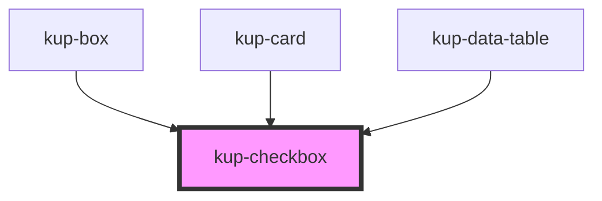

# kup-checkbox

### Features to add:

-   Main label support: by using a label tag and a generated id.
-   Support aria-labelledby attribute.

<!-- Auto Generated Below -->

## Properties

| Property        | Attribute       | Description                                                                  | Type      | Default |
| --------------- | --------------- | ---------------------------------------------------------------------------- | --------- | ------- |
| `checked`       | `checked`       | Defaults at false. When set to true, the component will be set to 'checked'. | `boolean` | `false` |
| `customStyle`   | `custom-style`  | Custom style of the component.                                               | `string`  | `''`    |
| `disabled`      | `disabled`      | When set to true, the component is disabled.                                 | `boolean` | `false` |
| `indeterminate` | `indeterminate` | When set to true, the component will be set to 'indeterminate'.              | `boolean` | `false` |
| `label`         | `label`         | When specified, its content will be shown as a label.                        | `string`  | `null`  |
| `leadingLabel`  | `leading-label` | When set to true, the label will be on the left of the component.            | `boolean` | `false` |

## Events

| Event                 | Description                                       | Type                                   |
| --------------------- | ------------------------------------------------- | -------------------------------------- |
| `kup-checkbox-blur`   | Triggered when the input element loses focus.     | `CustomEvent<KupCheckboxEventPayload>` |
| `kup-checkbox-change` | Triggered when the input element's value changes. | `CustomEvent<KupCheckboxEventPayload>` |
| `kup-checkbox-focus`  | Triggered when the input element gets focused.    | `CustomEvent<KupCheckboxEventPayload>` |

## Methods

### `getProps(descriptions?: boolean) => Promise<GenericObject>`

Used to retrieve component's props values.

#### Returns

Type: `Promise<GenericObject>`

List of props as object, each key will be a prop.

### `refresh() => Promise<void>`

This method is used to trigger a new render of the component.

#### Returns

Type: `Promise<void>`

### `setProps(props: GenericObject) => Promise<void>`

Sets the props to the component.

#### Returns

Type: `Promise<void>`

## CSS Custom Properties

| Name                                       | Description                                                                |
| ------------------------------------------ | -------------------------------------------------------------------------- |
| `--kup-checkbox-disabled-checkmark-color`  | Sets color of the checkmark of a disabled checkbox.                        |
| `--kup-checkbox-font-family`               | Sets font family of the checkbox's label.                                  |
| `--kup-checkbox-font-size`                 | Sets font size of the checkbox's label.                                    |
| `--kup-checkbox-font-weight`               | Sets font weight of the checkbox's label.                                  |
| `--kup-checkbox-padding`                   | Sets padding of the checkbox.                                              |
| `--kup-checkbox-primary-color`             | Sets primary color of the component.                                       |
| `--kup-checkbox-primary-color-rgb`         | Sets primary color RGB values of the component (used for shaders).         |
| `--kup-checkbox-text-color`                | Sets the text color of the component.                                      |
| `--kup-checkbox-text-color-rgb`            | Sets the text color RGB values of the component (used for shaders).        |
| `--kup-checkbox-text-on-primary-color`     | Sets text on primary color of the component.                               |
| `--kup-checkbox-text-on-primary-color-rgb` | Sets text on primary color RGB values of the component (used for shaders). |

## Dependencies

### Used by

 - [kup-box](../kup-box)
 - [kup-card](../kup-card)
 - [kup-data-table](../kup-data-table)

### Graph

----------------------------------------------

*Built with [StencilJS](https://stenciljs.com/)*
