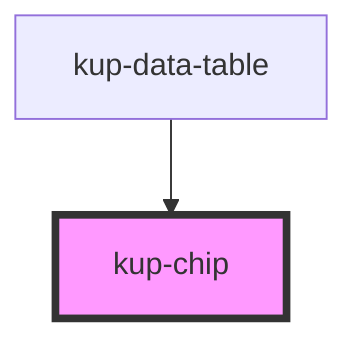

# kup-chip

<!-- Auto Generated Below -->

## Properties

| Property   | Attribute  | Description | Type      | Default |
| ---------- | ---------- | ----------- | --------- | ------- |
| `closable` | `closable` |             | `boolean` | `false` |
| `disabled` | `disabled` |             | `boolean` | `false` |

## Events

| Event   | Description | Type               |
| ------- | ----------- | ------------------ |
| `close` |             | `CustomEvent<any>` |

## CSS Custom Properties

| Name                                                                    | Description                                |
| ----------------------------------------------------------------------- | ------------------------------------------ |
| `--chi_background, --kup-chip_background`                               | Background color                           |
| `--chi_background-hover, --kup-chip_background-hover`                   | Background color on mouse hover            |
| `--chi_color, --kup-chip_color`                                         | Text color                                 |
| `--chi_disabled-background-color, --kup-chip_disabled-background-color` | Background color when the chip is disabled |
| `--chi_disabled-color, --kup-chip_disabled-color`                       | Text color when the chip is disabled       |
| `--chi_icon-color, --kup-chip_icon-color`                               | Icon color                                 |
| `--chi_icon-color-hover, --kup-chip_icon-color-hover`                   | Icon color on mouse hover                  |

## Dependencies

### Used by

 - [kup-data-table](..\kup-data-table)

### Graph

----------------------------------------------

*Built with [StencilJS](https://stenciljs.com/)*
