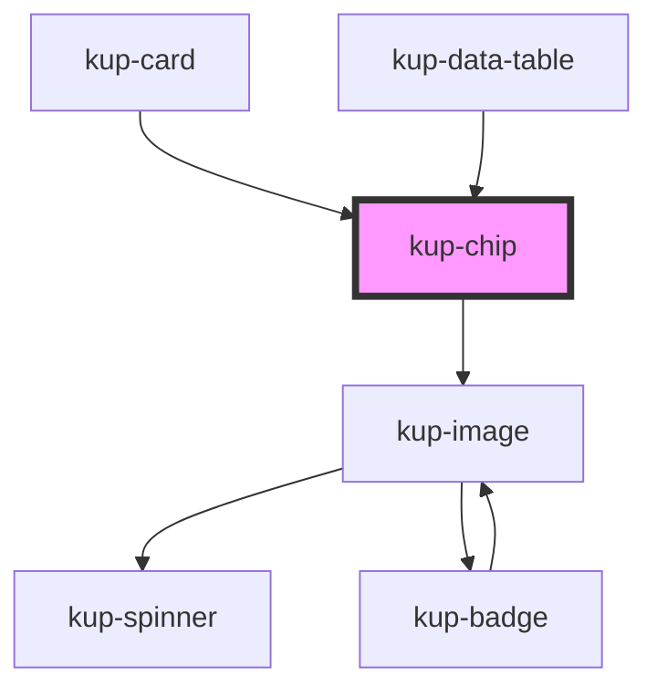

# kup-chip

<!-- Auto Generated Below -->

## Properties

| Property      | Attribute      | Description                                                                                                     | Type                     | Default     |
| ------------- | -------------- | --------------------------------------------------------------------------------------------------------------- | ------------------------ | ----------- |
| `customStyle` | `custom-style` | Custom style of the component. For more information: https://ketchup.smeup.com/ketchup-showcase/#/customization | `string`                 | `undefined` |
| `data`        | --             | List of elements.                                                                                               | `ComponentChipElement[]` | `[]`        |
| `type`        | `type`         | The type of chip. Available types: input, filter, choice or empty for default.                                  | `string`                 | `undefined` |

## Events

| Event              | Description | Type                                                         |
| ------------------ | ----------- | ------------------------------------------------------------ |
| `kupChipBlur`      |             | `CustomEvent<{ id: string; index: number; value: string; }>` |
| `kupChipClick`     |             | `CustomEvent<{ id: string; index: number; value: string; }>` |
| `kupChipFocus`     |             | `CustomEvent<{ id: string; index: number; value: string; }>` |
| `kupChipIconClick` |             | `CustomEvent<{ id: string; index: number; value: string; }>` |

## Methods

### `refreshCustomStyle(customStyleTheme: string) => Promise<void>`

#### Returns

Type: `Promise<void>`

## Dependencies

### Used by

 - [kup-card](../kup-card)
 - [kup-data-table](../kup-data-table)

### Depends on

- [kup-image](../kup-image)

### Graph

----------------------------------------------

*Built with [StencilJS](https://stenciljs.com/)*
