# kup-chip

<!-- Auto Generated Below -->

## Properties

| Property      | Attribute      | Description                                                                                                                            | Type                                                                                                                                                                | Default                        |
| ------------- | -------------- | -------------------------------------------------------------------------------------------------------------------------------------- | ------------------------------------------------------------------------------------------------------------------------------------------------------------------- | ------------------------------ |
| `customStyle` | `custom-style` | Custom style of the component.                                                                                                         | `string`                                                                                                                                                            | `''`                           |
| `data`        | --             | List of elements.                                                                                                                      | `KupChipNode[]`                                                                                                                                                     | `[]`                           |
| `disabled`    | `disabled`     | When true, the chip cannot be edited, nor removed.                                                                                     | `boolean`                                                                                                                                                           | `false`                        |
| `displayMode` | `display-mode` | When enabled, the chip's text will display both the id and description.                                                                | `ItemsDisplayMode.CODE \| ItemsDisplayMode.CODE_AND_DESC \| ItemsDisplayMode.CODE_AND_DESC_ALIAS \| ItemsDisplayMode.DESCRIPTION \| ItemsDisplayMode.DESC_AND_CODE` | `ItemsDisplayMode.DESCRIPTION` |
| `enableInput` | `enable-input` | When enabled, it's possible to add items to the chip's dataset through an input slot (kup-autocomplete, kup-combobox, kup-text-field). | `boolean`                                                                                                                                                           | `false`                        |
| `label`       | `label`        | When set,will be shown a label on the chips                                                                                            | `string`                                                                                                                                                            | `null`                         |
| `sizing`      | `sizing`       | Sets the size of the chip                                                                                                              | `FChipSize.MEDIUM \| FChipSize.SMALL`                                                                                                                               | `FChipSize.SMALL`              |
| `styling`     | `styling`      | Sets the style of the chip                                                                                                             | `FChipStyling.OUTLINED \| FChipStyling.RAISED`                                                                                                                      | `FChipStyling.RAISED`          |
| `type`        | `type`         | The type of chip. Available types: input, filter, choice or empty for default.                                                         | `FChipType.CHOICE \| FChipType.FILTER \| FChipType.INPUT \| FChipType.STANDARD`                                                                                     | `FChipType.STANDARD`           |

## Events

| Event                | Description                                                | Type                                     |
| -------------------- | ---------------------------------------------------------- | ---------------------------------------- |
| `kup-chip-blur`      | Triggered when a chip loses focus.                         | `CustomEvent<KupChipEventPayload>`       |
| `kup-chip-change`    | Triggered when the chip dataset changes.                   | `CustomEvent<KupChipChangeEventPayload>` |
| `kup-chip-click`     | Triggered when a chip is clicked.                          | `CustomEvent<KupChipEventPayload>`       |
| `kup-chip-focus`     | Triggered when a chip gets focused.                        | `CustomEvent<KupChipEventPayload>`       |
| `kup-chip-iconclick` | Triggered when the removal icon on input chips is clicked. | `CustomEvent<KupChipEventPayload>`       |

## Methods

### `getProps(descriptions?: boolean) => Promise<GenericObject>`

Used to retrieve component's props values.

#### Parameters

| Name           | Type      | Description                                                                            |
| -------------- | --------- | -------------------------------------------------------------------------------------- |
| `descriptions` | `boolean` | - When provided and true, the result will be the list of props with their description. |

#### Returns

Type: `Promise<GenericObject>`

List of props as object, each key will be a prop.

### `refresh() => Promise<void>`

This method is used to trigger a new render of the component.

#### Returns

Type: `Promise<void>`

### `setProps(props: GenericObject) => Promise<void>`

Sets the props to the component.

#### Parameters

| Name    | Type            | Description                                                  |
| ------- | --------------- | ------------------------------------------------------------ |
| `props` | `GenericObject` | - Object containing props that will be set to the component. |

#### Returns

Type: `Promise<void>`

## CSS Custom Properties

| Name                           | Description                                                        |
| ------------------------------ | ------------------------------------------------------------------ |
| `--kup-chip-background-color`  | Sets background color of the component.                            |
| `--kup-chip-border-radius`     | Sets border radius of the chips.                                   |
| `--kup-chip-font-family`       | Sets font family of the chips.                                     |
| `--kup-chip-font-size`         | Sets font size of the chips.                                       |
| `--kup-chip-font-weight`       | Sets font weight of the chips.                                     |
| `--kup-chip-height`            | Sets height of the chips.                                          |
| `--kup-chip-indent-multiplier` | Sets the indentation multiplier for children chips.                |
| `--kup-chip-margin`            | Sets margin of the chips.                                          |
| `--kup-chip-padding`           | Sets padding of the chips.                                         |
| `--kup-chip-primary-color`     | Sets primary color of the component.                               |
| `--kup-chip-primary-color-rgb` | Sets primary color RGB values of the component (used for shaders). |
| `--kup-chip-text-color`        | Sets text color of the component.                                  |
| `--kup-chip-text-color-rgb`    | Sets text color RGB values of the component (used for shaders).    |

## Dependencies

### Used by

 - [kup-box](../kup-box)
 - [kup-card](../kup-card)
 - [kup-cell](../kup-cell)
 - [kup-data-table](../kup-data-table)
 - [kup-form](../kup-form)
 - [kup-image-list](../kup-image-list)
 - [kup-input-panel](../kup-input-panel)
 - [kup-magic-box](../kup-magic-box)
 - [kup-toolbar](../kup-toolbar)
 - [kup-tree](../kup-tree)

### Depends on

- [kup-card](../kup-card)
- [kup-dialog](../kup-dialog)
- [kup-badge](../kup-badge)

### Graph

```mermaid
graph TD;
  kup-chip --> kup-card
  kup-chip --> kup-dialog
  kup-chip --> kup-badge
  kup-card --> kup-chip
  kup-image --> kup-card
  kup-image --> kup-image
  kup-image --> kup-dialog
  kup-image --> kup-spinner
  kup-image --> kup-badge
  kup-dialog --> kup-badge
  kup-dialog --> kup-card
  kup-dialog --> kup-dialog
  kup-badge --> kup-badge
  kup-badge --> kup-card
  kup-badge --> kup-dialog
  kup-spinner --> kup-card
  kup-spinner --> kup-dialog
  kup-autocomplete --> kup-list
  kup-autocomplete --> kup-card
  kup-autocomplete --> kup-dialog
  kup-autocomplete --> kup-badge
  kup-list --> kup-list
  kup-list --> kup-radio
  kup-list --> kup-card
  kup-list --> kup-dialog
  kup-list --> kup-badge
  kup-radio --> kup-card
  kup-radio --> kup-dialog
  kup-radio --> kup-badge
  kup-text-field --> kup-card
  kup-text-field --> kup-dialog
  kup-text-field --> kup-badge
  kup-color-picker --> kup-card
  kup-color-picker --> kup-dialog
  kup-color-picker --> kup-badge
  kup-combobox --> kup-list
  kup-combobox --> kup-card
  kup-combobox --> kup-dialog
  kup-combobox --> kup-badge
  kup-date-picker --> kup-card
  kup-date-picker --> kup-dialog
  kup-date-picker --> kup-badge
  kup-file-upload --> kup-spinner
  kup-file-upload --> kup-card
  kup-file-upload --> kup-dialog
  kup-file-upload --> kup-badge
  kup-rating --> kup-card
  kup-rating --> kup-dialog
  kup-time-picker --> kup-card
  kup-time-picker --> kup-list
  kup-time-picker --> kup-dialog
  kup-time-picker --> kup-badge
  kup-image-list --> kup-chip
  kup-button-list --> kup-dropdown-button
  kup-button-list --> kup-card
  kup-button-list --> kup-dialog
  kup-button-list --> kup-badge
  kup-dropdown-button --> kup-list
  kup-dropdown-button --> kup-card
  kup-dropdown-button --> kup-dialog
  kup-dropdown-button --> kup-badge
  kup-chart --> kup-card
  kup-chart --> kup-dialog
  kup-gauge --> kup-card
  kup-gauge --> kup-dialog
  kup-progress-bar --> kup-card
  kup-progress-bar --> kup-dialog
  kup-toolbar --> kup-chip
  kup-button --> kup-card
  kup-button --> kup-dialog
  kup-button --> kup-badge
  kup-checkbox --> kup-card
  kup-checkbox --> kup-dialog
  kup-checkbox --> kup-badge
  kup-data-table --> kup-chip
  kup-switch --> kup-card
  kup-switch --> kup-dialog
  kup-form --> kup-chip
  kup-tree --> kup-chip
  kup-tab-bar --> kup-toolbar
  kup-tab-bar --> kup-list
  kup-tab-bar --> kup-card
  kup-tab-bar --> kup-dialog
  kup-tab-bar --> kup-badge
  kup-box --> kup-chip
  kup-cell --> kup-chip
  kup-input-panel --> kup-chip
  kup-magic-box --> kup-chip
  style kup-chip fill:#f9f,stroke:#333,stroke-width:4px
```

----------------------------------------------

*Built with [StencilJS](https://stenciljs.com/)*
