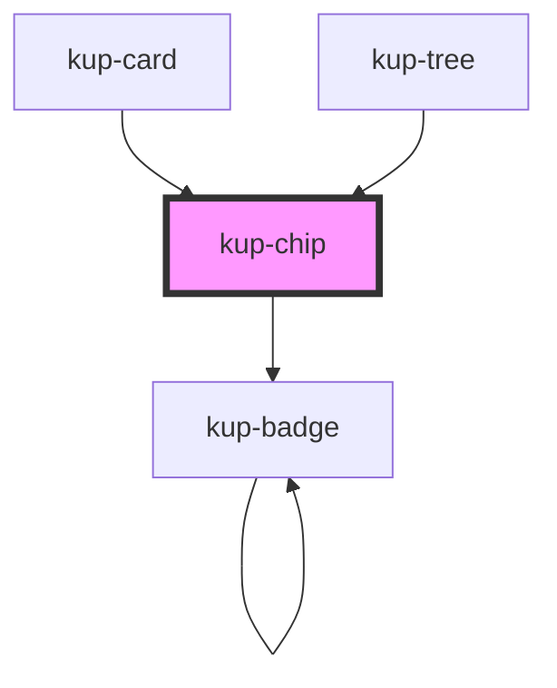

# kup-chip

<!-- Auto Generated Below -->

## Properties

| Property      | Attribute      | Description                                                                                                  | Type                                                                            | Default              |
| ------------- | -------------- | ------------------------------------------------------------------------------------------------------------ | ------------------------------------------------------------------------------- | -------------------- |
| `customStyle` | `custom-style` | Custom style of the component.                                                                               | `string`                                                                        | `''`                 |
| `data`        | --             | **[DEPRECATED]** soon to be replaced by TreeNode[]  List of elements. | `FChipData[]`                                                                   | `[]`                 |
| `dataNew`     | --             | List of elements.                                                                                            | `TreeNode[]`                                                                    | `[]`                 |
| `type`        | `type`         | The type of chip. Available types: input, filter, choice or empty for default.                               | `FChipType.CHOICE \| FChipType.FILTER \| FChipType.INPUT \| FChipType.STANDARD` | `FChipType.STANDARD` |

## Events

| Event                | Description                                                | Type                               |
| -------------------- | ---------------------------------------------------------- | ---------------------------------- |
| `kup-chip-blur`      | Triggered when a chip loses focus.                         | `CustomEvent<KupChipEventPayload>` |
| `kup-chip-click`     | Triggered when a chip is clicked.                          | `CustomEvent<KupChipEventPayload>` |
| `kup-chip-focus`     | Triggered when a chip gets focused.                        | `CustomEvent<KupChipEventPayload>` |
| `kup-chip-iconclick` | Triggered when the removal icon on input chips is clicked. | `CustomEvent<KupChipEventPayload>` |

## Methods

### `getProps(descriptions?: boolean) => Promise<GenericObject>`

Used to retrieve component's props values.

#### Returns

Type: `Promise<GenericObject>`

### `refresh() => Promise<void>`

This method is used to trigger a new render of the component.

#### Returns

Type: `Promise<void>`

### `setProps(props: GenericObject) => Promise<void>`

Sets the props to the component.

#### Returns

Type: `Promise<void>`

## Dependencies

### Used by

 - [kup-card](../kup-card)
 - [kup-tree](../kup-tree)

### Depends on

- [kup-badge](../kup-badge)

### Graph

----------------------------------------------

*Built with [StencilJS](https://stenciljs.com/)*
