# kup-chip

<!-- Auto Generated Below -->

## Properties

| Property      | Attribute      | Description                                                                    | Type                                                                            | Default              |
| ------------- | -------------- | ------------------------------------------------------------------------------ | ------------------------------------------------------------------------------- | -------------------- |
| `customStyle` | `custom-style` | Custom style of the component.                                                 | `string`                                                                        | `''`                 |
| `data`        | --             | List of elements.                                                              | `KupChipNode[]`                                                                 | `[]`                 |
| `type`        | `type`         | The type of chip. Available types: input, filter, choice or empty for default. | `FChipType.CHOICE \| FChipType.FILTER \| FChipType.INPUT \| FChipType.STANDARD` | `FChipType.STANDARD` |

## Events

| Event                | Description                                                | Type                               |
| -------------------- | ---------------------------------------------------------- | ---------------------------------- |
| `kup-chip-blur`      | Triggered when a chip loses focus.                         | `CustomEvent<KupChipEventPayload>` |
| `kup-chip-click`     | Triggered when a chip is clicked.                          | `CustomEvent<KupChipEventPayload>` |
| `kup-chip-focus`     | Triggered when a chip gets focused.                        | `CustomEvent<KupChipEventPayload>` |
| `kup-chip-iconclick` | Triggered when the removal icon on input chips is clicked. | `CustomEvent<KupChipEventPayload>` |

## Methods

### `getProps(descriptions?: boolean) => Promise<GenericObject>`

Used to retrieve component's props values.

#### Returns

Type: `Promise<GenericObject>`

List of props as object, each key will be a prop.

### `refresh() => Promise<void>`

This method is used to trigger a new render of the component.

#### Returns

Type: `Promise<void>`

### `setProps(props: GenericObject) => Promise<void>`

Sets the props to the component.

#### Returns

Type: `Promise<void>`

## CSS Custom Properties

| Name                           | Description                                                        |
| ------------------------------ | ------------------------------------------------------------------ |
| `--kup-chip-background-color`  | Sets background color of the component.                            |
| `--kup-chip-border-radius`     | Sets border radius of the chips.                                   |
| `--kup-chip-font-family`       | Sets font family of the chips.                                     |
| `--kup-chip-font-size`         | Sets font size of the chips.                                       |
| `--kup-chip-font-weight`       | Sets font weight of the chips.                                     |
| `--kup-chip-height`            | Sets height of the chips.                                          |
| `--kup-chip-indent-multiplier` | Sets the indentation multiplier for children chips.                |
| `--kup-chip-margin`            | Sets margin of the chips.                                          |
| `--kup-chip-padding`           | Sets padding of the chips.                                         |
| `--kup-chip-primary-color`     | Sets primary color of the component.                               |
| `--kup-chip-primary-color-rgb` | Sets primary color RGB values of the component (used for shaders). |
| `--kup-chip-text-color`        | Sets text color of the component.                                  |
| `--kup-chip-text-color-rgb`    | Sets text color RGB values of the component (used for shaders).    |

## Dependencies

### Used by

 - [kup-card](../kup-card)
 - [kup-magic-box](../kup-magic-box)

### Depends on

- [kup-card](../kup-card)
- [kup-badge](../kup-badge)

### Graph

```mermaid
graph TD;
  kup-chip --> kup-card
  kup-chip --> kup-badge
  kup-card --> kup-chip
  kup-badge --> kup-badge
  kup-badge --> kup-card
  kup-button --> kup-card
  kup-button --> kup-badge
  kup-list --> kup-list
  kup-list --> kup-radio
  kup-list --> kup-card
  kup-list --> kup-badge
  kup-radio --> kup-card
  kup-combobox --> kup-list
  kup-combobox --> kup-card
  kup-autocomplete --> kup-list
  kup-autocomplete --> kup-card
  kup-checkbox --> kup-card
  kup-date-picker --> kup-card
  kup-text-field --> kup-card
  kup-time-picker --> kup-card
  kup-time-picker --> kup-list
  kup-data-table --> kup-card
  kup-data-table --> kup-checkbox
  kup-data-table --> kup-tooltip
  kup-data-table --> kup-list
  kup-data-table --> kup-switch
  kup-data-table --> kup-button
  kup-data-table --> kup-combobox
  kup-data-table --> kup-badge
  kup-data-table --> kup-autocomplete
  kup-data-table --> kup-color-picker
  kup-data-table --> kup-date-picker
  kup-data-table --> kup-rating
  kup-data-table --> kup-time-picker
  kup-data-table --> kup-image
  kup-data-table --> kup-button-list
  kup-data-table --> kup-chart
  kup-data-table --> kup-gauge
  kup-data-table --> kup-progress-bar
  kup-data-table --> kup-radio
  kup-tooltip --> kup-button
  kup-tooltip --> kup-card
  kup-tooltip --> kup-box
  kup-tooltip --> kup-list
  kup-tooltip --> kup-tree
  kup-box --> kup-card
  kup-box --> kup-checkbox
  kup-box --> kup-badge
  kup-box --> kup-tooltip
  kup-box --> kup-combobox
  kup-box --> kup-text-field
  kup-box --> kup-autocomplete
  kup-box --> kup-color-picker
  kup-box --> kup-date-picker
  kup-box --> kup-rating
  kup-box --> kup-time-picker
  kup-box --> kup-image
  kup-box --> kup-button
  kup-box --> kup-button-list
  kup-box --> kup-chart
  kup-box --> kup-gauge
  kup-box --> kup-progress-bar
  kup-box --> kup-radio
  kup-color-picker --> kup-card
  kup-rating --> kup-card
  kup-image --> kup-spinner
  kup-image --> kup-card
  kup-image --> kup-badge
  kup-spinner --> kup-card
  kup-button-list --> kup-dropdown-button
  kup-button-list --> kup-card
  kup-button-list --> kup-badge
  kup-dropdown-button --> kup-list
  kup-dropdown-button --> kup-card
  kup-dropdown-button --> kup-badge
  kup-chart --> kup-card
  kup-gauge --> kup-card
  kup-progress-bar --> kup-card
  kup-tree --> kup-card
  kup-tree --> kup-tooltip
  kup-tree --> kup-list
  kup-tree --> kup-text-field
  kup-tree --> kup-autocomplete
  kup-tree --> kup-color-picker
  kup-tree --> kup-combobox
  kup-tree --> kup-date-picker
  kup-tree --> kup-rating
  kup-tree --> kup-time-picker
  kup-tree --> kup-image
  kup-tree --> kup-button
  kup-tree --> kup-button-list
  kup-tree --> kup-chart
  kup-tree --> kup-gauge
  kup-tree --> kup-progress-bar
  kup-tree --> kup-radio
  kup-tree --> kup-badge
  kup-switch --> kup-card
  kup-tab-bar --> kup-card
  kup-tab-bar --> kup-badge
  kup-magic-box --> kup-chip
  style kup-chip fill:#f9f,stroke:#333,stroke-width:4px
```

----------------------------------------------

*Built with [StencilJS](https://stenciljs.com/)*
