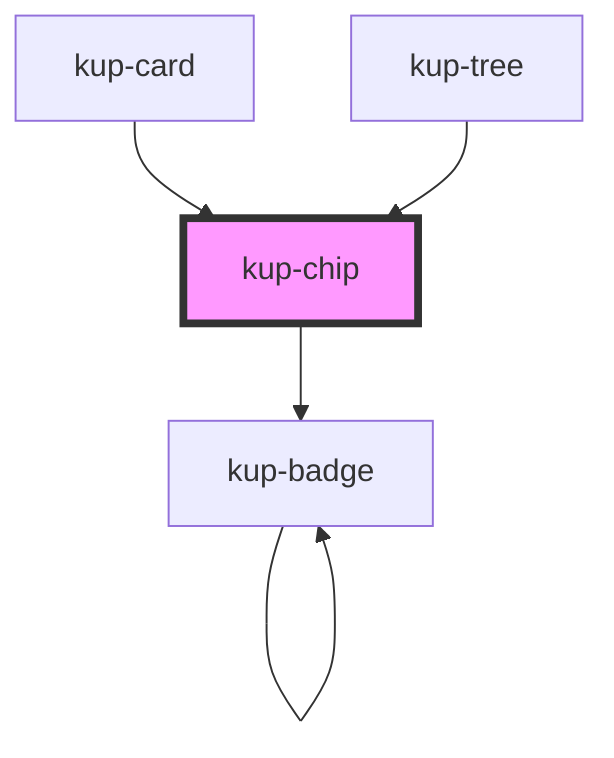

# kup-chip

<!-- Auto Generated Below -->

## Properties

| Property      | Attribute      | Description                                                                    | Type                                                                            | Default              |
| ------------- | -------------- | ------------------------------------------------------------------------------ | ------------------------------------------------------------------------------- | -------------------- |
| `customStyle` | `custom-style` | Custom style of the component.                                                 | `string`                                                                        | `''`                 |
| `data`        | --             | List of elements.                                                              | `FChipData[]`                                                                   | `[]`                 |
| `type`        | `type`         | The type of chip. Available types: input, filter, choice or empty for default. | `FChipType.CHOICE \| FChipType.FILTER \| FChipType.INPUT \| FChipType.STANDARD` | `FChipType.STANDARD` |

## Events

| Event              | Description                                                | Type                                                         |
| ------------------ | ---------------------------------------------------------- | ------------------------------------------------------------ |
| `kupChipBlur`      | Triggered when a chip loses focus.                         | `CustomEvent<{ id: string; index: number; value: string; }>` |
| `kupChipClick`     | Triggered when a chip is clicked.                          | `CustomEvent<{ id: string; index: number; value: string; }>` |
| `kupChipFocus`     | Triggered when a chip gets focused.                        | `CustomEvent<{ id: string; index: number; value: string; }>` |
| `kupChipIconClick` | Triggered when the removal icon on input chips is clicked. | `CustomEvent<{ id: string; index: number; value: string; }>` |

## Methods

### `refreshCustomStyle(customStyleTheme: string) => Promise<void>`

This method is invoked by the theme manager.
Whenever the current Ketch.UP theme changes, every component must be re-rendered with the new component-specific customStyle.

#### Returns

Type: `Promise<void>`

## Dependencies

### Used by

 - [kup-card](../kup-card)
 - [kup-tree](../kup-tree)

### Depends on

- [kup-badge](../kup-badge)

### Graph

----------------------------------------------

*Built with [StencilJS](https://stenciljs.com/)*
