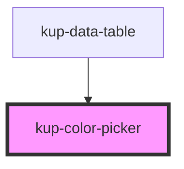

# kup-color-picker

<!-- Auto Generated Below -->

## Properties

| Property   | Attribute  | Description                                                                                                 | Type      | Default     |
| ---------- | ---------- | ----------------------------------------------------------------------------------------------------------- | --------- | ----------- |
| `disabled` | `disabled` | Defaults at false. When set to true, the component is disabled.                                             | `boolean` | `false`     |
| `value`    | `value`    | The html color, can be css color name, hex code or rgb code (sample: "red" or rgb(255, 0, 0) or "#FF0000" ) | `string`  | `undefined` |

## Dependencies

### Used by

 - [kup-data-table](../kup-data-table)

### Graph

----------------------------------------------

*Built with [StencilJS](https://stenciljs.com/)*
