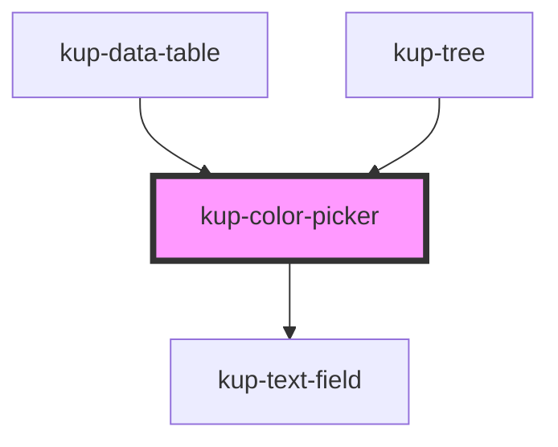

# kup-color-picker

<!-- Auto Generated Below -->

## Properties

| Property       | Attribute       | Description                                                                                                                           | Type      | Default     |
| -------------- | --------------- | ------------------------------------------------------------------------------------------------------------------------------------- | --------- | ----------- |
| `customStyle`  | `custom-style`  | Custom style of the component. For more information: https://ketchup.smeup.com/ketchup-showcase/#/customization                       | `string`  | `''`        |
| `data`         | --              | Props of the text field.                                                                                                              | `Object`  | `undefined` |
| `disabled`     | `disabled`      | Defaults at false. When set to true, the component is disabled.                                                                       | `boolean` | `false`     |
| `initialValue` | `initial-value` | Sets the initial value of the component. Can be css color name, hex code or rgb code (sample: "red" or rgb(255, 0, 0) or "#FF0000" ). | `string`  | `''`        |
| `swatchOnly`   | `swatch-only`   | When true, the component's text field will be replaced by a swatch.                                                                   | `boolean` | `false`     |

## Events

| Event                    | Description | Type                                      |
| ------------------------ | ----------- | ----------------------------------------- |
| `kup-colorpicker-change` |             | `CustomEvent<KupColorPickerEventPayload>` |
| `kup-colorpicker-input`  |             | `CustomEvent<KupColorPickerEventPayload>` |

## Methods

### `getProps(descriptions?: boolean) => Promise<GenericObject>`

Used to retrieve component's props values.

#### Returns

Type: `Promise<GenericObject>`

### `getValue() => Promise<string>`

#### Returns

Type: `Promise<string>`

### `refresh() => Promise<void>`

This method is used to trigger a new render of the component.

#### Returns

Type: `Promise<void>`

### `setFocus() => Promise<void>`

#### Returns

Type: `Promise<void>`

### `setProps(props: GenericObject) => Promise<void>`

Sets the props to the component.

#### Returns

Type: `Promise<void>`

### `setValue(value: string) => Promise<void>`

#### Returns

Type: `Promise<void>`

## Dependencies

### Used by

 - [kup-data-table](../kup-data-table)
 - [kup-tree](../kup-tree)

### Depends on

- [kup-text-field](../kup-text-field)

### Graph

----------------------------------------------

*Built with [StencilJS](https://stenciljs.com/)*
