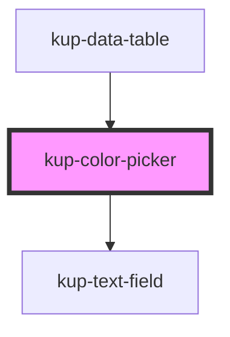

# kup-color-picker

<!-- Auto Generated Below -->

## Properties

| Property      | Attribute      | Description                                                                                                     | Type      | Default     |
| ------------- | -------------- | --------------------------------------------------------------------------------------------------------------- | --------- | ----------- |
| `customStyle` | `custom-style` | Custom style of the component. For more information: https://ketchup.smeup.com/ketchup-showcase/#/customization | `string`  | `undefined` |
| `data`        | --             | Props of the text field.                                                                                        | `{}`      | `undefined` |
| `disabled`    | `disabled`     | Defaults at false. When set to true, the component is disabled.                                                 | `boolean` | `false`     |
| `swatchOnly`  | `swatch-only`  | When true, the component's text field will be replaced by a swatch.                                             | `boolean` | `false`     |
| `value`       | `value`        | The html color, can be css color name, hex code or rgb code (sample: "red" or rgb(255, 0, 0) or "#FF0000" )     | `string`  | `undefined` |

## Events

| Event                  | Description | Type                           |
| ---------------------- | ----------- | ------------------------------ |
| `kupColorPickerChange` |             | `CustomEvent<{ value: any; }>` |

## Methods

### `refreshCustomStyle(customStyleTheme: string) => Promise<void>`

#### Returns

Type: `Promise<void>`

## Dependencies

### Used by

 - [kup-data-table](../kup-data-table)

### Depends on

- [kup-text-field](../kup-text-field)

### Graph

----------------------------------------------

*Built with [StencilJS](https://stenciljs.com/)*
