# kup-color-picker

<!-- Auto Generated Below -->

## Properties

| Property       | Attribute       | Description                                                                                                                           | Type      | Default |
| -------------- | --------------- | ------------------------------------------------------------------------------------------------------------------------------------- | --------- | ------- |
| `customStyle`  | `custom-style`  | Custom style of the component.                                                                                                        | `string`  | `''`    |
| `data`         | --              | Props of the text field.                                                                                                              | `Object`  | `null`  |
| `disabled`     | `disabled`      | Defaults at false. When set to true, the component is disabled.                                                                       | `boolean` | `false` |
| `initialValue` | `initial-value` | Sets the initial value of the component. Can be css color name, hex code or rgb code (sample: "red" or rgb(255, 0, 0) or "#FF0000" ). | `string`  | `''`    |
| `readOnly`     | `read-only`     | Sets the component to read only state, making it not editable, but interactable.                                                      | `boolean` | `false` |
| `swatchOnly`   | `swatch-only`   | When true, the component's text field will be replaced by a swatch.                                                                   | `boolean` | `false` |

## Events

| Event                    | Description | Type                                      |
| ------------------------ | ----------- | ----------------------------------------- |
| `kup-colorpicker-change` |             | `CustomEvent<KupColorPickerEventPayload>` |

## Methods

### `getProps(descriptions?: boolean) => Promise<GenericObject>`

Used to retrieve component's props values.

#### Parameters

| Name           | Type      | Description                                                                            |
| -------------- | --------- | -------------------------------------------------------------------------------------- |
| `descriptions` | `boolean` | - When provided and true, the result will be the list of props with their description. |

#### Returns

Type: `Promise<GenericObject>`

List of props as object, each key will be a prop.

### `getValue() => Promise<string>`

Retrieves the component's value.

#### Returns

Type: `Promise<string>`

Value of the component.

### `refresh() => Promise<void>`

This method is used to trigger a new render of the component.

#### Returns

Type: `Promise<void>`

### `setFocus() => Promise<void>`

Sets the focus to the component.

#### Returns

Type: `Promise<void>`

### `setProps(props: GenericObject) => Promise<void>`

Sets the props to the component.

#### Parameters

| Name    | Type            | Description                                                  |
| ------- | --------------- | ------------------------------------------------------------ |
| `props` | `GenericObject` | - Object containing props that will be set to the component. |

#### Returns

Type: `Promise<void>`

### `setValue(value: string) => Promise<void>`

Sets the component's value.

#### Parameters

| Name    | Type     | Description        |
| ------- | -------- | ------------------ |
| `value` | `string` | - Value to be set. |

#### Returns

Type: `Promise<void>`

## Dependencies

### Used by

 - [kup-box](../kup-box)
 - [kup-card](../kup-card)
 - [kup-cell](../kup-cell)
 - [kup-data-table](../kup-data-table)
 - [kup-form](../kup-form)
 - [kup-image-list](../kup-image-list)
 - [kup-input-panel](../kup-input-panel)
 - [kup-toolbar](../kup-toolbar)
 - [kup-tree](../kup-tree)

### Depends on

- [kup-card](../kup-card)
- [kup-dialog](../kup-dialog)
- [kup-badge](../kup-badge)

### Graph

```mermaid
graph TD;
  kup-color-picker --> kup-card
  kup-color-picker --> kup-dialog
  kup-color-picker --> kup-badge
  kup-card --> kup-color-picker
  kup-image --> kup-card
  kup-image --> kup-image
  kup-image --> kup-dialog
  kup-image --> kup-spinner
  kup-image --> kup-badge
  kup-dialog --> kup-badge
  kup-dialog --> kup-card
  kup-dialog --> kup-dialog
  kup-badge --> kup-badge
  kup-badge --> kup-card
  kup-badge --> kup-dialog
  kup-spinner --> kup-card
  kup-spinner --> kup-dialog
  kup-autocomplete --> kup-list
  kup-autocomplete --> kup-card
  kup-autocomplete --> kup-dialog
  kup-autocomplete --> kup-badge
  kup-list --> kup-list
  kup-list --> kup-radio
  kup-list --> kup-card
  kup-list --> kup-dialog
  kup-list --> kup-badge
  kup-radio --> kup-card
  kup-radio --> kup-dialog
  kup-radio --> kup-badge
  kup-chip --> kup-card
  kup-chip --> kup-dialog
  kup-chip --> kup-badge
  kup-text-field --> kup-card
  kup-text-field --> kup-dialog
  kup-text-field --> kup-badge
  kup-combobox --> kup-list
  kup-combobox --> kup-card
  kup-combobox --> kup-dialog
  kup-combobox --> kup-badge
  kup-date-picker --> kup-card
  kup-date-picker --> kup-dialog
  kup-date-picker --> kup-badge
  kup-file-upload --> kup-spinner
  kup-file-upload --> kup-card
  kup-file-upload --> kup-dialog
  kup-file-upload --> kup-badge
  kup-multi-select --> kup-chip
  kup-multi-select --> kup-tree
  kup-multi-select --> kup-card
  kup-multi-select --> kup-dialog
  kup-tree --> kup-color-picker
  kup-rating --> kup-card
  kup-rating --> kup-dialog
  kup-time-picker --> kup-card
  kup-time-picker --> kup-list
  kup-time-picker --> kup-dialog
  kup-time-picker --> kup-badge
  kup-button-list --> kup-dropdown-button
  kup-button-list --> kup-card
  kup-button-list --> kup-dialog
  kup-button-list --> kup-badge
  kup-dropdown-button --> kup-list
  kup-dropdown-button --> kup-card
  kup-dropdown-button --> kup-dialog
  kup-dropdown-button --> kup-badge
  kup-chart --> kup-card
  kup-chart --> kup-dialog
  kup-gauge --> kup-card
  kup-gauge --> kup-dialog
  kup-progress-bar --> kup-card
  kup-progress-bar --> kup-dialog
  kup-toolbar --> kup-color-picker
  kup-button --> kup-card
  kup-button --> kup-dialog
  kup-button --> kup-badge
  kup-checkbox --> kup-card
  kup-checkbox --> kup-dialog
  kup-checkbox --> kup-badge
  kup-data-table --> kup-color-picker
  kup-switch --> kup-card
  kup-switch --> kup-dialog
  kup-form --> kup-color-picker
  kup-tab-bar --> kup-toolbar
  kup-tab-bar --> kup-card
  kup-tab-bar --> kup-dialog
  kup-tab-bar --> kup-badge
  kup-box --> kup-color-picker
  kup-cell --> kup-color-picker
  kup-image-list --> kup-color-picker
  kup-input-panel --> kup-color-picker
  style kup-color-picker fill:#f9f,stroke:#333,stroke-width:4px
```

----------------------------------------------

*Built with [StencilJS](https://stenciljs.com/)*
