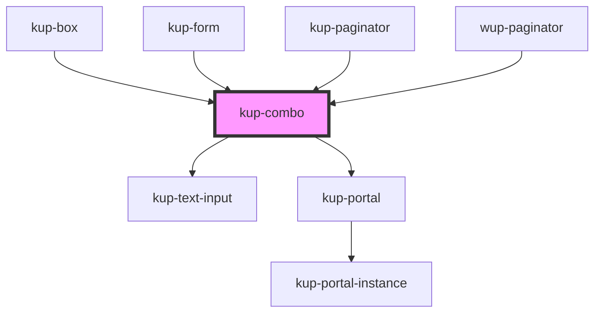

# kup-combo

<!-- Auto Generated Below -->

## Properties

| Property         | Attribute         | Description                                                                                                                                           | Type            | Default     |
| ---------------- | ----------------- | ----------------------------------------------------------------------------------------------------------------------------------------------------- | --------------- | ----------- |
| `displayedField` | `displayed-field` | Chooses which field of an item object should be used to create the list and be filtered.                                                              | `string`        | `'id'`      |
| `initialValue`   | --                | Allows to pass an initial selected item for the combobox                                                                                              | `ComboItem`     | `null`      |
| `isClearable`    | `is-clearable`    | Marks the field as clearable, allowing an icon to delete its content                                                                                  | `boolean`       | `false`     |
| `isFilterable`   | `is-filterable`   | Marks the field as filterable, allowing an input text to filter the options                                                                           | `boolean`       | `true`      |
| `items`          | --                | Items which can be selected                                                                                                                           | `ComboItem[]`   | `[]`        |
| `label`          | `label`           | Label to describe the radio group                                                                                                                     | `string`        | `''`        |
| `obj`            | --                | An arbitrary object object which can be passed to the component. It will be returned when ketchupComboSelected event is fired, inside detail.info.obj | `GenericObject` | `undefined` |
| `usePortal`      | `use-portal`      | If true, the combobox uses a Stencil portal to create the menu. Please use this feature carefully, only if needed.                                    | `boolean`       | `false`     |
| `valueField`     | `value-field`     | Chooses which field of an item object should be used to create the list and be filtered.                                                              | `string`        | `'id'`      |

## Events

| Event                  | Description                       | Type                                                     |
| ---------------------- | --------------------------------- | -------------------------------------------------------- |
| `ketchupComboBlurred`  | When combo is blurred             | `CustomEvent<KupPayloadEvent<ComboItem, GenericObject>>` |
| `ketchupComboFocused`  | When combo is focused             | `CustomEvent<KupPayloadEvent<ComboItem, GenericObject>>` |
| `ketchupComboSelected` | When an element has been selected | `CustomEvent<KupPayloadEvent<ComboItem, GenericObject>>` |

## Methods

### `closeCombo() => Promise<void>`

Programmatically close the combo box

#### Returns

Type: `Promise<void>`

### `openCombo() => Promise<void>`

Programmatically opens the combo box

#### Returns

Type: `Promise<void>`

## CSS Custom Properties

| Name                                                               | Description                                           |
| ------------------------------------------------------------------ | ----------------------------------------------------- |
| `--cmb_background-color, --kup-combo_background`                   | Specify background                                    |
| `--cmb_background-color--hover, --kup-combo_background--hover`     | Specify background on hover                           |
| `--cmb_border-color, --kup-combo_input_border-color`               | Specifies the border color                            |
| `--cmb_border-color--selected, --kup-combo_input_border-color`     | Specifies the border color when focused               |
| `--cmb_border-radius, --kup-combo_border-radius`                   | Specify border radius                                 |
| `--cmb_box-shadow, --kup-combo_box-shadow`                         | Specify menu box shadow                               |
| `--cmb_font-size, --kup-combo_input_font-size`                     | Regulates sizes of the font and the icon              |
| `--cmb_icon-color, --kup-combo_icon_color`                         | Base icon color                                       |
| `--cmb_icon-color--hover, --kup-combo_icon_color--hover`           | Icon color when hovered                               |
| `--cmb_menu-background, --kup-combo_menu_background`               | Specify menu background                               |
| `--cmb_menu-background--hover, --kup-combo_menu_background--hover` | Specify menu background on hover                      |
| `--cmb_menu-text, --kup-combo_menu_text`                           | Specify menu text color                               |
| `--cmb_menu-text--hover, --kup-combo_menu_text--hover`             | Specify menu text color on hover                      |
| `--cmb_text-color, --kup-combo_text-color`                         | Specify background                                    |
| `--cmb_text-color--hover, --kup-combo_text-color--hover`           | Specify background on hover                           |
| `--cmb_tr-duration, --kup-combo_input_transition-duration`         | Animation duration of all animations of the component |

## Dependencies

### Used by

 - [kup-box](../kup-box)
 - [kup-form](../kup-form)
 - [kup-paginator](../kup-paginator)
 - [wup-paginator](../wup-paginator)

### Depends on

- [kup-text-input](../kup-text-input)
- [kup-portal](../kup-portal)

### Graph

----------------------------------------------

*Built with [StencilJS](https://stenciljs.com/)*
