# wup-select

<!-- Auto Generated Below -->

## Properties

| Property           | Attribute             | Description                                                                                 | Type                                                                                             | Default                        |
| ------------------ | --------------------- | ------------------------------------------------------------------------------------------- | ------------------------------------------------------------------------------------------------ | ------------------------------ |
| `customStyle`      | `custom-style`        | Custom style of the component.                                                              | `string`                                                                                         | `''`                           |
| `data`             | --                    | Props of the sub-components (date input text field).                                        | `Object`                                                                                         | `undefined`                    |
| `disabled`         | `disabled`            | Defaults at false. When set to true, the component is disabled.                             | `boolean`                                                                                        | `false`                        |
| `displayMode`      | `display-mode`        | Sets how to show the selected item value. Suported values: "code", "description", "both".   | `ItemsDisplayMode.CODE \| ItemsDisplayMode.DESCRIPTION \| ItemsDisplayMode.DESCRIPTION_AND_CODE` | `ItemsDisplayMode.DESCRIPTION` |
| `initialValue`     | `initial-value`       | Sets the initial value of the component                                                     | `string`                                                                                         | `''`                           |
| `isSelect`         | `is-select`           | Lets the combobox behave as a select element.                                               | `boolean`                                                                                        | `false`                        |
| `selectMode`       | `select-mode`         | Sets how to return the selected item value. Suported values: "code", "description", "both". | `ItemsDisplayMode.CODE \| ItemsDisplayMode.DESCRIPTION \| ItemsDisplayMode.DESCRIPTION_AND_CODE` | `ItemsDisplayMode.CODE`        |
| `showDropDownIcon` | `show-drop-down-icon` | When true shows the drop-down icon, for open list.                                          | `boolean`                                                                                        | `true`                         |

## Events

| Event                    | Description | Type                                            |
| ------------------------ | ----------- | ----------------------------------------------- |
| `kup-combobox-blur`      |             | `CustomEvent<KupComboboxEventPayload>`          |
| `kup-combobox-change`    |             | `CustomEvent<KupComboboxEventPayload>`          |
| `kup-combobox-click`     |             | `CustomEvent<KupComboboxEventPayload>`          |
| `kup-combobox-focus`     |             | `CustomEvent<KupComboboxEventPayload>`          |
| `kup-combobox-iconclick` |             | `CustomEvent<KupComboboxIconClickEventPayload>` |
| `kup-combobox-input`     |             | `CustomEvent<KupComboboxEventPayload>`          |
| `kup-combobox-itemclick` |             | `CustomEvent<KupComboboxEventPayload>`          |

## Methods

### `getProps(descriptions?: boolean) => Promise<GenericObject>`

Used to retrieve component's props values.

#### Returns

Type: `Promise<GenericObject>`

List of props as object, each key will be a prop.

### `getValue() => Promise<string>`

Retrieves the component's value.

#### Returns

Type: `Promise<string>`

Value of the component.

### `refresh() => Promise<void>`

This method is used to trigger a new render of the component.

#### Returns

Type: `Promise<void>`

### `setFocus() => Promise<void>`

Sets the focus to the component.

#### Returns

Type: `Promise<void>`

### `setProps(props: GenericObject) => Promise<void>`

Sets the props to the component.

#### Returns

Type: `Promise<void>`

### `setValue(value: string) => Promise<void>`

Sets the component's value.

#### Returns

Type: `Promise<void>`

## Dependencies

### Used by

 - [kup-box](../kup-box)
 - [kup-card](../kup-card)
 - [kup-cell](../kup-cell)
 - [kup-data-table](../kup-data-table)
 - [kup-form](../kup-form)
 - [kup-image-list](../kup-image-list)
 - [kup-magic-box](../kup-magic-box)
 - [kup-tree](../kup-tree)

### Depends on

- [kup-list](../kup-list)
- [kup-card](../kup-card)

### Graph

```mermaid
graph TD;
  kup-combobox --> kup-list
  kup-combobox --> kup-card
  kup-list --> kup-list
  kup-list --> kup-radio
  kup-list --> kup-card
  kup-list --> kup-badge
  kup-radio --> kup-card
  kup-card --> kup-combobox
  kup-autocomplete --> kup-list
  kup-autocomplete --> kup-card
  kup-color-picker --> kup-card
  kup-date-picker --> kup-card
  kup-rating --> kup-card
  kup-time-picker --> kup-card
  kup-time-picker --> kup-list
  kup-image --> kup-spinner
  kup-image --> kup-card
  kup-image --> kup-badge
  kup-spinner --> kup-card
  kup-badge --> kup-badge
  kup-badge --> kup-card
  kup-button --> kup-card
  kup-button --> kup-badge
  kup-button-list --> kup-dropdown-button
  kup-button-list --> kup-card
  kup-button-list --> kup-badge
  kup-dropdown-button --> kup-list
  kup-dropdown-button --> kup-card
  kup-dropdown-button --> kup-badge
  kup-chart --> kup-card
  kup-gauge --> kup-card
  kup-progress-bar --> kup-card
  kup-chip --> kup-card
  kup-chip --> kup-badge
  kup-form --> kup-combobox
  kup-checkbox --> kup-card
  kup-text-field --> kup-card
  kup-data-table --> kup-combobox
  kup-switch --> kup-card
  kup-tab-bar --> kup-card
  kup-tab-bar --> kup-badge
  kup-tree --> kup-combobox
  kup-box --> kup-combobox
  kup-cell --> kup-combobox
  kup-image-list --> kup-combobox
  kup-magic-box --> kup-combobox
  style kup-combobox fill:#f9f,stroke:#333,stroke-width:4px
```

----------------------------------------------

*Built with [StencilJS](https://stenciljs.com/)*
