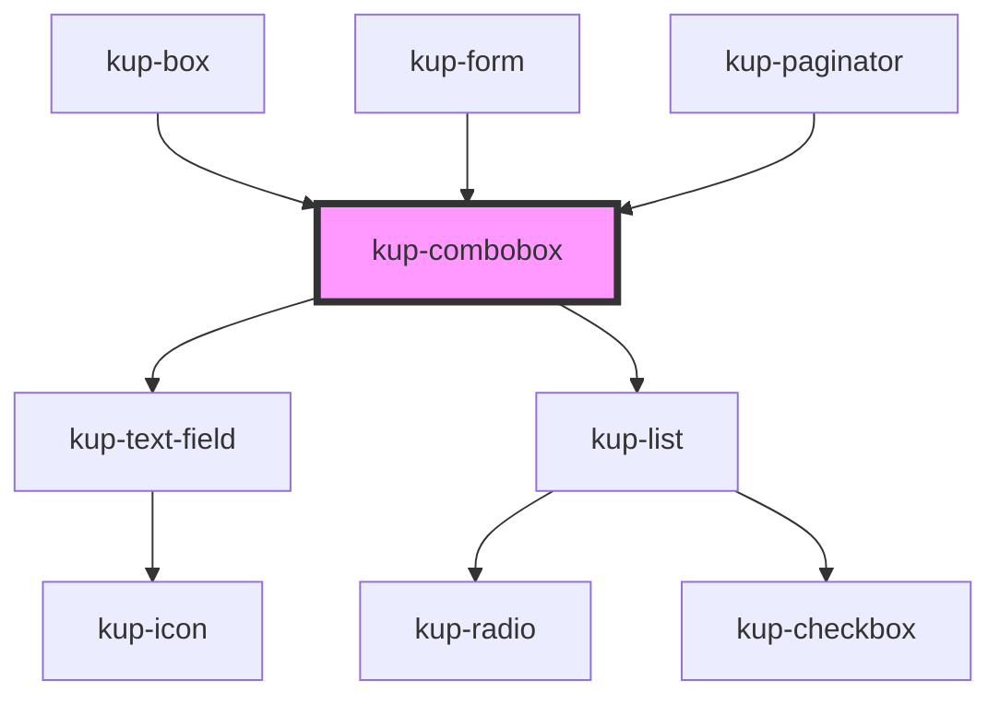

# wup-select

<!-- Auto Generated Below -->

## Properties

| Property        | Attribute      | Description                                 | Type                                                                                             | Default                 |
| --------------- | -------------- | ------------------------------------------- | ------------------------------------------------------------------------------------------------ | ----------------------- |
| `customStyle`   | `custom-style` | Custom style to be passed to the component. | `string`                                                                                         | `undefined`             |
| `listData`      | --             | Props of the list.                          | `Object`                                                                                         | `{}`                    |
| `selectMode`    | `select-mode`  | Sets how the return the selected item value | `ItemsDisplayMode.CODE \| ItemsDisplayMode.DESCRIPTION \| ItemsDisplayMode.DESCRIPTION_AND_CODE` | `ItemsDisplayMode.CODE` |
| `textfieldData` | --             | Props of the text field.                    | `Object`                                                                                         | `{}`                    |

## Events

| Event                  | Description    | Type                           |
| ---------------------- | -------------- | ------------------------------ |
| `kupComboboxBlur`      | Event example. | `CustomEvent<{ value: any; }>` |
| `kupComboboxChange`    |                | `CustomEvent<{ value: any; }>` |
| `kupComboboxClick`     |                | `CustomEvent<{ value: any; }>` |
| `kupComboboxFocus`     |                | `CustomEvent<{ value: any; }>` |
| `kupComboboxIconClick` |                | `CustomEvent<{ value: any; }>` |
| `kupComboboxInput`     |                | `CustomEvent<{ value: any; }>` |
| `kupComboboxItemClick` |                | `CustomEvent<{ value: any; }>` |

## Dependencies

### Used by

 - [kup-box](../kup-box)
 - [kup-form](../kup-form)
 - [kup-paginator](../kup-paginator)

### Depends on

- [kup-text-field](../kup-text-field)
- [kup-list](../kup-list)

### Graph

----------------------------------------------

*Built with [StencilJS](https://stenciljs.com/)*
