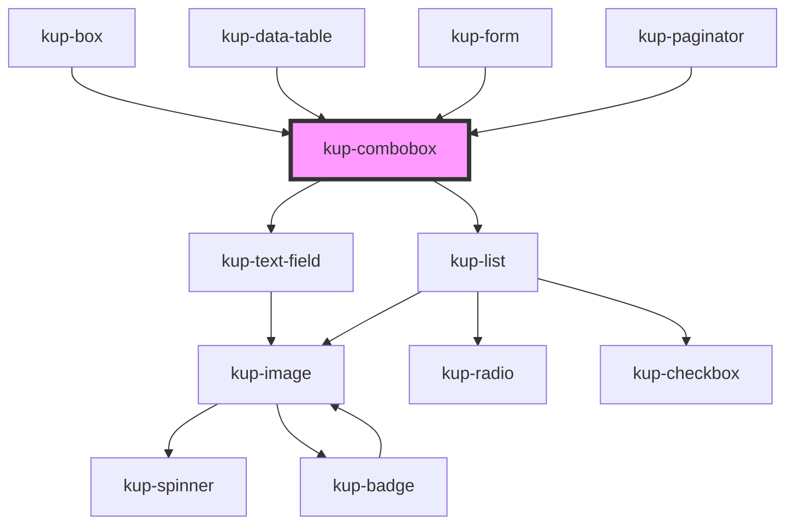

# wup-select

<!-- Auto Generated Below -->

## Properties

| Property        | Attribute      | Description                                                                                                     | Type                                                                                             | Default                        |
| --------------- | -------------- | --------------------------------------------------------------------------------------------------------------- | ------------------------------------------------------------------------------------------------ | ------------------------------ |
| `customStyle`   | `custom-style` | Custom style of the component. For more information: https://ketchup.smeup.com/ketchup-showcase/#/customization | `string`                                                                                         | `undefined`                    |
| `isSelect`      | `is-select`    | Lets the combobox behave as a select element.                                                                   | `boolean`                                                                                        | `false`                        |
| `listData`      | --             | Props of the list.                                                                                              | `Object`                                                                                         | `{}`                           |
| `selectMode`    | `select-mode`  | Sets how the return the elected item value. Suported values: "code", "description", "both".                     | `ItemsDisplayMode.CODE \| ItemsDisplayMode.DESCRIPTION \| ItemsDisplayMode.DESCRIPTION_AND_CODE` | `ItemsDisplayMode.DESCRIPTION` |
| `textfieldData` | --             | Props of the text field.                                                                                        | `Object`                                                                                         | `{}`                           |

## Events

| Event                        | Description    | Type                           |
| ---------------------------- | -------------- | ------------------------------ |
| `kupComboboxBlur`            | Event example. | `CustomEvent<{ value: any; }>` |
| `kupComboboxChange`          |                | `CustomEvent<{ value: any; }>` |
| `kupComboboxClick`           |                | `CustomEvent<{ value: any; }>` |
| `kupComboboxFocus`           |                | `CustomEvent<{ value: any; }>` |
| `kupComboboxIconClick`       |                | `CustomEvent<{ value: any; }>` |
| `kupComboboxInput`           |                | `CustomEvent<{ value: any; }>` |
| `kupComboboxItemClick`       |                | `CustomEvent<{ value: any; }>` |
| `kupComboboxTextFieldSubmit` |                | `CustomEvent<{ value: any; }>` |

## Methods

### `refreshCustomStyle(customStyleTheme: string) => Promise<void>`

#### Returns

Type: `Promise<void>`

## Dependencies

### Used by

 - [kup-box](../kup-box)
 - [kup-data-table](../kup-data-table)
 - [kup-form](../kup-form)
 - [kup-paginator](../kup-paginator)

### Depends on

- [kup-text-field](../kup-text-field)
- [kup-list](../kup-list)

### Graph

----------------------------------------------

*Built with [StencilJS](https://stenciljs.com/)*
