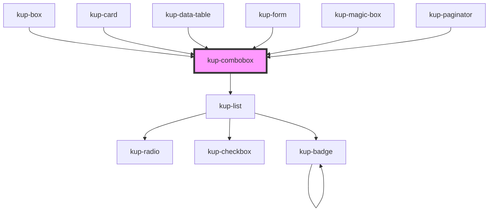

# wup-select

<!-- Auto Generated Below -->

## Properties

| Property       | Attribute       | Description                                                                                                     | Type                                                                                             | Default                        |
| -------------- | --------------- | --------------------------------------------------------------------------------------------------------------- | ------------------------------------------------------------------------------------------------ | ------------------------------ |
| `customStyle`  | `custom-style`  | Custom style of the component. For more information: https://ketchup.smeup.com/ketchup-showcase/#/customization | `string`                                                                                         | `''`                           |
| `data`         | --              | Props of the sub-components (date input text field).                                                            | `Object`                                                                                         | `undefined`                    |
| `disabled`     | `disabled`      | Defaults at false. When set to true, the component is disabled.                                                 | `boolean`                                                                                        | `false`                        |
| `displayMode`  | `display-mode`  | Sets how to show the selected item value. Suported values: "code", "description", "both".                       | `ItemsDisplayMode.CODE \| ItemsDisplayMode.DESCRIPTION \| ItemsDisplayMode.DESCRIPTION_AND_CODE` | `ItemsDisplayMode.DESCRIPTION` |
| `initialValue` | `initial-value` | Sets the initial value of the component                                                                         | `string`                                                                                         | `''`                           |
| `isSelect`     | `is-select`     | Lets the combobox behave as a select element.                                                                   | `boolean`                                                                                        | `false`                        |
| `selectMode`   | `select-mode`   | Sets how to return the selected item value. Suported values: "code", "description", "both".                     | `ItemsDisplayMode.CODE \| ItemsDisplayMode.DESCRIPTION \| ItemsDisplayMode.DESCRIPTION_AND_CODE` | `ItemsDisplayMode.CODE`        |

## Events

| Event                          | Description    | Type                                   |
| ------------------------------ | -------------- | -------------------------------------- |
| `kup-combobox-blur`            | Event example. | `CustomEvent<KupComboboxEventPayload>` |
| `kup-combobox-change`          |                | `CustomEvent<KupComboboxEventPayload>` |
| `kup-combobox-click`           |                | `CustomEvent<KupComboboxEventPayload>` |
| `kup-combobox-focus`           |                | `CustomEvent<KupComboboxEventPayload>` |
| `kup-combobox-iconclick`       |                | `CustomEvent<KupComboboxEventPayload>` |
| `kup-combobox-input`           |                | `CustomEvent<KupComboboxEventPayload>` |
| `kup-combobox-itemclick`       |                | `CustomEvent<KupComboboxEventPayload>` |
| `kup-combobox-textfieldsubmit` |                | `CustomEvent<KupComboboxEventPayload>` |

## Methods

### `getProps(descriptions?: boolean) => Promise<GenericObject>`

Used to retrieve component's props values.

#### Returns

Type: `Promise<GenericObject>`

### `getValue() => Promise<string>`

#### Returns

Type: `Promise<string>`

### `refresh() => Promise<void>`

This method is used to trigger a new render of the component.

#### Returns

Type: `Promise<void>`

### `setFocus() => Promise<void>`

#### Returns

Type: `Promise<void>`

### `setProps(props: GenericObject) => Promise<void>`

Sets the props to the component.

#### Returns

Type: `Promise<void>`

### `setValue(value: string) => Promise<void>`

#### Returns

Type: `Promise<void>`

## Dependencies

### Used by

 - [kup-box](../kup-box)
 - [kup-card](../kup-card)
 - [kup-data-table](../kup-data-table)
 - [kup-form](../kup-form)
 - [kup-magic-box](../kup-magic-box)
 - [kup-paginator](../kup-paginator)

### Depends on

- [kup-list](../kup-list)

### Graph

----------------------------------------------

*Built with [StencilJS](https://stenciljs.com/)*
