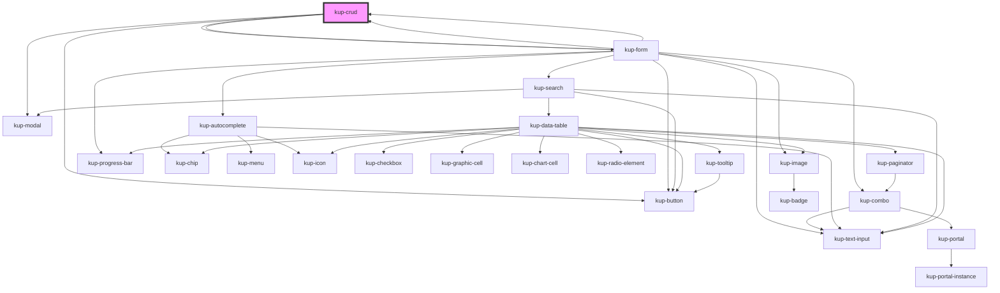

# kup-crud

Kup-crud is a web component that allows to configure a record or a set of records, in a classic CRUD style (create, read, update, delete).

## Callbacks and events

When a crud form action is submitted or a crud form field is changed you can use related callback function for your backend logic. In this way you can update directly the crud component related to that events.

You can also use kupCrudFormFieldChanged and kupCrudFormActionSubmitted events but if you have a crud inside a crud they can be sent by a crud child component. You can understand which crud component send them setting refid prop for each crud field and reading them from events.

<!-- Auto Generated Below -->

## Properties

| Property                             | Attribute  | Description | Type                                                                               | Default     |
| ------------------------------------ | ---------- | ----------- | ---------------------------------------------------------------------------------- | ----------- |
| `actions`                            | --         |             | `FormActions`                                                                      | `undefined` |
| `autocompleteCallBackOnFilterUpdate` | --         |             | `(detail: KupAutocompleteFilterUpdatePayload) => Promise<KupAutocompleteOption[]>` | `undefined` |
| `config`                             | --         |             | `CrudConfig`                                                                       | `undefined` |
| `crudCallBackOnFormActionSubmitted`  | --         |             | `(detail: FormActionEventDetail) => Promise<CrudCallBackOnFormEventResult>`        | `undefined` |
| `crudCallBackOnFormFieldChanged`     | --         |             | `(detail: FormFieldEventDetail) => Promise<CrudCallBackOnFormEventResult>`         | `undefined` |
| `disabled`                           | `disabled` |             | `boolean`                                                                          | `false`     |
| `extra`                              | `extra`    |             | `any`                                                                              | `undefined` |
| `extraMessages`                      | --         |             | `FormMessage[]`                                                                    | `[]`        |
| `fields`                             | --         |             | `FormFields`                                                                       | `undefined` |
| `records`                            | --         |             | `CrudRecord[]`                                                                     | `undefined` |
| `refid`                              | `refid`    |             | `string`                                                                           | `undefined` |
| `searchCallBackOnFilterSubmitted`    | --         |             | `(detail: SearchFilterSubmittedEventDetail) => Promise<TableData>`                 | `undefined` |
| `sections`                           | --         |             | `FormSection`                                                                      | `undefined` |

## Events

| Event                        | Description | Type                                 |
| ---------------------------- | ----------- | ------------------------------------ |
| `kupCrudBlurred`             |             | `CustomEvent<any>`                   |
| `kupCrudFocused`             |             | `CustomEvent<any>`                   |
| `kupCrudFormActionSubmitted` |             | `CustomEvent<FormActionEventDetail>` |
| `kupCrudFormFieldChanged`    |             | `CustomEvent<FormFieldEventDetail>`  |
| `kupCrudRecordsChanged`      |             | `CustomEvent<CrudRecordsChanged>`    |

## Methods

### `closeForm() => Promise<void>`

#### Returns

Type: `Promise<void>`

### `openForm() => Promise<void>`

#### Returns

Type: `Promise<void>`

## Dependencies

### Used by

 - [kup-form](../kup-form)

### Depends on

- [kup-button](../kup-button)
- [kup-modal](../kup-modal)
- [kup-form](../kup-form)
- [kup-form](../kup-form)

### Graph

----------------------------------------------

*Built with [StencilJS](https://stenciljs.com/)*
