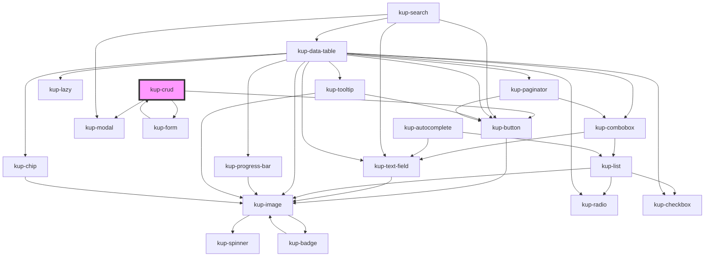

# kup-crud

<!-- Auto Generated Below -->

## Properties

| Property                             | Attribute  | Description | Type                                                                                                     | Default     |
| ------------------------------------ | ---------- | ----------- | -------------------------------------------------------------------------------------------------------- | ----------- |
| `actions`                            | --         |             | `FormActions`                                                                                            | `undefined` |
| `autocompleteCallBackOnFilterUpdate` | --         |             | `(detail: { filter: string; matchesMinimumCharsRequired: boolean; el: EventTarget; }) => Promise<any[]>` | `undefined` |
| `config`                             | --         |             | `CrudConfig`                                                                                             | `undefined` |
| `crudCallBackOnFormActionSubmitted`  | --         |             | `(detail: FormActionEventDetail) => Promise<CrudCallBackOnFormEventResult>`                              | `undefined` |
| `crudCallBackOnFormFieldChanged`     | --         |             | `(detail: FormFieldEventDetail) => Promise<CrudCallBackOnFormEventResult>`                               | `undefined` |
| `disabled`                           | `disabled` |             | `boolean`                                                                                                | `false`     |
| `extra`                              | `extra`    |             | `any`                                                                                                    | `undefined` |
| `extraMessages`                      | --         |             | `FormMessage[]`                                                                                          | `[]`        |
| `fields`                             | --         |             | `FormFields`                                                                                             | `undefined` |
| `records`                            | --         |             | `CrudRecord[]`                                                                                           | `undefined` |
| `refid`                              | `refid`    |             | `string`                                                                                                 | `undefined` |
| `searchCallBackOnFilterSubmitted`    | --         |             | `(detail: SearchFilterSubmittedEventDetail) => Promise<TableData>`                                       | `undefined` |
| `sections`                           | --         |             | `FormSection`                                                                                            | `undefined` |

## Events

| Event                        | Description | Type                                 |
| ---------------------------- | ----------- | ------------------------------------ |
| `kupCrudBlurred`             |             | `CustomEvent<any>`                   |
| `kupCrudFocused`             |             | `CustomEvent<any>`                   |
| `kupCrudFormActionSubmitted` |             | `CustomEvent<FormActionEventDetail>` |
| `kupCrudFormFieldChanged`    |             | `CustomEvent<FormFieldEventDetail>`  |
| `kupCrudRecordsChanged`      |             | `CustomEvent<CrudRecordsChanged>`    |

## Methods

### `closeForm() => Promise<void>`

#### Returns

Type: `Promise<void>`

### `openForm() => Promise<void>`

#### Returns

Type: `Promise<void>`

## Dependencies

### Used by

 - [kup-form](../kup-form)

### Depends on

- [kup-button](../kup-button)
- [kup-modal](../kup-modal)
- [kup-form](../kup-form)

### Graph

----------------------------------------------

*Built with [StencilJS](https://stenciljs.com/)*
