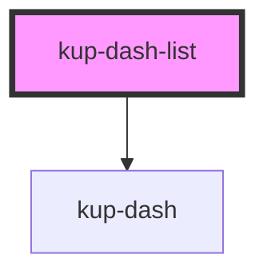

# kup-tooltip

<!-- Auto Generated Below -->

## Properties

| Property   | Attribute  | Description | Type       | Default     |
| ---------- | ---------- | ----------- | ---------- | ----------- |
| `active`   | `active`   |             | `boolean`  | `false`     |
| `data`     | --         |             | `DashData` | `undefined` |
| `fontsize` | `fontsize` |             | `string`   | `''`        |
| `layout`   | `layout`   |             | `string`   | `'1'`       |

## Events

| Event                | Description | Type              |
| -------------------- | ----------- | ----------------- |
| `ketchupDashClicked` |             | `CustomEvent<{}>` |

## Dependencies

### Depends on

- [kup-dash](../kup-dash)

### Graph

----------------------------------------------

*Built with [StencilJS](https://stenciljs.com/)*
