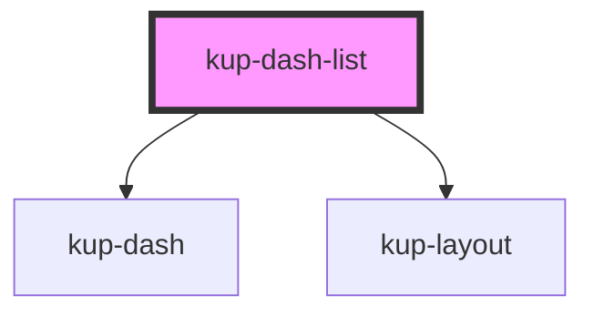

# kup-dash-list

<!-- Auto Generated Below -->

## Properties

| Property        | Attribute        | Description | Type        | Default     |
| --------------- | ---------------- | ----------- | ----------- | ----------- |
| `active`        | `active`         |             | `boolean`   | `false`     |
| `columnsNumber` | `columns-number` |             | `number`    | `1`         |
| `data`          | --               |             | `TableData` | `undefined` |
| `fillSpace`     | `fill-space`     |             | `boolean`   | `false`     |
| `fontsize`      | `fontsize`       |             | `string`    | `''`        |
| `horizontal`    | `horizontal`     |             | `boolean`   | `false`     |
| `layout`        | `layout`         |             | `string`    | `'1'`       |

## Events

| Event                | Description | Type              |
| -------------------- | ----------- | ----------------- |
| `ketchupDashClicked` |             | `CustomEvent<{}>` |

## Dependencies

### Depends on

- [kup-dash](../kup-dash)
- [kup-layout](../kup-layout)

### Graph

----------------------------------------------

*Built with [StencilJS](https://stenciljs.com/)*
