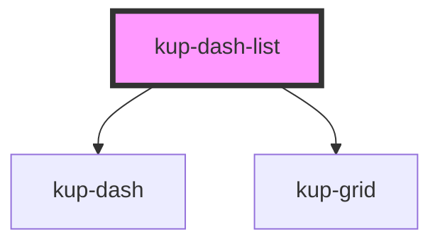

# kup-dash-list

<!-- Auto Generated Below -->

## Properties

| Property        | Attribute        | Description | Type             | Default     |
| --------------- | ---------------- | ----------- | ---------------- | ----------- |
| `active`        | `active`         |             | `boolean`        | `false`     |
| `columnsNumber` | `columns-number` |             | `number`         | `1`         |
| `data`          | --               |             | `KupDataDataset` | `undefined` |
| `fontsize`      | `fontsize`       |             | `string`         | `''`        |
| `fullWidth`     | `full-width`     |             | `boolean`        | `true`      |
| `horizontal`    | `horizontal`     |             | `boolean`        | `false`     |
| `iconColor`     | --               |             | `any[]`          | `[]`        |
| `layout`        | `layout`         |             | `string`         | `'1'`       |
| `textColor`     | --               |             | `any[]`          | `[]`        |
| `valueColor`    | --               |             | `any[]`          | `[]`        |

## Events

| Event            | Description | Type                            |
| ---------------- | ----------- | ------------------------------- |
| `kup-dash-click` |             | `CustomEvent<{ idx: number; }>` |

## Dependencies

### Depends on

- [kup-dash](../kup-dash)
- [kup-grid](../kup-grid)

### Graph

----------------------------------------------

*Built with [StencilJS](https://stenciljs.com/)*
