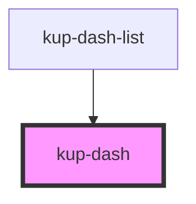

# kup-dash

<!-- Auto Generated Below -->

## Properties

| Property   | Attribute  | Description                          | Type      | Default |
| ---------- | ---------- | ------------------------------------ | --------- | ------- |
| `active`   | `active`   | The component can be clicked.        | `boolean` | `false` |
| `fontsize` | `fontsize` | Sets the font size of the component. | `string`  | `''`    |
| `index`    | `index`    | No idea what this is about.          | `number`  | `0`     |
| `layout`   | `layout`   | Sets the layout of the component.    | `string`  | `'1'`   |

## Events

| Event            | Description | Type                           |
| ---------------- | ----------- | ------------------------------ |
| `kup-dash-click` |             | `CustomEvent<{ id: number; }>` |

## Dependencies

### Used by

 - [kup-dash-list](../kup-dash-list)

### Graph

----------------------------------------------

*Built with [StencilJS](https://stenciljs.com/)*
