# kup-data-table

## About persistent header

A persistent header is when the header of the table remains positioned fixedly and is visible when a user scrolls the window until the whole table has disappeared from view.

The current implementation, based on the features of the currently used SmeUP data table component, make use of the CSS property `position: sticky;`. [Here](https://caniuse.com/#feat=css-sticky) you can see the support fot this feature.

The implementation of this feature makes use of pure CSS because its current behavior is quite simple.

More details about the component's modification to allow sticky positioning can be found inside the comments left in the component itself.

To see how to configure this behavior, check out the `header-is-persistent` property.

#### Known limitations

##### Table headers borders

Browsers tables has always been problematic. Due to how browsers implements the `sticky` feature, when applied to a `<th>` element inside a `<thead>`, the borders do not get scrolled down: they stay in their original position.

In other words, if you need to set border between header cells, your best call would be to either use the `:before` or `after` pseudo elements positioned absolutely inside each cell. Or set the border to a wrapper which is also the first children of the cell itself.

This helps you solve also other problems with `<th>` elements having a transparent border set when scrolling. A border you cannot get rid of.

##### The `sticky` behavior is relative to an element first scrollable ancestor

The `sticky` behavior gets triggered when the first ancestor element with a scrollable content gets scrolled.

If the `sticky` element would be hidden by the scroll, after having specified a threshold (top, bottom, left, right), the element gets positioned fixedly until its ancestor is fully scrolled: in that moment it stops from being fixed and disappears.

<!-- Auto Generated Below -->

## Properties

| Property                    | Attribute                      | Description                                                                                                                                                                                                                    | Type                                                                                                      | Default                              |
| --------------------------- | ------------------------------ | ------------------------------------------------------------------------------------------------------------------------------------------------------------------------------------------------------------------------------ | --------------------------------------------------------------------------------------------------------- | ------------------------------------ |
| `autoFillMissingCells`      | `auto-fill-missing-cells`      | When true and when a row is missing some columns, the missing cells will be autogenerated.                                                                                                                                     | `boolean`                                                                                                 | `false`                              |
| `customStyle`               | `custom-style`                 | Custom style of the component. For more information: https://ketchup.smeup.com/ketchup-showcase/#/customization                                                                                                                | `string`                                                                                                  | `''`                                 |
| `data`                      | --                             | The data of the table.                                                                                                                                                                                                         | `KupDataTableDataset`                                                                                     | `undefined`                          |
| `density`                   | `density`                      | The density of the rows, defaults at 'medium' and can be also set to 'large' or 'small'.                                                                                                                                       | `FCellPadding.DENSE \| FCellPadding.MEDIUM \| FCellPadding.NONE \| FCellPadding.WIDE`                     | `FCellPadding.DENSE`                 |
| `dragEnabled`               | `drag-enabled`                 | Enables drag.                                                                                                                                                                                                                  | `boolean`                                                                                                 | `false`                              |
| `dropEnabled`               | `drop-enabled`                 | Enables drop.                                                                                                                                                                                                                  | `boolean`                                                                                                 | `false`                              |
| `editableData`              | `editable-data`                | When set to true, editable cells will be rendered using input components.                                                                                                                                                      | `boolean`                                                                                                 | `false`                              |
| `emptyDataLabel`            | `empty-data-label`             | Defines the label to show when the table is empty.                                                                                                                                                                             | `string`                                                                                                  | `null`                               |
| `enableColumnsFormula`      | `enable-columns-formula`       | Enables the choice to set formulas on columns by dragging them into different columns.                                                                                                                                         | `boolean`                                                                                                 | `true`                               |
| `enableExtraColumns`        | `enable-extra-columns`         | Enables the extracolumns add buttons.                                                                                                                                                                                          | `boolean`                                                                                                 | `true`                               |
| `enableMergeColumns`        | `enable-merge-columns`         | Enables the merging of columns by dragging them into different columns.                                                                                                                                                        | `boolean`                                                                                                 | `true`                               |
| `enableSortableColumns`     | `enable-sortable-columns`      | Enables the sorting of columns by dragging them into different columns.                                                                                                                                                        | `boolean`                                                                                                 | `true`                               |
| `expandGroups`              | `expand-groups`                | Expands groups when set to true.                                                                                                                                                                                               | `boolean`                                                                                                 | `false`                              |
| `filters`                   | --                             | List of filters set by the user.                                                                                                                                                                                               | `GenericFilter`                                                                                           | `{}`                                 |
| `fixedColumns`              | `fixed-columns`                | Fixes the given number of columns so that they stay visible when horizontally scrolling the data-table. If grouping is active or the value of the prop is <= 0, this prop will have no effect. Can be combined with fixedRows. | `number`                                                                                                  | `0`                                  |
| `fixedRows`                 | `fixed-rows`                   | Fixes the given number of rows so that they stay visible when vertically scrolling the data-table. If grouping is active or the value of the prop is <= 0, this prop will have no effect. Can be combined with fixedColumns.   | `number`                                                                                                  | `0`                                  |
| `forceOneLine`              | `force-one-line`               | Forces cells with long text and a fixed column size to have an ellipsis set on their text. The reflect attribute is mandatory to allow styling.                                                                                | `boolean`                                                                                                 | `false`                              |
| `globalFilter`              | `global-filter`                | When set to true it activates the global filter.                                                                                                                                                                               | `boolean`                                                                                                 | `false`                              |
| `globalFilterValue`         | `global-filter-value`          | The value of the global filter.                                                                                                                                                                                                | `string`                                                                                                  | `''`                                 |
| `groupLabelDisplay`         | `group-label-display`          | How the label of a group must be displayed. For available values [see here]{@link GroupLabelDisplayMode}                                                                                                                       | `GroupLabelDisplayMode.BOTH \| GroupLabelDisplayMode.LABEL \| GroupLabelDisplayMode.VALUE`                | `GroupLabelDisplayMode.BOTH`         |
| `groups`                    | --                             | The list of groups.                                                                                                                                                                                                            | `GroupObject[]`                                                                                           | `[]`                                 |
| `headerIsPersistent`        | `header-is-persistent`         | When set to true the header will stick on top of the table when scrolling.                                                                                                                                                     | `boolean`                                                                                                 | `true`                               |
| `insertMode`                | `insert-mode`                  | Enables insert mode.                                                                                                                                                                                                           | `"" \| "form" \| "row"`                                                                                   | `''`                                 |
| `isFocusable`               | `is-focusable`                 | When set to true, clicked-on rows will have a visual feedback.                                                                                                                                                                 | `boolean`                                                                                                 | `false`                              |
| `lazyLoadRows`              | `lazy-load-rows`               | When set to true, extra rows will be automatically loaded once the last row enters the viewport. When groups are present, the number of rows is referred to groups and not to their content. Paginator is disabled.            | `boolean`                                                                                                 | `false`                              |
| `lineBreakCharacter`        | `line-break-character`         | Defines the placeholder character which will be replaced by a line break inside table header cells, normal or sticky.                                                                                                          | `string`                                                                                                  | `'\n'`                               |
| `loadMoreLimit`             | `load-more-limit`              | Sets a maximum limit of new records which can be required by the load more functionality.                                                                                                                                      | `number`                                                                                                  | `1000`                               |
| `loadMoreMode`              | `load-more-mode`               | Establish the modality of how many new records will be downloaded.  This property is regulated also by loadMoreStep.                                                                                                           | `LoadMoreMode.CONSTANT \| LoadMoreMode.CONSTANT_INCREMENT \| LoadMoreMode.PROGRESSIVE_THRESHOLD`          | `LoadMoreMode.PROGRESSIVE_THRESHOLD` |
| `loadMoreStep`              | `load-more-step`               | The number of records which will be requested to be downloaded when clicking on the load more button.  This property is regulated also by loadMoreMode.                                                                        | `number`                                                                                                  | `60`                                 |
| `pageSelected`              | `page-selected`                | Current selected page set on component load                                                                                                                                                                                    | `number`                                                                                                  | `-1`                                 |
| `paginatorPos`              | `paginator-pos`                | Sets the position of the paginator. Available positions: top, bottom or both.                                                                                                                                                  | `PaginatorPos.BOTH \| PaginatorPos.BOTTOM \| PaginatorPos.TOP`                                            | `PaginatorPos.TOP`                   |
| `removableColumns`          | `removable-columns`            | Sets the possibility to remove the selected column.                                                                                                                                                                            | `boolean`                                                                                                 | `false`                              |
| `resizableColumns`          | `resizable-columns`            | Gives the possibility to resize columns by dragging on their right edge.                                                                                                                                                       | `boolean`                                                                                                 | `true`                               |
| `rowActions`                | --                             | Sets the actions of the rows.                                                                                                                                                                                                  | `KupDataRowAction[]`                                                                                      | `undefined`                          |
| `rowsPerPage`               | `rows-per-page`                | Sets the number of rows per page to display.                                                                                                                                                                                   | `number`                                                                                                  | `10`                                 |
| `scrollOnHover`             | `scroll-on-hover`              | Activates the scroll on hover function.                                                                                                                                                                                        | `boolean`                                                                                                 | `false`                              |
| `selection`                 | `selection`                    | Set the type of the rows selection.                                                                                                                                                                                            | `SelectionMode.MULTIPLE \| SelectionMode.MULTIPLE_CHECKBOX \| SelectionMode.NONE \| SelectionMode.SINGLE` | `SelectionMode.SINGLE`               |
| `showCustomization`         | `show-customization`           | If set to true, displays the button to open the customization panel.                                                                                                                                                           | `boolean`                                                                                                 | `true`                               |
| `showDeleteButton`          | `show-delete-button`           | Enables the delete row button.                                                                                                                                                                                                 | `boolean`                                                                                                 | `false`                              |
| `showFilters`               | `show-filters`                 | When set to true enables the column filters.                                                                                                                                                                                   | `boolean`                                                                                                 | `false`                              |
| `showFooter`                | `show-footer`                  | When set to true shows the footer.                                                                                                                                                                                             | `boolean`                                                                                                 | `false`                              |
| `showGrid`                  | `show-grid`                    | Can be used to customize the grid view of the table.                                                                                                                                                                           | `ShowGrid.COL \| ShowGrid.COMPLETE \| ShowGrid.NONE \| ShowGrid.ROW`                                      | `ShowGrid.ROW`                       |
| `showGroups`                | `show-groups`                  | When set to true enables the column grouping.                                                                                                                                                                                  | `boolean`                                                                                                 | `false`                              |
| `showHeader`                | `show-header`                  | Enables rendering of the table header.                                                                                                                                                                                         | `boolean`                                                                                                 | `true`                               |
| `showLoadMore`              | `show-load-more`               | If set to true, displays the button to load more records.                                                                                                                                                                      | `boolean`                                                                                                 | `false`                              |
| `sort`                      | --                             | Defines the current sorting options.                                                                                                                                                                                           | `SortObject[]`                                                                                            | `[]`                                 |
| `sortEnabled`               | `sort-enabled`                 | When set to true enables the sorting of the columns by clicking on the column header.                                                                                                                                          | `boolean`                                                                                                 | `true`                               |
| `sortableColumnsMutateData` | `sortable-columns-mutate-data` | If set to true, when a column is dragged to be sorted, the component directly mutates the data.columns property and then fires the event                                                                                       | `boolean`                                                                                                 | `true`                               |
| `stateId`                   | `state-id`                     |                                                                                                                                                                                                                                | `string`                                                                                                  | `''`                                 |
| `store`                     | --                             |                                                                                                                                                                                                                                | `KupStore`                                                                                                | `undefined`                          |
| `tableHeight`               | `table-height`                 | Sets the height of the table.                                                                                                                                                                                                  | `string`                                                                                                  | `undefined`                          |
| `tableWidth`                | `table-width`                  | Sets the width of the table.                                                                                                                                                                                                   | `string`                                                                                                  | `undefined`                          |
| `totals`                    | --                             | Defines the current totals options                                                                                                                                                                                             | `TotalsMap`                                                                                               | `undefined`                          |
| `transpose`                 | `transpose`                    | Transposes the data of the data table                                                                                                                                                                                          | `boolean`                                                                                                 | `false`                              |

## Events

| Event                             | Description                                                                           | Type                                                  |
| --------------------------------- | ------------------------------------------------------------------------------------- | ----------------------------------------------------- |
| `kup-datatable-click`             | Generic click event on data table.                                                    | `CustomEvent<KupDatatableClickEventPayload>`          |
| `kup-datatable-columnmenu`        | Emitted by the column menu card when opened/closed or when a kup-card-event is fired. | `CustomEvent<KupDatatableColumnMenuEventPayload>`     |
| `kup-datatable-columnmove`        | Event fired when columns are moved (sorted).                                          | `CustomEvent<KupDatatableColumnMoveEventPayload>`     |
| `kup-datatable-columnremove`      | Event fired when columns are removed (set to hidden).                                 | `CustomEvent<KupDatatableColumnRemoveEventPayload>`   |
| `kup-datatable-contextmenu`       | Generic right click event on data table.                                              | `CustomEvent<KupDatatableClickEventPayload>`          |
| `kup-datatable-dblclick`          | Generic double click event on data table.                                             | `CustomEvent<KupDatatableClickEventPayload>`          |
| `kup-datatable-delete-row`        | Event fired when the delete row button is pressed.                                    | `CustomEvent<KupDatatableDeleteRowEventPayload>`      |
| `kup-datatable-didload`           | When component load is complete                                                       | `CustomEvent<KupEventPayload>`                        |
| `kup-datatable-didunload`         | When component unload is complete                                                     | `CustomEvent<KupEventPayload>`                        |
| `kup-datatable-insert-row`        | Event fired when the insert row confirm button is pressed.                            | `CustomEvent<KupDatatableInsertRowEventPayload>`      |
| `kup-datatable-loadmoreclick`     |                                                                                       | `CustomEvent<KupDatatableLoadMoreClickEventPayload>`  |
| `kup-datatable-resetselectedrows` | When rows selections reset                                                            | `CustomEvent<KupEventPayload>`                        |
| `kup-datatable-rowactionclick`    | When a row action is clicked                                                          | `CustomEvent<KupDatatableRowActionClickEventPayload>` |
| `kup-datatable-rowselected`       | When a row is selected                                                                | `CustomEvent<KupDatatableRowSelectedEventPayload>`    |

## Methods

### `closeColumnMenu() => Promise<void>`

Closes any opened column menu.

#### Returns

Type: `Promise<void>`

### `closeConfirmDeleteCard() => Promise<void>`

Closes the delete confirm card (called by backend, on success)

#### Returns

Type: `Promise<void>`

### `closeInsertCard() => Promise<void>`

Closes the insert new record card (called by backend, on success)

#### Returns

Type: `Promise<void>`

### `collapseAll() => Promise<void>`

Collapses all groups.

#### Returns

Type: `Promise<void>`

### `defaultSortingFunction(columns: KupDataColumn[], receivingColumnIndex: number, sortedColumnIndex: number, useNewObject?: boolean) => Promise<KupDataColumn[]>`

#### Returns

Type: `Promise<KupDataColumn[]>`

### `deleteRows(ids?: string[]) => Promise<Array<KupDataTableRow>>`

This method will delete rows by id from the data table dataset.

#### Returns

Type: `Promise<KupDataTableRow[]>`

Deleted rows.

### `expandAll() => Promise<void>`

Expands all groups.

#### Returns

Type: `Promise<void>`

### `getCards() => Promise<any>`

Returns cards and sub components

#### Returns

Type: `Promise<any>`

### `getInternalState() => Promise<{ groups: GroupObject[]; filters: GenericFilter; data: KupDataTableDataset; }>`

#### Returns

Type: `Promise<{ groups: GroupObject[]; filters: GenericFilter; data: KupDataTableDataset; }>`

### `getProps(descriptions?: boolean) => Promise<GenericObject>`

Used to retrieve component's props values.

#### Returns

Type: `Promise<GenericObject>`

List of props as object, each key will be a prop.

### `getSelectedRows() => Promise<Array<KupDataTableRow>>`

This method will get the selected rows of the component.

#### Returns

Type: `Promise<KupDataTableRow[]>`

### `hideColumn(column: KupDataColumn) => Promise<void>`

Hides the given column.

#### Returns

Type: `Promise<void>`

### `insertNewRow(row: KupDataTableRow) => Promise<void>`

Adds a new row to the list data

#### Returns

Type: `Promise<void>`

### `newColumn(type: KupDataNewColumnTypes, options: KupDataNewColumnOptions) => Promise<string | KupDataColumn>`

Invokes the KupData API for column creation, then refreshes the component in case no errors were catched.

#### Returns

Type: `Promise<string | KupDataColumn>`

Returns the new column created or a string containing the error message if something went wrong.

### `openColumnMenu(column: string) => Promise<void>`

Opens the column menu of the given column.

#### Returns

Type: `Promise<void>`

### `refresh(recalcRows?: boolean) => Promise<void>`

This method is used to trigger a new render of the component.

#### Returns

Type: `Promise<void>`

### `resizeCallback() => Promise<void>`

This method is invoked by KupManager whenever the component changes size.

#### Returns

Type: `Promise<void>`

### `setCellValue(columnName: string, rowId: string, value: string) => Promise<void>`

Sets the cell value in a table cell.

#### Returns

Type: `Promise<void>`

### `setFocus(column: string, rowId: string) => Promise<void>`

Sets the focus on an editable table cell.

#### Returns

Type: `Promise<void>`

### `setProps(props: GenericObject) => Promise<void>`

Sets the props to the component.

#### Returns

Type: `Promise<void>`

### `setSelectedRows(rowsIdentifiers: string[] | number[], emitEvent?: boolean) => Promise<void>`

This method will set the selected rows of the component.

#### Returns

Type: `Promise<void>`

## CSS Custom Properties

| Name                                     | Description                                                |
| ---------------------------------------- | ---------------------------------------------------------- |
| `--kup-datatable-background-color`       | Sets background color of the component.                    |
| `--kup-datatable-border`                 | Sets border of the component.                              |
| `--kup-datatable-color`                  | Sets text color of the component.                          |
| `--kup-datatable-font-family`            | Sets font family of the component.                         |
| `--kup-datatable-font-family-monospace`  | Sets monospace font family of the component (for numbers). |
| `--kup-datatable-font-size`              | Sets font size of the component.                           |
| `--kup-datatable-th-border`              | Sets border of the th elements.                            |
| `--kup-datatable-th-resize-handle-width` | Sets the width of the handle used to resize columns.       |

## Dependencies

### Used by

 - [kup-card](../kup-card)
 - [kup-magic-box](../kup-magic-box)

### Depends on

- [kup-card](../kup-card)
- [kup-list](../kup-list)
- [kup-switch](../kup-switch)
- [kup-button](../kup-button)
- [kup-spinner](../kup-spinner)
- [kup-form](../kup-form)
- [kup-image](../kup-image)
- [kup-checkbox](../kup-checkbox)
- [kup-combobox](../kup-combobox)
- [kup-badge](../kup-badge)
- [kup-autocomplete](../kup-autocomplete)
- [kup-color-picker](../kup-color-picker)
- [kup-date-picker](../kup-date-picker)
- [kup-rating](../kup-rating)
- [kup-time-picker](../kup-time-picker)
- [kup-button-list](../kup-button-list)
- [kup-chart](../kup-chart)
- [kup-gauge](../kup-gauge)
- [kup-progress-bar](../kup-progress-bar)
- [kup-radio](../kup-radio)

### Graph

```mermaid
graph TD;
  kup-data-table --> kup-card
  kup-data-table --> kup-list
  kup-data-table --> kup-switch
  kup-data-table --> kup-button
  kup-data-table --> kup-spinner
  kup-data-table --> kup-form
  kup-data-table --> kup-image
  kup-data-table --> kup-checkbox
  kup-data-table --> kup-combobox
  kup-data-table --> kup-badge
  kup-data-table --> kup-autocomplete
  kup-data-table --> kup-color-picker
  kup-data-table --> kup-date-picker
  kup-data-table --> kup-rating
  kup-data-table --> kup-time-picker
  kup-data-table --> kup-button-list
  kup-data-table --> kup-chart
  kup-data-table --> kup-gauge
  kup-data-table --> kup-progress-bar
  kup-data-table --> kup-radio
  kup-card --> kup-data-table
  kup-autocomplete --> kup-list
  kup-autocomplete --> kup-card
  kup-list --> kup-list
  kup-list --> kup-radio
  kup-list --> kup-card
  kup-list --> kup-badge
  kup-radio --> kup-card
  kup-badge --> kup-badge
  kup-badge --> kup-card
  kup-color-picker --> kup-card
  kup-combobox --> kup-list
  kup-combobox --> kup-card
  kup-date-picker --> kup-card
  kup-rating --> kup-card
  kup-time-picker --> kup-card
  kup-time-picker --> kup-list
  kup-image --> kup-spinner
  kup-image --> kup-card
  kup-image --> kup-badge
  kup-spinner --> kup-card
  kup-button --> kup-card
  kup-button --> kup-badge
  kup-button-list --> kup-dropdown-button
  kup-button-list --> kup-card
  kup-button-list --> kup-badge
  kup-dropdown-button --> kup-list
  kup-dropdown-button --> kup-card
  kup-dropdown-button --> kup-badge
  kup-chart --> kup-card
  kup-gauge --> kup-card
  kup-progress-bar --> kup-card
  kup-chip --> kup-card
  kup-chip --> kup-badge
  kup-form --> kup-card
  kup-form --> kup-autocomplete
  kup-form --> kup-color-picker
  kup-form --> kup-combobox
  kup-form --> kup-date-picker
  kup-form --> kup-rating
  kup-form --> kup-time-picker
  kup-form --> kup-image
  kup-form --> kup-button
  kup-form --> kup-button-list
  kup-form --> kup-chart
  kup-form --> kup-gauge
  kup-form --> kup-progress-bar
  kup-form --> kup-radio
  kup-form --> kup-badge
  kup-checkbox --> kup-card
  kup-text-field --> kup-card
  kup-tab-bar --> kup-card
  kup-tab-bar --> kup-badge
  kup-tree --> kup-card
  kup-tree --> kup-list
  kup-tree --> kup-text-field
  kup-tree --> kup-autocomplete
  kup-tree --> kup-color-picker
  kup-tree --> kup-combobox
  kup-tree --> kup-date-picker
  kup-tree --> kup-rating
  kup-tree --> kup-time-picker
  kup-tree --> kup-image
  kup-tree --> kup-button
  kup-tree --> kup-button-list
  kup-tree --> kup-chart
  kup-tree --> kup-gauge
  kup-tree --> kup-progress-bar
  kup-tree --> kup-radio
  kup-tree --> kup-badge
  kup-switch --> kup-card
  kup-magic-box --> kup-data-table
  style kup-data-table fill:#f9f,stroke:#333,stroke-width:4px
```

----------------------------------------------

*Built with [StencilJS](https://stenciljs.com/)*
