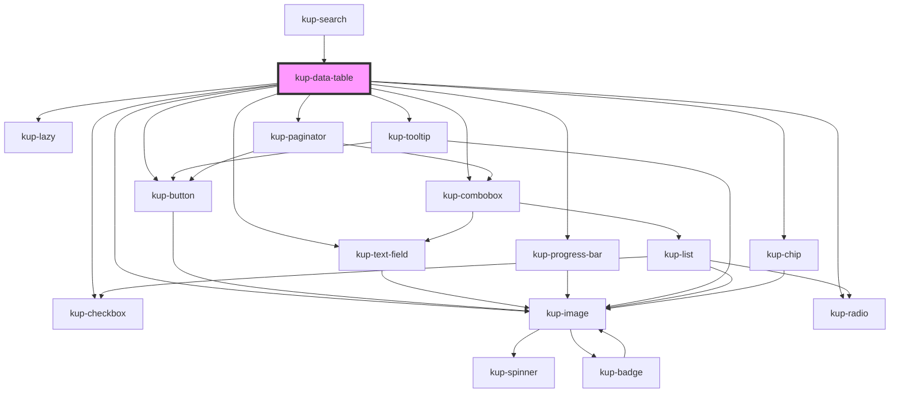

# kup-data-table

## About persistent header

A persistent header is when the header of the table remains positioned fixedly and is visible when a user scrolls the window until the whole table has disappeared from view.

The current implementation, based on the features of the currently used SmeUP data table component, make use of the CSS property `position: sticky;`. [Here](https://caniuse.com/#feat=css-sticky) you can see the support fot this feature.

The implementation of this feature makes use of pure CSS because its current behavior is quite simple.

More details about the component's modification to allow sticky positioning can be found inside the comments left in the component itself.

To see how to configure this behavior, check out the `header-is-persistent` property.

#### Known limitations

##### Table headers borders

Browsers tables has always been problematic. Due to how browsers implements the `sticky` feature, when applied to a `<th>` element inside a `<thead>`, the borders do not get scrolled down: they stay in their original position.

In other words, if you need to set border between header cells, your best call would be to either use the `:before` or `after` pseudo elements positioned absolutely inside each cell. Or set the border to a wrapper which is also the first children of the cell itself.

This helps you solve also other problems with `<th>` elements having a transparent border set when scrolling. A border you cannot get rid of.

##### The `sticky` behavior is relative to an element first scrollable ancestor

The `sticky` behavior gets triggered when the first ancestor element with a scrollable content gets scrolled.

If the `sticky` element would be hidden by the scroll, after having specified a threshold (top, bottom, left, right), the element gets positioned fixedly until its ancestor is fully scrolled: in that moment it stops from being fixed and disappears.

<!-- Auto Generated Below -->

## Properties

| Property                    | Attribute                      | Description                                                                                                                                                                                                                    | Type                                                                                             | Default                              |
| --------------------------- | ------------------------------ | ------------------------------------------------------------------------------------------------------------------------------------------------------------------------------------------------------------------------------ | ------------------------------------------------------------------------------------------------ | ------------------------------------ |
| `data`                      | --                             | The data of the table.                                                                                                                                                                                                         | `TableData`                                                                                      | `undefined`                          |
| `density`                   | `density`                      | The density of the rows, defaults at 'medium' and can be also set to 'large' or 'small'.                                                                                                                                       | `string`                                                                                         | `'dense'`                            |
| `enableSortableColumns`     | `enable-sortable-columns`      | Enables the sorting of columns by dragging them into different columns.                                                                                                                                                        | `boolean`                                                                                        | `true`                               |
| `expandGroups`              | `expand-groups`                | Expands groups when set to true.                                                                                                                                                                                               | `boolean`                                                                                        | `false`                              |
| `filters`                   | --                             | List of filters set by the user.                                                                                                                                                                                               | `GenericFilter`                                                                                  | `{}`                                 |
| `fixedColumns`              | `fixed-columns`                | Fixes the given number of columns so that they stay visible when horizontally scrolling the data-table. If grouping is active or the value of the prop is <= 0, this prop will have no effect. Can be combined with fixedRows. | `number`                                                                                         | `0`                                  |
| `fixedRows`                 | `fixed-rows`                   | Fixes the given number of rows so that they stay visible when vertically scrolling the data-table. If grouping is active or the value of the prop is <= 0, this prop will have no effect. Can be combined with fixedColumns.   | `number`                                                                                         | `0`                                  |
| `forceOneLine`              | `force-one-line`               | Forces cells with long text and a fixed column size to have an ellipsis set on their text. The reflect attribute is mandatory to allow styling.                                                                                | `boolean`                                                                                        | `false`                              |
| `globalFilter`              | `global-filter`                | When set to true it activates the global filter.                                                                                                                                                                               | `boolean`                                                                                        | `false`                              |
| `globalFilterValue`         | `global-filter-value`          | The value of the global filter.                                                                                                                                                                                                | `string`                                                                                         | `''`                                 |
| `groupLabelDisplay`         | `group-label-display`          | How the label of a group must be displayed. For available values [see here]{@link GroupLabelDisplayMode}                                                                                                                       | `GroupLabelDisplayMode.BOTH \| GroupLabelDisplayMode.LABEL \| GroupLabelDisplayMode.VALUE`       | `GroupLabelDisplayMode.BOTH`         |
| `groups`                    | --                             | The list of groups.                                                                                                                                                                                                            | `GroupObject[]`                                                                                  | `[]`                                 |
| `headerIsPersistent`        | `header-is-persistent`         | When set to true the header will stick on top of the table when scrolling.                                                                                                                                                     | `boolean`                                                                                        | `true`                               |
| `lazyLoadRows`              | `lazy-load-rows`               | When set to true, extra rows will be automatically loaded once the last row enters the viewport. When groups are present, the number of rows is referred to groups and not to their content. Paginator is disabled.            | `boolean`                                                                                        | `true`                               |
| `lineBreakCharacter`        | `line-break-character`         | Defines the placeholder character which will be replaced by a line break inside table header cells, normal or sticky.                                                                                                          | `string`                                                                                         | `'\|'`                               |
| `loadMoreLimit`             | `load-more-limit`              | Sets a maximum limit of new records which can be required by the load more functionality.                                                                                                                                      | `number`                                                                                         | `1000`                               |
| `loadMoreMode`              | `load-more-mode`               | Establish the modality of how many new records will be downloaded.  This property is regulated also by loadMoreStep.                                                                                                           | `LoadMoreMode.CONSTANT \| LoadMoreMode.CONSTANT_INCREMENT \| LoadMoreMode.PROGRESSIVE_THRESHOLD` | `LoadMoreMode.PROGRESSIVE_THRESHOLD` |
| `loadMoreStep`              | `load-more-step`               | The number of records which will be requested to be downloaded when clicking on the load more button.  This property is regulated also by loadMoreMode.                                                                        | `number`                                                                                         | `60`                                 |
| `multiSelection`            | `multi-selection`              | When set to true enables rows multi selection.                                                                                                                                                                                 | `boolean`                                                                                        | `false`                              |
| `paginatorPos`              | `paginator-pos`                | Sets the position of the paginator. Available positions: top, bottom or both.                                                                                                                                                  | `PaginatorPos.BOTH \| PaginatorPos.BOTTOM \| PaginatorPos.TOP`                                   | `PaginatorPos.TOP`                   |
| `rowActions`                | --                             | Sets the actions of the rows.                                                                                                                                                                                                  | `RowAction[]`                                                                                    | `undefined`                          |
| `rowsPerPage`               | `rows-per-page`                | Sets the number of rows per page to display.                                                                                                                                                                                   | `number`                                                                                         | `10`                                 |
| `selectRow`                 | `select-row`                   | Selects the specified row.                                                                                                                                                                                                     | `number`                                                                                         | `undefined`                          |
| `showFilters`               | `show-filters`                 | When set to true enables the column filters.                                                                                                                                                                                   | `boolean`                                                                                        | `false`                              |
| `showGrid`                  | `show-grid`                    | Can be used to customize the grid view of the table.                                                                                                                                                                           | `ShowGrid.COL \| ShowGrid.COMPLETE \| ShowGrid.NONE \| ShowGrid.ROW`                             | `ShowGrid.ROW`                       |
| `showHeader`                | `show-header`                  | Enables rendering of the table header.                                                                                                                                                                                         | `boolean`                                                                                        | `true`                               |
| `showLoadMore`              | `show-load-more`               | If set to true, displays the button to load more records.                                                                                                                                                                      | `boolean`                                                                                        | `false`                              |
| `sort`                      | --                             | Defines the current sorting options.                                                                                                                                                                                           | `SortObject[]`                                                                                   | `[]`                                 |
| `sortEnabled`               | `sort-enabled`                 | When set to true enables the sorting of the columns.                                                                                                                                                                           | `boolean`                                                                                        | `true`                               |
| `sortableColumnsMutateData` | `sortable-columns-mutate-data` | If set to true, when a column is dragged to be sorted, the component directly mutates the data.columns property and then fires the event                                                                                       | `boolean`                                                                                        | `true`                               |
| `stateId`                   | `state-id`                     |                                                                                                                                                                                                                                | `string`                                                                                         | `''`                                 |
| `store`                     | --                             |                                                                                                                                                                                                                                | `KupStore`                                                                                       | `undefined`                          |
| `tableHeight`               | `table-height`                 | Sets the height of the table.                                                                                                                                                                                                  | `string`                                                                                         | `undefined`                          |
| `tableWidth`                | `table-width`                  | Sets the width of the table.                                                                                                                                                                                                   | `string`                                                                                         | `undefined`                          |
| `tooltipDetailTimeout`      | `tooltip-detail-timeout`       | Defines the timout for tooltip detail                                                                                                                                                                                          | `number`                                                                                         | `undefined`                          |
| `tooltipLoadTimeout`        | `tooltip-load-timeout`         | Defines the timout for tooltip load                                                                                                                                                                                            | `number`                                                                                         | `undefined`                          |
| `totals`                    | --                             | Defines the current totals options.                                                                                                                                                                                            | `TotalsMap`                                                                                      | `undefined`                          |

## Events

| Event                      | Description                                    | Type                                                                                                          |
| -------------------------- | ---------------------------------------------- | ------------------------------------------------------------------------------------------------------------- |
| `kupAddColumn`             | When 'add column' menu item is clicked         | `CustomEvent<{ column: string; }>`                                                                            |
| `kupAutoRowSelect`         | When a row is auto selected via selectRow prop | `CustomEvent<{ selectedRow: Row; }>`                                                                          |
| `kupCellButtonClicked`     |                                                | `CustomEvent<KupDataTableCellButtonClick>`                                                                    |
| `kupDataTableSortedColumn` |                                                | `CustomEvent<KupDataTableSortedColumnIndexes>`                                                                |
| `kupDetailRequest`         | When a tooltip request detail data             | `CustomEvent<{ cell: Cell; tooltip: EventTarget; }>`                                                          |
| `kupLoadMoreClicked`       |                                                | `CustomEvent<{ loadItems: number; }>`                                                                         |
| `kupLoadRequest`           | When a tooltip request initial data            | `CustomEvent<{ cell: Cell; tooltip: EventTarget; }>`                                                          |
| `kupOptionClicked`         | When cell option is clicked                    | `CustomEvent<{ column: string; row: Row; }>`                                                                  |
| `kupRowActionClicked`      | When a row action is clicked                   | `CustomEvent<{ type: "default" \| "variable" \| "expander"; row: Row; action?: RowAction; index?: number; }>` |
| `kupRowSelected`           | When a row is selected                         | `CustomEvent<{ selectedRows: Row[]; clickedColumn: string; }>`                                                |

## Methods

### `defaultSortingFunction(columns: Column[], receivingColumnIndex: number, sortedColumnIndex: number, useNewObject?: boolean) => Promise<Column[]>`

#### Returns

Type: `Promise<Column[]>`

### `getInternalState() => Promise<{ groups: GroupObject[]; filters: GenericFilter; data: TableData; }>`

#### Returns

Type: `Promise<{ groups: GroupObject[]; filters: GenericFilter; data: TableData; }>`

## CSS Custom Properties

| Name                                                                      | Description                                                             |
| ------------------------------------------------------------------------- | ----------------------------------------------------------------------- |
| `--dtt_background-color, --kup-data-table_background-color`               | background-color of the whole component (paginator and table).          |
| `--dtt_border-color, --kup-data-table_border-color`                       | border-color for the whole table.                                       |
| `--dtt_box-shadow, --kup-data-table_box-shadow`                           | common box-shadow used by the table.                                    |
| `--dtt_cell-image_max-height, --kup-data-table_cell-image_max-height`     | The max height images object inside cells can have                      |
| `--dtt_cell-image_min-height, --kup-data-table_cell-image_min-height`     | The minimum height images object inside cells can have                  |
| `--dtt_color, --kup-data-table_color`                                     | Text color of the column menu when hovering a header cell.              |
| `--dtt_density-box-shadow, --kup-data-table_density-box-shadow`           | Box shadow of the density combo, to match paginator's.                  |
| `--dtt_density-icon-background, --kup-data-table_density-icon-background` | Background of the density icon, to match paginator's.                   |
| `--dtt_density-icon-color, --kup-data-table_density-icon-color`           | Color of the density icon, to match paginator's.                        |
| `--dtt_drag-over--allowed, --kup-data-table_drag-over--allowed`           | the color of the cell when the drop of the drag is allowed.             |
| `--dtt_drag-over--forbidden, --kup-data-table_drag-over--forbidden`       | the color of the cell when the drop of the drag is forbidden.           |
| `--dtt_filter-background-color, --kup-data-table_filter-background-color` | Sets background color onto kup-text-field elements used to filter rows. |
| `--dtt_filter-border-color, --kup-data-table_filter-border-color`         | Sets border color onto kup-text-field elements used to filter rows.     |
| `--dtt_font-size, --kup-data-table_font-size`                             | Sets basic font size.                                                   |
| `--dtt_group-background-color, --kup-data-table_group-background-color`   | background-color when grouping elements.                                |
| `--dtt_head-background-color, --kup-data-table_head-background-color`     | Background color of the table header.                                   |
| `--dtt_hover-background-color, --kup-data-table_hover-background-color`   | background-color of a row when it's selected or hovered.                |
| `--dtt_hover-color, --kup-data-table_hover-color`                         | text color of a row when it's selected or hovered.                      |
| `--dtt_icons-color, --kup-data-table_icons-color`                         | Color of a table icon.                                                  |
| `--dtt_icons-hover-color, --kup-data-table_icons-hover-color`             | Color of a hovered icon.                                                |
| `--dtt_main-color, --kup-data-table_main-color`                           | Set text color. Has the precedence.                                     |
| `--dtt_main-color-darker, --kup-data-table_main-color`                    | Set darker text color. Has the precedence.                              |
| `--dtt_main-color-lighter, --kup-data-table_main-color`                   | Set lighter text color. Has the precedence.                             |
| `--dtt_paginator-background, --kup-data-table_paginator-background`       | Color of the paginator's background.                                    |
| `--dtt_remove-icon-color, --kup-data-table_remove-icon-color`             | Color of the remove group icon.                                         |
| `--dtt_remove-icon-color-hover, --kup-data-table_remove-icon-color-hover` | Color of the remove group icon at hover.                                |
| `--dtt_table-wrapper-height, --kup-data-table_table-wrapper-height`       | The height of the table inside the data table.                          |
| `--dtt_text-on-main-color, --kup-data-table_text-on-main-color`           | Color of the grouping chips of a column.                                |

## Dependencies

### Used by

 - [kup-search](../kup-search)

### Depends on

- [kup-checkbox](../kup-checkbox)
- [kup-button](../kup-button)
- [kup-image](../kup-image)
- [kup-text-field](../kup-text-field)
- [kup-lazy](../kup-lazy)
- [kup-progress-bar](../kup-progress-bar)
- [kup-radio](../kup-radio)
- [kup-tooltip](../kup-tooltip)
- [kup-paginator](../kup-paginator)
- [kup-combobox](../kup-combobox)
- [kup-chip](../kup-chip)

### Graph

----------------------------------------------

*Built with [StencilJS](https://stenciljs.com/)*
