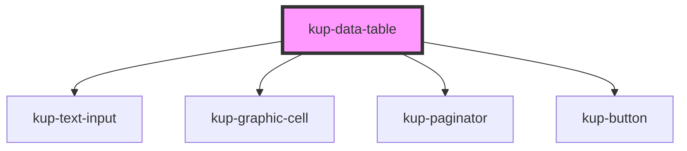

# kup-data-table

<!-- Auto Generated Below -->

## Properties

| Property         | Attribute         | Description | Type                                                                 | Default            |
| ---------------- | ----------------- | ----------- | -------------------------------------------------------------------- | ------------------ |
| `columnsWidth`   | --                |             | `{ column: string; width: number; }[]`                               | `[]`               |
| `data`           | --                |             | `{ columns?: Column[]; rows?: Row[]; }`                              | `undefined`        |
| `expandGroups`   | `expand-groups`   |             | `boolean`                                                            | `false`            |
| `filters`        | --                |             | `GenericMap`                                                         | `{}`               |
| `globalFilter`   | `global-filter`   |             | `boolean`                                                            | `false`            |
| `groups`         | --                |             | `GroupObject[]`                                                      | `[]`               |
| `multiSelection` | `multi-selection` |             | `boolean`                                                            | `false`            |
| `paginatorPos`   | `paginator-pos`   |             | `PaginatorPos.BOTH \| PaginatorPos.BOTTOM \| PaginatorPos.TOP`       | `PaginatorPos.TOP` |
| `rowActions`     | --                |             | `RowAction[]`                                                        | `undefined`        |
| `rowsPerPage`    | `rows-per-page`   |             | `number`                                                             | `10`               |
| `selectRow`      | `select-row`      |             | `number`                                                             | `undefined`        |
| `showFilters`    | `show-filters`    |             | `boolean`                                                            | `false`            |
| `showGrid`       | `show-grid`       |             | `ShowGrid.COL \| ShowGrid.COMPLETE \| ShowGrid.NONE \| ShowGrid.ROW` | `ShowGrid.NONE`    |
| `showHeader`     | `show-header`     |             | `boolean`                                                            | `true`             |
| `sort`           | --                |             | `SortObject[]`                                                       | `[]`               |
| `sortEnabled`    | `sort-enabled`    |             | `boolean`                                                            | `true`             |
| `totals`         | --                |             | `TotalsMap`                                                          | `undefined`        |

## Events

| Event                 | Description                                    | Type                                                                                                          |
| --------------------- | ---------------------------------------------- | ------------------------------------------------------------------------------------------------------------- |
| `kupAddColumn`        | When 'add column' menu item is clicked         | `CustomEvent<{ column: string; }>`                                                                            |
| `kupAutoRowSelect`    | When a row is auto selected via selectRow prop | `CustomEvent<{ selectedRow: Row; }>`                                                                          |
| `kupOptionClicked`    | When cell option is clicked                    | `CustomEvent<{ column: string; row: Row; }>`                                                                  |
| `kupRowActionClicked` | When a row action is clicked                   | `CustomEvent<{ type: "default" \| "variable" \| "expander"; row: Row; action?: RowAction; index?: number; }>` |
| `kupRowSelected`      | When a row is selected                         | `CustomEvent<{ selectedRows: Row[]; clickedColumn: string; }>`                                                |

## CSS Custom Properties

| Name                                                                    | Description                            |
| ----------------------------------------------------------------------- | -------------------------------------- |
| `--int_hover-background-color, --kup-data-table_hover-background-color` | Set background color when hover on row |
| `--int_hover-color, --kup-data-table_hover-color`                       | Set text color when hover on row       |
| `--int_stronger-color, --kup-data-table_stronger-color`                 | Set text color                         |

## Dependencies

### Depends on

- [kup-text-input](..\kup-text-input)
- [kup-graphic-cell](..\kup-graphic-cell)
- [kup-paginator](..\kup-paginator)
- [kup-button](..\kup-button)

### Graph

----------------------------------------------

*Built with [StencilJS](https://stenciljs.com/)*
