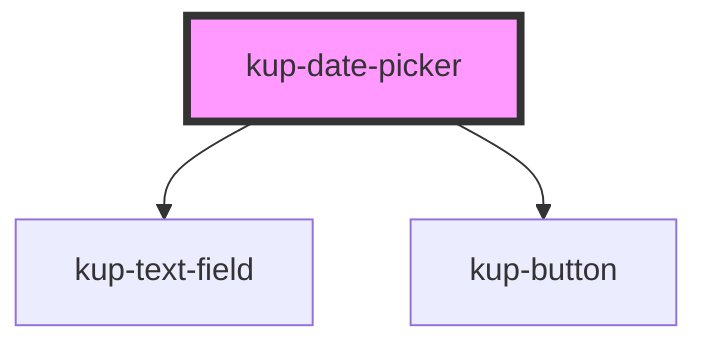

# kup-date-picker

<!-- Auto Generated Below -->

## Properties

| Property        | Attribute         | Description                                                                                                     | Type      | Default     |
| --------------- | ----------------- | --------------------------------------------------------------------------------------------------------------- | --------- | ----------- |
| `customStyle`   | `custom-style`    | Custom style of the component. For more information: https://ketchup.smeup.com/ketchup-showcase/#/customization | `string`  | `undefined` |
| `data`          | --                | Props of the sub-components (date input text field).                                                            | `Object`  | `{}`        |
| `disabled`      | `disabled`        | Defaults at false. When set to true, the component is disabled.                                                 | `boolean` | `false`     |
| `firstDayIndex` | `first-day-index` | First day number (0 - sunday, 1 - monday, ...)                                                                  | `number`  | `1`         |
| `initialValue`  | `initial-value`   | Sets the initial value of the component                                                                         | `string`  | `''`        |

## Events

| Event                          | Description | Type                                                        |
| ------------------------------ | ----------- | ----------------------------------------------------------- |
| `kupDatePickerBlur`            |             | `CustomEvent<{ value: any; source: PICKER_SOURCE_EVENT; }>` |
| `kupDatePickerChange`          |             | `CustomEvent<{ value: any; source: PICKER_SOURCE_EVENT; }>` |
| `kupDatePickerClick`           |             | `CustomEvent<{ value: any; source: PICKER_SOURCE_EVENT; }>` |
| `kupDatePickerFocus`           |             | `CustomEvent<{ value: any; source: PICKER_SOURCE_EVENT; }>` |
| `kupDatePickerIconClick`       |             | `CustomEvent<{ value: any; source: PICKER_SOURCE_EVENT; }>` |
| `kupDatePickerInput`           |             | `CustomEvent<{ value: any; source: PICKER_SOURCE_EVENT; }>` |
| `kupDatePickerItemClick`       |             | `CustomEvent<{ value: any; source: PICKER_SOURCE_EVENT; }>` |
| `kupDatePickerTextFieldSubmit` |             | `CustomEvent<{ value: any; source: PICKER_SOURCE_EVENT; }>` |

## Methods

### `getValue() => Promise<string>`

#### Returns

Type: `Promise<string>`

### `refreshCustomStyle(customStyleTheme: string) => Promise<void>`

#### Returns

Type: `Promise<void>`

### `setFocus() => Promise<void>`

#### Returns

Type: `Promise<void>`

### `setValue(value: string) => Promise<void>`

#### Returns

Type: `Promise<void>`

## Dependencies

### Depends on

- [kup-text-field](../kup-text-field)
- [kup-button](../kup-button)

### Graph

----------------------------------------------

*Built with [StencilJS](https://stenciljs.com/)*
