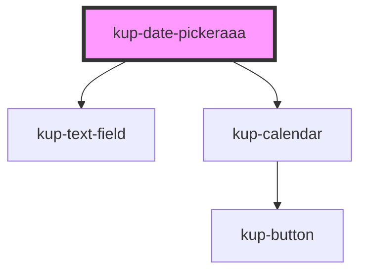

# kup-date-picker

<!-- Auto Generated Below -->

## Properties

| Property        | Attribute | Description              | Type     | Default |
| --------------- | --------- | ------------------------ | -------- | ------- |
| `textfieldData` | --        | Props of the text field. | `Object` | `{}`    |

## Events

| Event                        | Description                | Type                                                                     |
| ---------------------------- | -------------------------- | ------------------------------------------------------------------------ |
| `kupCalendarViewChanged`     | When the navigation change | `CustomEvent<{ from: Date; to: Date; }>`                                 |
| `kupDatePickerBlur`          | Event example.             | `CustomEvent<{ value: any; }>`                                           |
| `kupDatePickerChange`        |                            | `CustomEvent<{ value: any; }>`                                           |
| `kupDatePickerClick`         |                            | `CustomEvent<{ value: any; }>`                                           |
| `kupDatePickerFilterChanged` |                            | `CustomEvent<{ filter: string; matchesMinimumCharsRequired: boolean; }>` |
| `kupDatePickerFocus`         |                            | `CustomEvent<{ value: any; }>`                                           |
| `kupDatePickerIconClick`     |                            | `CustomEvent<{ value: any; }>`                                           |
| `kupDatePickerInput`         |                            | `CustomEvent<{ value: any; }>`                                           |
| `kupDatePickerItemClick`     |                            | `CustomEvent<{ value: any; }>`                                           |

## Methods

### `refreshCustomStyle(customStyleTheme: string) => Promise<void>`

#### Returns

Type: `Promise<void>`

## Dependencies

### Depends on

- [kup-text-field](../kup-text-field)
- [kup-calendar](../kup-calendar)

### Graph

----------------------------------------------

*Built with [StencilJS](https://stenciljs.com/)*
