# kup-date-picker

<!-- Auto Generated Below -->

## Properties

| Property                    | Attribute                       | Description                                                                                        | Type                                                                                                                                                    | Default                    |
| --------------------------- | ------------------------------- | -------------------------------------------------------------------------------------------------- | ------------------------------------------------------------------------------------------------------------------------------------------------------- | -------------------------- |
| `appendSelection`           | `append-selection`              | When set to true, the selected date will be appended to the current value instead of replacing it. | `boolean`                                                                                                                                               | `false`                    |
| `customStyle`               | `custom-style`                  | Custom style of the component.                                                                     | `string`                                                                                                                                                | `''`                       |
| `data`                      | --                              | Props of the sub-components.                                                                       | `Object`                                                                                                                                                | `null`                     |
| `disabled`                  | `disabled`                      | Defaults at false. When set to true, the component is disabled.                                    | `boolean`                                                                                                                                               | `false`                    |
| `error`                     | `error`                         | Set error message                                                                                  | `string`                                                                                                                                                | `''`                       |
| `firstDayIndex`             | `first-day-index`               | First day number (0 - sunday, 1 - monday, ...) TODO: manage with kupDates.locale, remove prop      | `number`                                                                                                                                                | `1`                        |
| `initialValue`              | `initial-value`                 | Sets the initial value of the component                                                            | `string`                                                                                                                                                | `''`                       |
| `legacyLook`                | `legacy-look`                   | When enabled, font will be set to monospace and sizing will be extra-small .                       | `boolean`                                                                                                                                               | `false`                    |
| `outlined`                  | `outlined`                      | When set to true, the component will be rendered as an outlined field.                             | `boolean`                                                                                                                                               | `false`                    |
| `showIcon`                  | `show-icon`                     | Sets the sizing of the textfield of the datepicker                                                 | `boolean`                                                                                                                                               | `true`                     |
| `showMarker`                | `show-marker`                   | When true shows a small marker on the component.                                                   | `boolean`                                                                                                                                               | `false`                    |
| `showPreviousNextMonthDays` | `show-previous-next-month-days` | Sets show previous/next month days in calendar                                                     | `boolean`                                                                                                                                               | `true`                     |
| `sizing`                    | `sizing`                        | Sets the sizing of the textfield of the datepicker                                                 | `KupComponentSizing.EXTRA_LARGE \| KupComponentSizing.EXTRA_SMALL \| KupComponentSizing.LARGE \| KupComponentSizing.MEDIUM \| KupComponentSizing.SMALL` | `KupComponentSizing.SMALL` |

## Events

| Event                            | Description | Type                                     |
| -------------------------------- | ----------- | ---------------------------------------- |
| `kup-datepicker-blur`            |             | `CustomEvent<KupDatePickerEventPayload>` |
| `kup-datepicker-change`          |             | `CustomEvent<KupDatePickerEventPayload>` |
| `kup-datepicker-cleariconclick`  |             | `CustomEvent<KupEventPayload>`           |
| `kup-datepicker-click`           |             | `CustomEvent<KupDatePickerEventPayload>` |
| `kup-datepicker-focus`           |             | `CustomEvent<KupDatePickerEventPayload>` |
| `kup-datepicker-iconclick`       |             | `CustomEvent<KupDatePickerEventPayload>` |
| `kup-datepicker-input`           |             | `CustomEvent<KupDatePickerEventPayload>` |
| `kup-datepicker-itemclick`       |             | `CustomEvent<KupDatePickerEventPayload>` |
| `kup-datepicker-textfieldsubmit` |             | `CustomEvent<KupDatePickerEventPayload>` |

## Methods

### `getProps(descriptions?: boolean) => Promise<GenericObject>`

Used to retrieve component's props values.

#### Parameters

| Name           | Type      | Description                                                                            |
| -------------- | --------- | -------------------------------------------------------------------------------------- |
| `descriptions` | `boolean` | - When provided and true, the result will be the list of props with their description. |

#### Returns

Type: `Promise<GenericObject>`

List of props as object, each key will be a prop.

### `getValue() => Promise<string>`

Retrieves the component's value.

#### Returns

Type: `Promise<string>`

Value of the component.

### `refresh() => Promise<void>`

This method is used to trigger a new render of the component.

#### Returns

Type: `Promise<void>`

### `setFocus() => Promise<void>`

Sets the focus to the component.

#### Returns

Type: `Promise<void>`

### `setValue(value: string) => Promise<void>`

Sets the component's value.

#### Parameters

| Name    | Type     | Description        |
| ------- | -------- | ------------------ |
| `value` | `string` | - Value to be set. |

#### Returns

Type: `Promise<void>`

## Dependencies

### Used by

 - [kup-box](../kup-box)
 - [kup-card](../kup-card)
 - [kup-cell](../kup-cell)
 - [kup-data-table](../kup-data-table)
 - [kup-form](../kup-form)
 - [kup-image-list](../kup-image-list)
 - [kup-input-panel](../kup-input-panel)
 - [kup-toolbar](../kup-toolbar)
 - [kup-tree](../kup-tree)

### Depends on

- [kup-card](../kup-card)
- [kup-dialog](../kup-dialog)
- [kup-badge](../kup-badge)

### Graph

```mermaid
graph TD;
  kup-date-picker --> kup-card
  kup-date-picker --> kup-dialog
  kup-date-picker --> kup-badge
  kup-card --> kup-date-picker
  kup-image --> kup-card
  kup-image --> kup-image
  kup-image --> kup-dialog
  kup-image --> kup-spinner
  kup-image --> kup-badge
  kup-dialog --> kup-badge
  kup-dialog --> kup-card
  kup-dialog --> kup-dialog
  kup-badge --> kup-badge
  kup-badge --> kup-card
  kup-badge --> kup-dialog
  kup-spinner --> kup-card
  kup-spinner --> kup-dialog
  kup-autocomplete --> kup-list
  kup-autocomplete --> kup-card
  kup-autocomplete --> kup-dialog
  kup-autocomplete --> kup-badge
  kup-list --> kup-list
  kup-list --> kup-radio
  kup-list --> kup-card
  kup-list --> kup-dialog
  kup-list --> kup-badge
  kup-radio --> kup-card
  kup-radio --> kup-dialog
  kup-radio --> kup-badge
  kup-chip --> kup-card
  kup-chip --> kup-dialog
  kup-chip --> kup-badge
  kup-text-field --> kup-card
  kup-text-field --> kup-dialog
  kup-text-field --> kup-badge
  kup-color-picker --> kup-card
  kup-color-picker --> kup-dialog
  kup-color-picker --> kup-badge
  kup-combobox --> kup-list
  kup-combobox --> kup-card
  kup-combobox --> kup-dialog
  kup-combobox --> kup-badge
  kup-file-upload --> kup-spinner
  kup-file-upload --> kup-card
  kup-file-upload --> kup-dialog
  kup-file-upload --> kup-badge
  kup-multi-select --> kup-chip
  kup-multi-select --> kup-tree
  kup-multi-select --> kup-card
  kup-multi-select --> kup-dialog
  kup-tree --> kup-date-picker
  kup-rating --> kup-card
  kup-rating --> kup-dialog
  kup-time-picker --> kup-card
  kup-time-picker --> kup-list
  kup-time-picker --> kup-dialog
  kup-time-picker --> kup-badge
  kup-button-list --> kup-dropdown-button
  kup-button-list --> kup-card
  kup-button-list --> kup-dialog
  kup-button-list --> kup-badge
  kup-dropdown-button --> kup-list
  kup-dropdown-button --> kup-card
  kup-dropdown-button --> kup-dialog
  kup-dropdown-button --> kup-badge
  kup-chart --> kup-card
  kup-chart --> kup-dialog
  kup-gauge --> kup-card
  kup-gauge --> kup-dialog
  kup-progress-bar --> kup-card
  kup-progress-bar --> kup-dialog
  kup-toolbar --> kup-date-picker
  kup-button --> kup-card
  kup-button --> kup-dialog
  kup-button --> kup-badge
  kup-checkbox --> kup-card
  kup-checkbox --> kup-dialog
  kup-checkbox --> kup-badge
  kup-data-table --> kup-date-picker
  kup-switch --> kup-card
  kup-switch --> kup-dialog
  kup-form --> kup-date-picker
  kup-tab-bar --> kup-toolbar
  kup-tab-bar --> kup-card
  kup-tab-bar --> kup-dialog
  kup-tab-bar --> kup-badge
  kup-box --> kup-date-picker
  kup-cell --> kup-date-picker
  kup-image-list --> kup-date-picker
  kup-input-panel --> kup-date-picker
  style kup-date-picker fill:#f9f,stroke:#333,stroke-width:4px
```

----------------------------------------------

*Built with [StencilJS](https://stenciljs.com/)*
