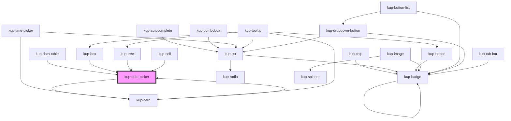

# kup-date-picker

<!-- Auto Generated Below -->

## Properties

| Property        | Attribute         | Description                                                                                   | Type      | Default |
| --------------- | ----------------- | --------------------------------------------------------------------------------------------- | --------- | ------- |
| `customStyle`   | `custom-style`    | Custom style of the component.                                                                | `string`  | `''`    |
| `data`          | --                | Props of the sub-components.                                                                  | `Object`  | `null`  |
| `disabled`      | `disabled`        | Defaults at false. When set to true, the component is disabled.                               | `boolean` | `false` |
| `firstDayIndex` | `first-day-index` | First day number (0 - sunday, 1 - monday, ...) TODO: manage with kupDates.locale, remove prop | `number`  | `1`     |
| `initialValue`  | `initial-value`   | Sets the initial value of the component                                                       | `string`  | `''`    |

## Events

| Event                            | Description | Type                                     |
| -------------------------------- | ----------- | ---------------------------------------- |
| `kup-datepicker-blur`            |             | `CustomEvent<KupDatePickerEventPayload>` |
| `kup-datepicker-change`          |             | `CustomEvent<KupDatePickerEventPayload>` |
| `kup-datepicker-cleariconclick`  |             | `CustomEvent<KupEventPayload>`           |
| `kup-datepicker-click`           |             | `CustomEvent<KupDatePickerEventPayload>` |
| `kup-datepicker-focus`           |             | `CustomEvent<KupDatePickerEventPayload>` |
| `kup-datepicker-iconclick`       |             | `CustomEvent<KupDatePickerEventPayload>` |
| `kup-datepicker-input`           |             | `CustomEvent<KupDatePickerEventPayload>` |
| `kup-datepicker-itemclick`       |             | `CustomEvent<KupDatePickerEventPayload>` |
| `kup-datepicker-textfieldsubmit` |             | `CustomEvent<KupDatePickerEventPayload>` |

## Methods

### `getProps(descriptions?: boolean) => Promise<GenericObject>`

Used to retrieve component's props values.

#### Returns

Type: `Promise<GenericObject>`

List of props as object, each key will be a prop.

### `getValue() => Promise<string>`

Retrieves the component's value.

#### Returns

Type: `Promise<string>`

Value of the component.

### `refresh() => Promise<void>`

This method is used to trigger a new render of the component.

#### Returns

Type: `Promise<void>`

### `setFocus() => Promise<void>`

Sets the focus to the component.

#### Returns

Type: `Promise<void>`

### `setValue(value: string) => Promise<void>`

Sets the component's value.

#### Returns

Type: `Promise<void>`

## Dependencies

### Used by

 - [kup-box](../kup-box)
 - [kup-card](../kup-card)
 - [kup-cell](../kup-cell)
 - [kup-data-table](../kup-data-table)
 - [kup-tree](../kup-tree)

### Depends on

- [kup-card](../kup-card)

### Graph

----------------------------------------------

*Built with [StencilJS](https://stenciljs.com/)*
