# kup-dialog

<!-- Auto Generated Below -->

## Properties

| Property      | Attribute      | Description                                                                                 | Type                  | Default                          |
| ------------- | -------------- | ------------------------------------------------------------------------------------------- | --------------------- | -------------------------------- |
| `autoCenter`  | --             | Auto centers the dialog relatively to the viewport.                                         | `KupDialogAutoCenter` | `{ onReady: true }`              |
| `customStyle` | `custom-style` | Custom style of the component.                                                              | `string`              | `''`                             |
| `header`      | --             | Header options.                                                                             | `KupDialogHeader`     | `{ icons: { close: true } }`     |
| `maxSizeX`    | `max-size-x`   | The max width of the dialog, defaults to 90dvw.                                             | `string`              | `'90dvw'`                        |
| `maxSizeY`    | `max-size-y`   | The max height of the dialog, defaults to 90dvh.                                            | `string`              | `'90dvh'`                        |
| `modal`       | --             | Set of options to display the dialog as a modal.                                            | `KupDialogModal`      | `{ closeOnBackdropClick: true }` |
| `resizable`   | `resizable`    | Sets whether the dialog is resizable or not.                                                | `boolean`             | `true`                           |
| `sizeX`       | `size-x`       | The width of the dialog, defaults to auto. Accepts any valid CSS format (px, %, vw, etc.).  | `string`              | `'auto'`                         |
| `sizeY`       | `size-y`       | The height of the dialog, defaults to auto. Accepts any valid CSS format (px, %, vh, etc.). | `string`              | `'auto'`                         |

## Events

| Event              | Description | Type                           |
| ------------------ | ----------- | ------------------------------ |
| `kup-dialog-close` |             | `CustomEvent<KupEventPayload>` |
| `kup-dialog-ready` |             | `CustomEvent<KupEventPayload>` |

## Methods

### `close() => Promise<void>`

Closes the dialog detaching it from the DOM.

#### Returns

Type: `Promise<void>`

### `getProps(descriptions?: boolean) => Promise<GenericObject>`

Used to retrieve component's props values.

#### Parameters

| Name           | Type      | Description                                                                            |
| -------------- | --------- | -------------------------------------------------------------------------------------- |
| `descriptions` | `boolean` | - When provided and true, the result will be the list of props with their description. |

#### Returns

Type: `Promise<GenericObject>`

List of props as object, each key will be a prop.

### `recalcPosition() => Promise<void>`

Places the dialog at the center of the screen.

#### Returns

Type: `Promise<void>`

### `refresh() => Promise<void>`

This method is used to trigger a new render of the component.

#### Returns

Type: `Promise<void>`

### `setProps(props: GenericObject) => Promise<void>`

Sets the props to the component.

#### Parameters

| Name    | Type            | Description                                                  |
| ------- | --------------- | ------------------------------------------------------------ |
| `props` | `GenericObject` | - Object containing props that will be set to the component. |

#### Returns

Type: `Promise<void>`

## CSS Custom Properties

| Name                         | Description                        |
| ---------------------------- | ---------------------------------- |
| `--kup-dialog-header-height` | Sets the height of the header bar. |

## Dependencies

### Used by

 - [kup-accordion](../kup-accordion)
 - [kup-activity-timeline](../kup-activity-timeline)
 - [kup-autocomplete](../kup-autocomplete)
 - [kup-badge](../kup-badge)
 - [kup-box](../kup-box)
 - [kup-button](../kup-button)
 - [kup-button-list](../kup-button-list)
 - [kup-calendar](../kup-calendar)
 - [kup-card](../kup-card)
 - [kup-card-list](../kup-card-list)
 - [kup-cell](../kup-cell)
 - [kup-chart](../kup-chart)
 - [kup-checkbox](../kup-checkbox)
 - [kup-chip](../kup-chip)
 - [kup-color-picker](../kup-color-picker)
 - [kup-combobox](../kup-combobox)
 - [kup-dashboard](../kup-dashboard)
 - [kup-data-table](../kup-data-table)
 - [kup-date-picker](../kup-date-picker)
 - [kup-dialog](.)
 - [kup-drawer](../kup-drawer)
 - [kup-dropdown-button](../kup-dropdown-button)
 - [kup-echart](../kup-echart)
 - [kup-editor](../kup-editor)
 - [kup-family-tree](../kup-family-tree)
 - [kup-form](../kup-form)
 - [kup-gauge](../kup-gauge)
 - [kup-grid](../kup-grid)
 - [kup-htm](../kup-htm)
 - [kup-iframe](../kup-iframe)
 - [kup-image](../kup-image)
 - [kup-image-list](../kup-image-list)
 - [kup-input-panel](../kup-input-panel)
 - [kup-lazy](../kup-lazy)
 - [kup-list](../kup-list)
 - [kup-magic-box](../kup-magic-box)
 - [kup-nav-bar](../kup-nav-bar)
 - [kup-numeric-picker](../kup-numeric-picker)
 - [kup-object-field](../kup-object-field)
 - [kup-pdf](../kup-pdf)
 - [kup-planner](../kup-planner)
 - [kup-probe](../kup-probe)
 - [kup-progress-bar](../kup-progress-bar)
 - [kup-qlik](../kup-qlik)
 - [kup-radio](../kup-radio)
 - [kup-rating](../kup-rating)
 - [kup-snackbar](../kup-snackbar)
 - [kup-spinner](../kup-spinner)
 - [kup-switch](../kup-switch)
 - [kup-tab-bar](../kup-tab-bar)
 - [kup-text-field](../kup-text-field)
 - [kup-time-picker](../kup-time-picker)
 - [kup-toolbar](../kup-toolbar)
 - [kup-tree](../kup-tree)
 - [kup-txt](../kup-txt)
 - [kup-typography](../kup-typography)
 - [kup-typography-list](../kup-typography-list)

### Depends on

- [kup-badge](../kup-badge)
- [kup-card](../kup-card)
- [kup-dialog](.)

### Graph

```mermaid
graph TD;
  kup-dialog --> kup-dialog
  kup-badge --> kup-dialog
  kup-card --> kup-dialog
  kup-autocomplete --> kup-dialog
  kup-list --> kup-dialog
  kup-radio --> kup-dialog
  kup-text-field --> kup-dialog
  kup-chip --> kup-dialog
  kup-color-picker --> kup-dialog
  kup-combobox --> kup-dialog
  kup-date-picker --> kup-dialog
  kup-rating --> kup-dialog
  kup-time-picker --> kup-dialog
  kup-image --> kup-dialog
  kup-spinner --> kup-dialog
  kup-button-list --> kup-dialog
  kup-dropdown-button --> kup-dialog
  kup-chart --> kup-dialog
  kup-gauge --> kup-dialog
  kup-progress-bar --> kup-dialog
  kup-toolbar --> kup-dialog
  kup-button --> kup-dialog
  kup-checkbox --> kup-dialog
  kup-data-table --> kup-dialog
  kup-switch --> kup-dialog
  kup-form --> kup-dialog
  kup-tab-bar --> kup-dialog
  kup-tree --> kup-dialog
  kup-accordion --> kup-dialog
  kup-activity-timeline --> kup-dialog
  kup-box --> kup-dialog
  kup-calendar --> kup-dialog
  kup-card-list --> kup-dialog
  kup-cell --> kup-dialog
  kup-dashboard --> kup-dialog
  kup-drawer --> kup-dialog
  kup-echart --> kup-dialog
  kup-editor --> kup-dialog
  kup-family-tree --> kup-dialog
  kup-grid --> kup-dialog
  kup-htm --> kup-dialog
  kup-iframe --> kup-dialog
  kup-image-list --> kup-dialog
  kup-input-panel --> kup-dialog
  kup-lazy --> kup-dialog
  kup-magic-box --> kup-dialog
  kup-nav-bar --> kup-dialog
  kup-numeric-picker --> kup-dialog
  kup-object-field --> kup-dialog
  kup-pdf --> kup-dialog
  kup-planner --> kup-dialog
  kup-probe --> kup-dialog
  kup-qlik --> kup-dialog
  kup-snackbar --> kup-dialog
  kup-txt --> kup-dialog
  kup-typography --> kup-dialog
  kup-typography-list --> kup-dialog
  style kup-dialog fill:#f9f,stroke:#333,stroke-width:4px
```

----------------------------------------------

*Built with [StencilJS](https://stenciljs.com/)*
