# kup-dialog

<!-- Auto Generated Below -->

## Properties

| Property | Attribute | Description | Type | Default |
| --- | --- | --- | --- | --- |
| `autoCenter` | -- | Auto centers the dialog relatively to the viewport. | `KupDialogAutoCenter` | `{ onReady: true }` |
| `customStyle` | `custom-style` | Custom style of the component. | `string` | `''` |
| `header` | -- | Header options. | `KupDialogHeader` | `{ icons: { close: true } }` |
| `maxSizeX` | `max-size-x` | The max width of the dialog, defaults to 90dvw. | `string` | `'90dvw'` |
| `maxSizeY` | `max-size-y` | The max height of the dialog, defaults to 90dvh. | `string` | `'90dvh'` |
| `modal` | -- | Set of options to display the dialog as a modal. | `KupDialogModal` | `{ closeOnBackdropClick: true }` |
| `resizable` | `resizable` | Sets whether the dialog is resizable or not. | `boolean` | `true` |
| `sizeX` | `size-x` | The width of the dialog, defaults to auto. Accepts any valid CSS format (px, %, vw, etc.). | `string` | `'auto'` |
| `sizeY` | `size-y` | The height of the dialog, defaults to auto. Accepts any valid CSS format (px, %, vh, etc.). | `string` | `'auto'` |

## Events

| Event              | Description | Type                           |
| ------------------ | ----------- | ------------------------------ |
| `kup-dialog-close` |             | `CustomEvent<KupEventPayload>` |
| `kup-dialog-ready` |             | `CustomEvent<KupEventPayload>` |

## Methods

### `close() => Promise<void>`

Closes the dialog detaching it from the DOM.

#### Returns

Type: `Promise<void>`

### `getProps(descriptions?: boolean) => Promise<GenericObject>`

Used to retrieve component's props values.

#### Parameters

| Name | Type | Description |
| --- | --- | --- |
| `descriptions` | `boolean` | - When provided and true, the result will be the list of props with their description. |

#### Returns

Type: `Promise<GenericObject>`

List of props as object, each key will be a prop.

### `recalcPosition() => Promise<void>`

Places the dialog at the center of the screen.

#### Returns

Type: `Promise<void>`

### `refresh() => Promise<void>`

This method is used to trigger a new render of the component.

#### Returns

Type: `Promise<void>`

### `setProps(props: GenericObject) => Promise<void>`

Sets the props to the component.

#### Parameters

| Name | Type | Description |
| --- | --- | --- |
| `props` | `GenericObject` | - Object containing props that will be set to the component. |

#### Returns

Type: `Promise<void>`

## CSS Custom Properties

| Name                         | Description                        |
| ---------------------------- | ---------------------------------- |
| `--kup-dialog-header-height` | Sets the height of the header bar. |

## Dependencies

### Used by

-   [kup-data-table](../kup-data-table)
-   [kup-image](../kup-image)

### Depends on

-   [kup-badge](../kup-badge)
-   [kup-card](../kup-card)

### Graph

```mermaid
graph TD;
  kup-dialog --> kup-dialog
  kup-badge --> kup-dialog
  kup-card --> kup-dialog
  kup-image --> kup-dialog
  kup-spinner --> kup-dialog
  kup-autocomplete --> kup-dialog
  kup-list --> kup-dialog
  kup-radio --> kup-dialog
  kup-chip --> kup-dialog
  kup-text-field --> kup-dialog
  kup-color-picker --> kup-dialog
  kup-combobox --> kup-dialog
  kup-date-picker --> kup-dialog
  kup-rating --> kup-dialog
  kup-time-picker --> kup-dialog
  kup-button-list --> kup-dialog
  kup-dropdown-button --> kup-dialog
  kup-chart --> kup-dialog
  kup-gauge --> kup-dialog
  kup-progress-bar --> kup-dialog
  kup-toolbar --> kup-dialog
  kup-button --> kup-dialog
  kup-checkbox --> kup-dialog
  kup-data-table --> kup-dialog
  kup-switch --> kup-card
  kup-form --> kup-card
  kup-form --> kup-image
  kup-form --> kup-autocomplete
  kup-form --> kup-chip
  kup-form --> kup-text-field
  kup-form --> kup-color-picker
  kup-form --> kup-combobox
  kup-form --> kup-date-picker
  kup-form --> kup-rating
  kup-form --> kup-time-picker
  kup-form --> kup-button-list
  kup-form --> kup-chart
  kup-form --> kup-gauge
  kup-form --> kup-progress-bar
  kup-form --> kup-badge
  kup-form --> kup-toolbar
  kup-tab-bar --> kup-toolbar
  kup-tab-bar --> kup-card
  kup-tab-bar --> kup-badge
  kup-tree --> kup-card
  kup-tree --> kup-list
  kup-tree --> kup-text-field
  kup-tree --> kup-image
  kup-tree --> kup-autocomplete
  kup-tree --> kup-chip
  kup-tree --> kup-color-picker
  kup-tree --> kup-combobox
  kup-tree --> kup-date-picker
  kup-tree --> kup-rating
  kup-tree --> kup-time-picker
  kup-tree --> kup-button-list
  kup-tree --> kup-chart
  kup-tree --> kup-gauge
  kup-tree --> kup-progress-bar
  kup-tree --> kup-badge
  kup-tree --> kup-toolbar
  style kup-dialog fill:#f9f,stroke:#333,stroke-width:4px
```

---

_Built with [StencilJS](https://stenciljs.com/)_
