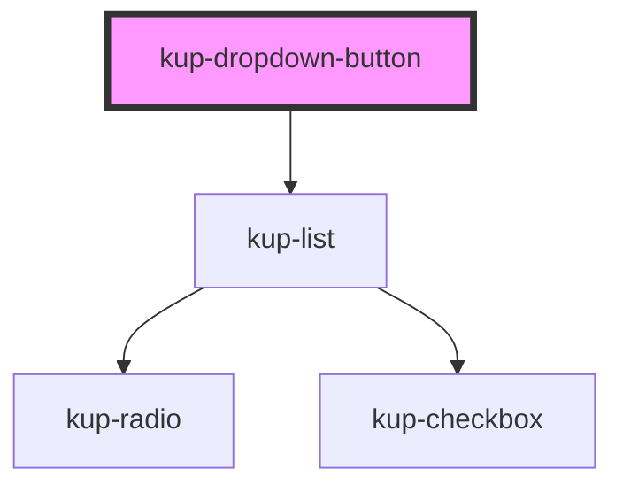

# kup-dropdown-button

<!-- Auto Generated Below -->

## Properties

| Property       | Attribute       | Description                                                                                                     | Type                                                                                             | Default                        |
| -------------- | --------------- | --------------------------------------------------------------------------------------------------------------- | ------------------------------------------------------------------------------------------------ | ------------------------------ |
| `customStyle`  | `custom-style`  | Custom style of the component. For more information: https://ketchup.smeup.com/ketchup-showcase/#/customization | `string`                                                                                         | `''`                           |
| `data`         | --              | Props of the sub-components.                                                                                    | `Object`                                                                                         | `undefined`                    |
| `disabled`     | `disabled`      | Defaults at false. When set to true, the component is disabled.                                                 | `boolean`                                                                                        | `false`                        |
| `displayMode`  | `display-mode`  | Sets how the show the selected item value. Suported values: "code", "description", "both".                      | `ItemsDisplayMode.CODE \| ItemsDisplayMode.DESCRIPTION \| ItemsDisplayMode.DESCRIPTION_AND_CODE` | `ItemsDisplayMode.DESCRIPTION` |
| `icon`         | `icon`          | Defaults at null. When set, the button will show this icon.                                                     | `string`                                                                                         | `null`                         |
| `initialValue` | `initial-value` | Sets the initial value of the component.                                                                        | `string`                                                                                         | `''`                           |
| `label`        | `label`         | Defaults at null. When set, the button will show this text.                                                     | `string`                                                                                         | `null`                         |
| `selectMode`   | `select-mode`   | Sets how the return the selected item value. Suported values: "code", "description", "both".                    | `ItemsDisplayMode.CODE \| ItemsDisplayMode.DESCRIPTION \| ItemsDisplayMode.DESCRIPTION_AND_CODE` | `ItemsDisplayMode.CODE`        |
| `styling`      | `styling`       | Defines the style of the button. Available styles are "flat" and "outlined", "raised" is the default.           | `string`                                                                                         | `''`                           |
| `trailingIcon` | `trailing-icon` | Defaults at null. When set, the icon will be shown after the text.                                              | `boolean`                                                                                        | `false`                        |

## Events

| Event                           | Description | Type                                          |
| ------------------------------- | ----------- | --------------------------------------------- |
| `kupDropdownButtonBlur`         |             | `CustomEvent<{ id: string; value: string; }>` |
| `kupDropdownButtonClick`        |             | `CustomEvent<{ id: string; value: string; }>` |
| `kupDropdownButtonFocus`        |             | `CustomEvent<{ id: string; value: string; }>` |
| `kupDropdownSelectionChange`    |             | `CustomEvent<{ value: any; }>`                |
| `kupDropdownSelectionItemClick` |             | `CustomEvent<{ value: any; }>`                |

## Methods

### `getValue() => Promise<string>`

#### Returns

Type: `Promise<string>`

### `setValue(value: string) => Promise<void>`

#### Returns

Type: `Promise<void>`

### `themeChangeCallback(customStyleTheme: string) => Promise<void>`

#### Returns

Type: `Promise<void>`

## Dependencies

### Depends on

- [kup-list](../kup-list)

### Graph

----------------------------------------------

*Built with [StencilJS](https://stenciljs.com/)*
