# kup-dropdown-button

<!-- Auto Generated Below -->

## Properties

| Property          | Attribute          | Description                                                                                                                     | Type                                                                                                                                                                | Default                        |
| ----------------- | ------------------ | ------------------------------------------------------------------------------------------------------------------------------- | ------------------------------------------------------------------------------------------------------------------------------------------------------------------- | ------------------------------ |
| `customStyle`     | `custom-style`     | Custom style of the component.                                                                                                  | `string`                                                                                                                                                            | `''`                           |
| `data`            | --                 | Props of the sub-components.                                                                                                    | `Object`                                                                                                                                                            | `null`                         |
| `disabled`        | `disabled`         | Defaults at false. When set to true, the component is disabled.                                                                 | `boolean`                                                                                                                                                           | `false`                        |
| `displayMode`     | `display-mode`     | Sets how to show the selected item value. Suported values: "CodeOnly", "DescOnly", "Both" or "CodeAndDesc" and "DescAndCode".   | `ItemsDisplayMode.CODE \| ItemsDisplayMode.CODE_AND_DESC \| ItemsDisplayMode.CODE_AND_DESC_ALIAS \| ItemsDisplayMode.DESCRIPTION \| ItemsDisplayMode.DESC_AND_CODE` | `ItemsDisplayMode.DESCRIPTION` |
| `dropdownOnly`    | `dropdown-only`    | Default value is false. When set to true, the arrow dropdown button is the only button displayed.                               | `boolean`                                                                                                                                                           | `false`                        |
| `icon`            | `icon`             | Defaults at null. When set, the button will show this icon.                                                                     | `string`                                                                                                                                                            | `null`                         |
| `initialValue`    | `initial-value`    | Sets the initial value of the component.                                                                                        | `string`                                                                                                                                                            | `''`                           |
| `label`           | `label`            | Defaults at null. When set, the button will show this text.                                                                     | `string`                                                                                                                                                            | `null`                         |
| `placeholderIcon` | `placeholder-icon` | When set, the button will show this icon, if icon/image not found.                                                              | `string`                                                                                                                                                            | `null`                         |
| `selectMode`      | `select-mode`      | Sets how to return the selected item value. Suported values: "CodeOnly", "DescOnly", "Both" or "CodeAndDesc" and "DescAndCode". | `ItemsDisplayMode.CODE \| ItemsDisplayMode.CODE_AND_DESC \| ItemsDisplayMode.CODE_AND_DESC_ALIAS \| ItemsDisplayMode.DESCRIPTION \| ItemsDisplayMode.DESC_AND_CODE` | `ItemsDisplayMode.CODE`        |
| `sizing`          | `sizing`           | Defines the size of the buttons. Available styles are from "extra-small" to "extra-large". Small will be the default            | `KupComponentSizing.EXTRA_LARGE \| KupComponentSizing.EXTRA_SMALL \| KupComponentSizing.LARGE \| KupComponentSizing.MEDIUM \| KupComponentSizing.SMALL`             | `KupComponentSizing.SMALL`     |
| `styling`         | `styling`          | Defines the style of the button. Styles available: "flat", "outlined" and "raised" which is also the default.                   | `FButtonStyling.FLAT \| FButtonStyling.FLOATING \| FButtonStyling.ICON \| FButtonStyling.OUTLINED \| FButtonStyling.RAISED`                                         | `FButtonStyling.RAISED`        |
| `trailingIcon`    | `trailing-icon`    | Defaults at null. When set, the icon will be shown after the text.                                                              | `boolean`                                                                                                                                                           | `false`                        |

## Events

| Event                          | Description                                    | Type                                         |
| ------------------------------ | ---------------------------------------------- | -------------------------------------------- |
| `kup-dropdownbutton-blur`      | Triggered when the primary button loses focus. | `CustomEvent<KupDropdownButtonEventPayload>` |
| `kup-dropdownbutton-change`    | Triggered when a list item changes.            | `CustomEvent<KupDropdownButtonEventPayload>` |
| `kup-dropdownbutton-click`     | Triggered when the primary button is clicked.  | `CustomEvent<KupDropdownButtonEventPayload>` |
| `kup-dropdownbutton-focus`     | Triggered when the primary button is focused.  | `CustomEvent<KupDropdownButtonEventPayload>` |
| `kup-dropdownbutton-itemclick` | Triggered when a list item is clicked.         | `CustomEvent<KupDropdownButtonEventPayload>` |

## Methods

### `getProps(descriptions?: boolean) => Promise<GenericObject>`

Used to retrieve component's props values.

#### Parameters

| Name           | Type      | Description                                                                            |
| -------------- | --------- | -------------------------------------------------------------------------------------- |
| `descriptions` | `boolean` | - When provided and true, the result will be the list of props with their description. |

#### Returns

Type: `Promise<GenericObject>`

List of props as object, each key will be a prop.

### `getValue() => Promise<string>`

Returns the component's internal value.

#### Returns

Type: `Promise<string>`

### `refresh() => Promise<void>`

This method is used to trigger a new render of the component.

#### Returns

Type: `Promise<void>`

### `setProps(props: GenericObject) => Promise<void>`

Sets the props to the component.

#### Parameters

| Name    | Type            | Description                                                  |
| ------- | --------------- | ------------------------------------------------------------ |
| `props` | `GenericObject` | - Object containing props that will be set to the component. |

#### Returns

Type: `Promise<void>`

### `setValue(value: string) => Promise<void>`

Sets the internal value of the component.

#### Parameters

| Name    | Type     | Description |
| ------- | -------- | ----------- |
| `value` | `string` |             |

#### Returns

Type: `Promise<void>`

## Dependencies

### Used by

 - [kup-button-list](../kup-button-list)
 - [kup-card](../kup-card)
 - [kup-data-table](../kup-data-table)
 - [kup-input-panel](../kup-input-panel)

### Depends on

- [kup-list](../kup-list)
- [kup-card](../kup-card)
- [kup-dialog](../kup-dialog)
- [kup-badge](../kup-badge)

### Graph

```mermaid
graph TD;
  kup-dropdown-button --> kup-list
  kup-dropdown-button --> kup-card
  kup-dropdown-button --> kup-dialog
  kup-dropdown-button --> kup-badge
  kup-list --> kup-list
  kup-list --> kup-radio
  kup-list --> kup-card
  kup-list --> kup-dialog
  kup-list --> kup-badge
  kup-radio --> kup-card
  kup-radio --> kup-dialog
  kup-radio --> kup-badge
  kup-card --> kup-dropdown-button
  kup-image --> kup-card
  kup-image --> kup-image
  kup-image --> kup-dialog
  kup-image --> kup-spinner
  kup-image --> kup-badge
  kup-dialog --> kup-badge
  kup-dialog --> kup-card
  kup-dialog --> kup-dialog
  kup-badge --> kup-badge
  kup-badge --> kup-card
  kup-badge --> kup-dialog
  kup-spinner --> kup-card
  kup-spinner --> kup-dialog
  kup-autocomplete --> kup-list
  kup-autocomplete --> kup-card
  kup-autocomplete --> kup-dialog
  kup-autocomplete --> kup-badge
  kup-chip --> kup-card
  kup-chip --> kup-dialog
  kup-chip --> kup-badge
  kup-text-field --> kup-card
  kup-text-field --> kup-dialog
  kup-text-field --> kup-badge
  kup-color-picker --> kup-card
  kup-color-picker --> kup-dialog
  kup-color-picker --> kup-badge
  kup-combobox --> kup-list
  kup-combobox --> kup-card
  kup-combobox --> kup-dialog
  kup-combobox --> kup-badge
  kup-date-picker --> kup-card
  kup-date-picker --> kup-dialog
  kup-date-picker --> kup-badge
  kup-file-upload --> kup-spinner
  kup-file-upload --> kup-card
  kup-file-upload --> kup-dialog
  kup-file-upload --> kup-badge
  kup-rating --> kup-card
  kup-rating --> kup-dialog
  kup-time-picker --> kup-card
  kup-time-picker --> kup-list
  kup-time-picker --> kup-dialog
  kup-time-picker --> kup-badge
  kup-button-list --> kup-dropdown-button
  kup-chart --> kup-card
  kup-chart --> kup-dialog
  kup-gauge --> kup-card
  kup-gauge --> kup-dialog
  kup-progress-bar --> kup-card
  kup-progress-bar --> kup-dialog
  kup-toolbar --> kup-card
  kup-toolbar --> kup-dialog
  kup-toolbar --> kup-badge
  kup-toolbar --> kup-image
  kup-toolbar --> kup-autocomplete
  kup-toolbar --> kup-chip
  kup-toolbar --> kup-text-field
  kup-toolbar --> kup-color-picker
  kup-toolbar --> kup-combobox
  kup-toolbar --> kup-date-picker
  kup-toolbar --> kup-file-upload
  kup-toolbar --> kup-rating
  kup-toolbar --> kup-time-picker
  kup-toolbar --> kup-button-list
  kup-toolbar --> kup-chart
  kup-toolbar --> kup-gauge
  kup-toolbar --> kup-progress-bar
  kup-toolbar --> kup-toolbar
  kup-button --> kup-card
  kup-button --> kup-dialog
  kup-button --> kup-badge
  kup-checkbox --> kup-card
  kup-checkbox --> kup-dialog
  kup-checkbox --> kup-badge
  kup-data-table --> kup-dropdown-button
  kup-switch --> kup-card
  kup-switch --> kup-dialog
  kup-form --> kup-card
  kup-form --> kup-dialog
  kup-form --> kup-image
  kup-form --> kup-autocomplete
  kup-form --> kup-chip
  kup-form --> kup-text-field
  kup-form --> kup-color-picker
  kup-form --> kup-combobox
  kup-form --> kup-date-picker
  kup-form --> kup-file-upload
  kup-form --> kup-rating
  kup-form --> kup-time-picker
  kup-form --> kup-button-list
  kup-form --> kup-chart
  kup-form --> kup-gauge
  kup-form --> kup-progress-bar
  kup-form --> kup-badge
  kup-form --> kup-toolbar
  kup-tab-bar --> kup-toolbar
  kup-tab-bar --> kup-list
  kup-tab-bar --> kup-card
  kup-tab-bar --> kup-dialog
  kup-tab-bar --> kup-badge
  kup-tree --> kup-card
  kup-tree --> kup-list
  kup-tree --> kup-text-field
  kup-tree --> kup-dialog
  kup-tree --> kup-image
  kup-tree --> kup-autocomplete
  kup-tree --> kup-chip
  kup-tree --> kup-color-picker
  kup-tree --> kup-combobox
  kup-tree --> kup-date-picker
  kup-tree --> kup-file-upload
  kup-tree --> kup-rating
  kup-tree --> kup-time-picker
  kup-tree --> kup-button-list
  kup-tree --> kup-chart
  kup-tree --> kup-gauge
  kup-tree --> kup-progress-bar
  kup-tree --> kup-badge
  kup-tree --> kup-toolbar
  kup-input-panel --> kup-dropdown-button
  style kup-dropdown-button fill:#f9f,stroke:#333,stroke-width:4px
```

----------------------------------------------

*Built with [StencilJS](https://stenciljs.com/)*
