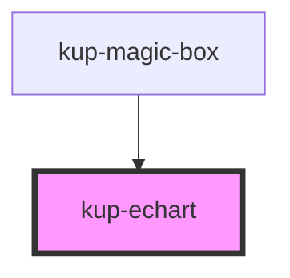

# kup-echarts

<!-- Auto Generated Below -->

## Properties

| Property      | Attribute      | Description                                                                                                                                                            | Type          | Default     |
| ------------- | -------------- | ---------------------------------------------------------------------------------------------------------------------------------------------------------------------- | ------------- | ----------- |
| `axis`        | `axis`         | Sets the axis of the chart.                                                                                                                                            | `string`      | `''`        |
| `chartTitle`  | --             | Title of the graph.                                                                                                                                                    | `EchartTitle` | `undefined` |
| `customStyle` | `custom-style` | Custom style of the component. For more information: https://ketchup.smeup.com/ketchup-showcase/#/customization.                                                       | `string`      | `''`        |
| `data`        | --             | The actual data of the chart.                                                                                                                                          | `object`      | `{}`        |
| `legend`      | `legend`       | Sets the position of the legend. Supported values: bottom, left, right, top. Keep in mind that legend types are tied to chart types, some combinations might not work. | `string`      | `undefined` |
| `mapType`     | `map-type`     | Choose which map you want to view, supported values: "europe", "africa", "asia", "oceania", "america" and "world". You can also provide your own JSON.                 | `any`         | `undefined` |
| `series`      | --             | The data series to be displayed. They must be of the same type.                                                                                                        | `string[]`    | `undefined` |
| `types`       | --             | The type of the chart. Supported formats: Line, Pie, Map, Scatter                                                                                                      | `String[]`    | `['Line']`  |

## Events

| Event            | Description | Type                           |
| ---------------- | ----------- | ------------------------------ |
| `kupEchartClick` |             | `CustomEvent<KupEventPayload>` |

## Methods

### `getProps(descriptions?: boolean) => Promise<GenericObject>`

Used to retrieve component's props values.

#### Returns

Type: `Promise<GenericObject>`

### `refresh() => Promise<void>`

This method is used to trigger a new render of the component.

#### Returns

Type: `Promise<void>`

### `resizeCallback() => Promise<void>`

This method is invoked by KupManager whenever the component changes size.

#### Returns

Type: `Promise<void>`

### `setProps(props: GenericObject) => Promise<void>`

Sets the props to the component.

#### Returns

Type: `Promise<void>`

## Dependencies

### Used by

 - [kup-magic-box](../kup-magic-box)

### Graph

----------------------------------------------

*Built with [StencilJS](https://stenciljs.com/)*
