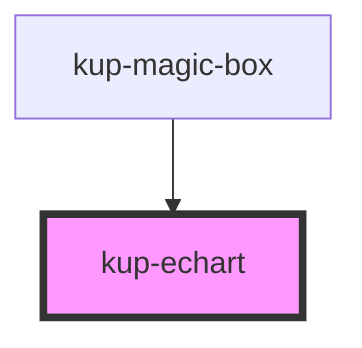

# kup-echart

<!-- Auto Generated Below -->

## Properties

| Property           | Attribute           | Description                                                                                                                                                                                            | Type                                                                                                                                                                                                                                                                                                                                                                                                                                                                                                                                                                                                                                                                                                                                                                                                                                                                                                                           | Default                          |
| ------------------ | ------------------- | ------------------------------------------------------------------------------------------------------------------------------------------------------------------------------------------------------ | ------------------------------------------------------------------------------------------------------------------------------------------------------------------------------------------------------------------------------------------------------------------------------------------------------------------------------------------------------------------------------------------------------------------------------------------------------------------------------------------------------------------------------------------------------------------------------------------------------------------------------------------------------------------------------------------------------------------------------------------------------------------------------------------------------------------------------------------------------------------------------------------------------------------------------ | -------------------------------- |
| `axis`             | `axis`              | Sets the axis of the chart.                                                                                                                                                                            | `string`                                                                                                                                                                                                                                                                                                                                                                                                                                                                                                                                                                                                                                                                                                                                                                                                                                                                                                                       | `''`                             |
| `chartTitle`       | --                  | Title of the graph.                                                                                                                                                                                    | `KupEchartTitle`                                                                                                                                                                                                                                                                                                                                                                                                                                                                                                                                                                                                                                                                                                                                                                                                                                                                                                               | `null`                           |
| `colors`           | --                  | Overrides theme's colors.                                                                                                                                                                              | `string[]`                                                                                                                                                                                                                                                                                                                                                                                                                                                                                                                                                                                                                                                                                                                                                                                                                                                                                                                     | `[]`                             |
| `consistencyCheck` | `consistency-check` | When true, performs checks in order to properly initialize props which could be missing (i.e.: axis). For performances purposes, this prop will run only once when the component is initially created. | `boolean`                                                                                                                                                                                                                                                                                                                                                                                                                                                                                                                                                                                                                                                                                                                                                                                                                                                                                                                      | `false`                          |
| `customStyle`      | `custom-style`      | Custom style of the component.                                                                                                                                                                         | `string`                                                                                                                                                                                                                                                                                                                                                                                                                                                                                                                                                                                                                                                                                                                                                                                                                                                                                                                       | `''`                             |
| `data`             | --                  | The actual data of the chart.                                                                                                                                                                          | `KupDataDataset`                                                                                                                                                                                                                                                                                                                                                                                                                                                                                                                                                                                                                                                                                                                                                                                                                                                                                                               | `null`                           |
| `legend`           | `legend`            | Sets the position of the legend. Supported values: bottom, left, right, top, hidden. Keep in mind that legend types are tied to chart types, some combinations might not work.                         | `KupEchartLegendPlacement.BOTTOM \| KupEchartLegendPlacement.HIDDEN \| KupEchartLegendPlacement.LEFT \| KupEchartLegendPlacement.RIGHT \| KupEchartLegendPlacement.TOP`                                                                                                                                                                                                                                                                                                                                                                                                                                                                                                                                                                                                                                                                                                                                                        | `KupEchartLegendPlacement.RIGHT` |
| `map`              | `map`               | Choose which map you want to view, supported values: "europe", "africa", "asia", "oceania", "america", "italy" and "world". It's possible to supply a custom JSON too.                                 | `Feature<Geometry, { [name: string]: any; }> \| FeatureCollection<Geometry, { [name: string]: any; }> \| GeometryCollection \| LineString \| MultiLineString \| MultiPoint \| MultiPolygon \| Point \| Polygon \| string`                                                                                                                                                                                                                                                                                                                                                                                                                                                                                                                                                                                                                                                                                                      | `null`                           |
| `series`           | --                  | The data series to be displayed. They must be of the same type.                                                                                                                                        | `string[]`                                                                                                                                                                                                                                                                                                                                                                                                                                                                                                                                                                                                                                                                                                                                                                                                                                                                                                                     | `[]`                             |
| `sizeX`            | `size-x`            | The width of the chart, defaults to 100%. Accepts any valid CSS format (px, %, vw, etc.).                                                                                                              | `string`                                                                                                                                                                                                                                                                                                                                                                                                                                                                                                                                                                                                                                                                                                                                                                                                                                                                                                                       | `'100%'`                         |
| `sizeY`            | `size-y`            | The height of the chart, defaults to 100%. Accepts any valid CSS format (px, %, vh, etc.).                                                                                                             | `string`                                                                                                                                                                                                                                                                                                                                                                                                                                                                                                                                                                                                                                                                                                                                                                                                                                                                                                                       | `'100%'`                         |
| `types`            | --                  | The type of the chart. Supported formats: Bar, Gaussian, Line, Pie, Map and Scatter.                                                                                                                   | `KupEchartTypes[]`                                                                                                                                                                                                                                                                                                                                                                                                                                                                                                                                                                                                                                                                                                                                                                                                                                                                                                             | `[KupEchartTypes.LINE]`          |
| `xAxis`            | --                  | Customization options for the x Axis.                                                                                                                                                                  | `AxisBaseOptionCommon & { gridIndex?: number; gridId?: string; position?: CartesianAxisPosition; offset?: number; categorySortInfo?: OrdinalSortInfo; } & { mainType?: "xAxis"; } \| CategoryAxisBaseOption & { gridIndex?: number; gridId?: string; position?: CartesianAxisPosition; offset?: number; categorySortInfo?: OrdinalSortInfo; } & { mainType?: "xAxis"; } \| LogAxisBaseOption & { gridIndex?: number; gridId?: string; position?: CartesianAxisPosition; offset?: number; categorySortInfo?: OrdinalSortInfo; } & { mainType?: "xAxis"; } \| TimeAxisBaseOption & { gridIndex?: number; gridId?: string; position?: CartesianAxisPosition; offset?: number; categorySortInfo?: OrdinalSortInfo; } & { mainType?: "xAxis"; } \| ValueAxisBaseOption & { gridIndex?: number; gridId?: string; position?: CartesianAxisPosition; offset?: number; categorySortInfo?: OrdinalSortInfo; } & { mainType?: "xAxis"; }` | `null`                           |
| `yAxis`            | --                  | Customization options for the y Axis.                                                                                                                                                                  | `AxisBaseOptionCommon & { gridIndex?: number; gridId?: string; position?: CartesianAxisPosition; offset?: number; categorySortInfo?: OrdinalSortInfo; } & { mainType?: "yAxis"; } \| CategoryAxisBaseOption & { gridIndex?: number; gridId?: string; position?: CartesianAxisPosition; offset?: number; categorySortInfo?: OrdinalSortInfo; } & { mainType?: "yAxis"; } \| LogAxisBaseOption & { gridIndex?: number; gridId?: string; position?: CartesianAxisPosition; offset?: number; categorySortInfo?: OrdinalSortInfo; } & { mainType?: "yAxis"; } \| TimeAxisBaseOption & { gridIndex?: number; gridId?: string; position?: CartesianAxisPosition; offset?: number; categorySortInfo?: OrdinalSortInfo; } & { mainType?: "yAxis"; } \| ValueAxisBaseOption & { gridIndex?: number; gridId?: string; position?: CartesianAxisPosition; offset?: number; categorySortInfo?: OrdinalSortInfo; } & { mainType?: "yAxis"; }` | `null`                           |

## Events

| Event              | Description | Type                                      |
| ------------------ | ----------- | ----------------------------------------- |
| `kup-echart-click` |             | `CustomEvent<KupEchartClickEventPayload>` |

## Methods

### `getProps(descriptions?: boolean) => Promise<GenericObject>`

Used to retrieve component's props values.

#### Returns

Type: `Promise<GenericObject>`

List of props as object, each key will be a prop.

### `refresh() => Promise<void>`

This method is used to trigger a new render of the component.

#### Returns

Type: `Promise<void>`

### `resizeCallback() => Promise<void>`

This method is invoked by KupManager whenever the component changes size.

#### Returns

Type: `Promise<void>`

### `setProps(props: GenericObject) => Promise<void>`

Sets the props to the component.

#### Returns

Type: `Promise<void>`

## Dependencies

### Used by

 - [kup-magic-box](../kup-magic-box)

### Graph

----------------------------------------------

*Built with [StencilJS](https://stenciljs.com/)*
